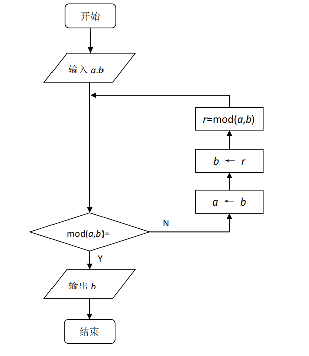

# **实现模乘法逆元算法**

### **一、实验目的**

通过本实验使学生掌握最大公因子算法的实现、同余类中元素的乘法逆元的求解。

### **二、实验原理**

本实验的准备知识包括最大公约数、模运算及其基本性质、互素等概念。

- 最大公约数：*a*和*b*的最大公约数是能够同时整除*a*和*b*的最大正整数，记为：gcd(*a*,*b*)或(*a*,*b*)。 
- 互素的（既约的）：满足 gcd(*a*,*b*)=1 的 *a* 和 *b*。 
- 同余（模运算）：设整数 *a*，*b*，*n*(*n*≠0)，如果 *a*-*b* 是 *n* 的整数倍（正的或负的），我们就说 *a*≡*b*(mod *n*)，读作：*a* 同余于 *b* 模 *n*。



```mermaid
flowchart TD
 A(开始) --> B[/输入a,b/];
    B -->C{"mod(a,b)=0"};
    C --Y--> D[/输出b/];
    D --> E[结束];
    
    C --N--> F[a <- b];
    F --> G[b <- r];
    G -->H["r=mod(a,b)"]
    H -->B
```

- 欧几里得算法：又称辗转相除法，基于定理 gcd(*a*,*b*)=gcd(*b*,*a* mod *b*) (*a*>*b*) 

- 扩展的欧几里得算法：对于不完全为 0 的非负整数 *a*，*b*，gcd(*a*,*b*)表示 *a*，*b* 的最大公约数，必然存在整数对 *x*，*y*，使得 gcd(a,b) = *ax*+*by*。 

-  乘法逆元素：假设 gcd(*a*,*n*)=1，则存在整数 *s*，*t*，使得 *as+nt*=1（由扩展的欧几里得算法可知），则 *as*≡1(mod *n*)，因此 *s* 是 *a*(mod *n*)的乘法逆元素。且有：$a^{-1}$ ≡*s*(mod *n*)。

### **三、实验内容**

实现以下算法，加深掌握模运算的性质

- 欧几里得算法

  计算 gcd(23456,987654)

- 扩展的欧几里得算法

  计算 8787 (mod 91919)的乘法逆元素

## 实验具体实现

### python

如果我们使用python，由于有`gmpy2`库的存在，自然是三句话让python给为写了十八个实验

#### `gmpy2`实现

- `gmpy2.mpz(n)`初始化一个大整数
- `gmpy2.invert(m,phi)`求$mod (phi)$的逆元
- `pow(m,e,n)`求$c^d mod n$
- `gmpy2.is_prime(n) `素数判断
- `gmpy2.gcd(a,b)`  欧几里得算法，最大公约数
- `gmpy2.gcdext(a,b)`  扩展欧几里得算法
- `gmpy2.iroot(x,n)` x开n次根，$\sqrt[n]{x}$

```python
import gmpy2

a, b = map(int, input("请输入a,b").split())
print(gmpy2.gcd(a, b))
print(gmpy2.gcdext(a, b))

m,phi= map(int, input("请输入m,phi").split())
print(gmpy2.invert(m,phi))
```

运行结果为

```
请输入a,b>? 23456 987654
2
(mpz(2), mpz(-3158), mpz(75))
请输入m,phi>? 8787 91919
71374
```


欧几里得拓展算法返回一个三元素元组`tuple (g,s,t) `其中` g == gcd(a,b) and g == a*s + b*t`

当然这只是调用库，并不能体现算法，但由于gmpy2的源代码无法步入，这里对欧几里得算法做了推算，运行结果也是正确的

```python
def gcdext(a: int, b: int) -> (int, int, int):
    # 扩展欧几里得算法 tuple (g,s,t)
    s, t, x, y = 1, 0, 0, 1  # 初始化s,t,x2,y2
    while b:
        q, r = divmod(a, b)
        a, b = b, r  # 求最大公约数
        s, t, x, y = x, y, s - q * x, t - q * y  # 辗转相除
    # 返回元组(g,s,t)，使 g == a*s + b*t
    return a, s, t


def gcd(a: int, b: int):
    # 欧几里得算法求最大公约数
    while a != 0:
        a, b = b % a, a
    return b


def invert(m:int, phi:int):
    # 求逆元，实际上调用拓展欧几里得函数
    _, mi, _ = gcdext(m, phi)
    return mi if mi > 0 else mi + phi


if __name__ == "__main__":
    a, b = map(int, input("请输入a,b").split())
    print(gcd(a, b))
    print(gcdext(a, b))

    m, phi = map(int, input("请输入m,phi").split())
    print(invert(m, phi))
```

### java

```java
package com.skprimin.gcd;
//*2021/10/25 20:36 by SKPrimin *Describe:欧几里得算法，Gcd类

public class Gcd {
    int a, b;
    private int g, s = 1, t = 0, m; //此处使用私有变量，保护g,s,t;g == a*s + b*t

    public Gcd() { //空构造器
    }

    public Gcd(int a, int b) { //全参构造器
        this.a = a;
        this.b = b;
        m = b; //存储模以备不时之需
    }

    @Override
    public String toString() {
        return "Gcd{" + "a=" + a + ", b=" + b + ", g=" + g + ", s=" + s + ", t=" + t + '}';
    }

    static int getG(int a, int b) { //本处使用了静态类，即可以不用创建实例，直接 Gcd.getG(a,b)调用
        if (b == 0) { //mod(a,b) = 0,则 此时的a就是最大公约数
            return a;
        }
        int r = a % b; // 辗转相除法
        return getG(b, r); //递归
//    return b==0?a:getG(b,a%b); // 三元运算符版本,一行解决
    }

    void getGst() {
        int x = 0, y = 1, q, r, sy, ty;
        while (b != 0) { //辗转相除
            q = a / b; // 将 ab的整数倍存储起来
            r = a % b;// 将 ab的余数存储起来
            a = b;
            b = r;

            sy = s; //将 s,t原始值存储起来
            ty = t;
            s = x; // 辗转交换
            t = y;
            x = sy - q * x;
            y = ty - q * y;
        }
        g = a;
    }

    public int getS() { //s即逆元
        return s > 0 ? s : s + m; //如果算出的s小于0，就加模变为正数
    }
}

class Test {
    public static void main(String[] args) {
        Gcd gcd = new Gcd(23456, 987654);
        gcd.getGst();
        System.out.println(gcd.toString());

        //使用静态类可以直接调用
        System.out.println(Gcd.getG(23456, 987654));

        Gcd gcd2 = new Gcd(8787, 91919);
        gcd2.getGst();
        System.out.println(gcd2.getS());
    }
}
```

运行结果

```
Gcd{a=2, b=0, g=2, s=-3158, t=75}
2
71374
```


