# 实现 DES 的工作模式


## **一、 实验目的**

1. 掌握 DES 算法的工作原理；

2. 熟悉分组加密算法的工作模式。

## **二、 实验原理**

1. DES 的基本原理

ppop 其入口参数有三个：key、data、mode。 Key 为加密解密使用的密钥，data 为加密解密的数据，mode 为其工作模式。当模式为加密模式时，明文按照 64 位进行分组，形成明文组， key 用于对数据加密，当模式为解密模式时，key 用于对数据解密。实际运用中，密钥只用到了 64 位中的 56 位，这样才具有高的安全性。

2. 分组密码工作模式

电码本模式（ECB）的加密过程：

$$\begin{aligned} C_i = E(K,P_i),i=1,2,···N \end{aligned}$$


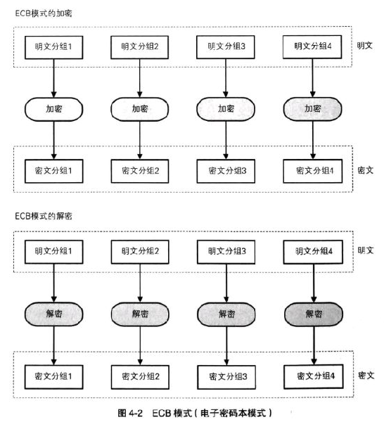

密码分组链接模式（CBC)的加密过程：

$$C_1=E(K,[P_1\bigoplus IV]),\\ C_j =E(K,[P_1\bigoplus C_ {j-1}]),j=2,3,···N  $$


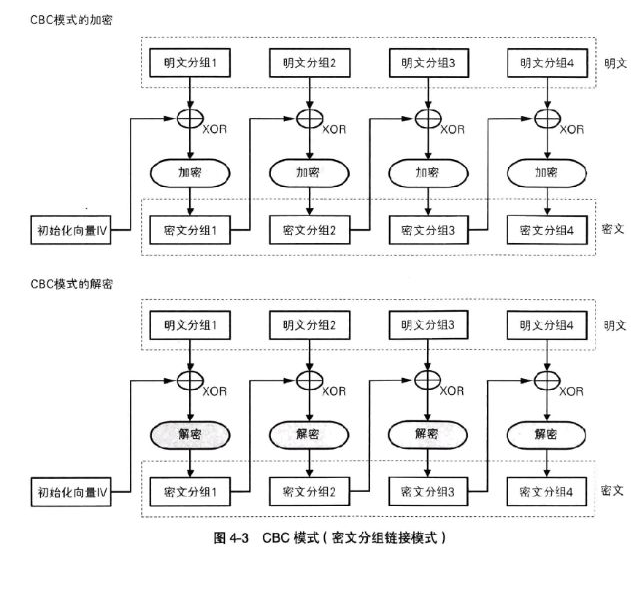

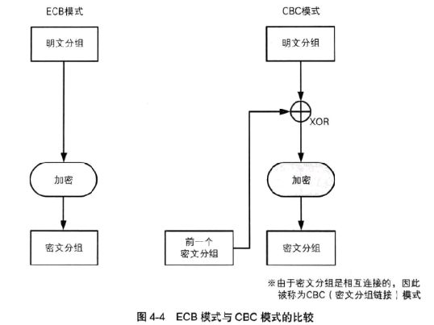

DES 是原型块密码— 一种算法，它采用固定长度的明文位字符串，并通过一系列复杂的操作将其转换为另一个相同长度的密文位字符串。对于 DES，块大小为 64 位。DES还使用密钥来自定义转换，因此解密只能由那些知道用于加密的特定密钥的人执行。密钥表面上由64位组成;但是，算法实际使用了其中的56个。KEY的每个 8 位字节中的一个位可用于密钥生成、分发和存储中的错误检测。位 8、16,..., 64 用于确保每个字节具有奇偶校验。第八位仅用于检查奇偶校验，然后被丢弃。因此，有效密钥长度为 56 位。

该算法的整体结构如图 1 所示：有 16 个相同的处理阶段，称为轮次。还有一个初始和最终排列，称为IP和FP，它们是逆的（IP"撤消"FP的作用，反之亦然）。IP 和 FP 没有加密意义，但包括在内是为了便于在 20 世纪 70 年代中期基于 8 位的硬件中加载块。

在主回合之前，块被分成两个32位的半部分并交替处理;这种纵横交错被称为Feistel方案。Feistel 结构可确保解密和加密是非常相似的过程 — 唯一的区别是解密时子密钥以相反的顺序应用。算法的其余部分是相同的。这大大简化了实现，特别是在硬件中，因为不需要单独的加密和解密算法。

⊕符号表示抑或（XOR） 操作。F 函数将半个块与一些键一起打乱。然后，F函数的输出与块的另一半组合，并在下一轮之前交换一半。在最后一轮之后，交换一半;这是Feistel结构的一个特征，它使加密和解密过程相似。

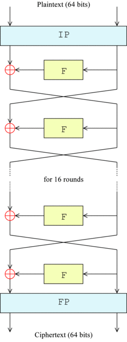


**DES 的 Feistel 函数（F 函数）**

轮函数的作用是根据“右侧”和子密钥生成对“左侧”进行加密的比特序列，它是密码系统的核心。将轮函数的输出与“左侧”进行XOR运算，其结果就是“加密后的左侧”。也就是说，我们用XOR将轮函数的输出与“左侧”进行了合并。而输人的“右侧”则会直接成为输出的“右侧”。

总结一下，一轮的具体计算步骤如下：

1. 将输人的数据等分为左右两部分
2. 将输人的右侧直接发送到输出的右侧
3. 将输人的右侧发送到轮函数
4. 轮函数根据右侧数据和子密钥，计算出一串看上去是随机的比特序列
5. 将上一步得到的比特序列与左侧数据进行XOR运算，并将结果作为加密后的左侧。

但是，这样一来“右侧”根本就没有被加密，因此我们需要用不同的子密钥对一轮的处理重复若干次，并在每两轮处理之间将左侧和右侧的数据对调。

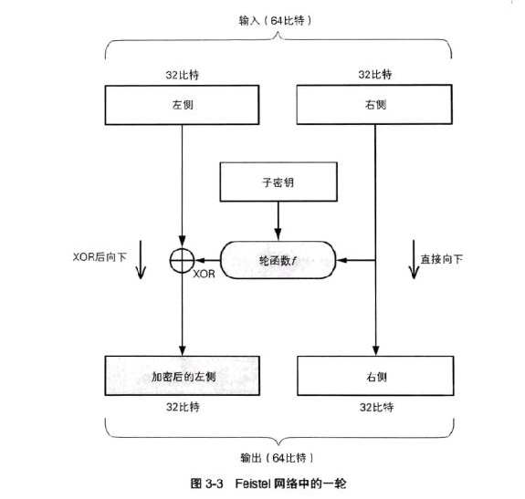

 Feistel具体的轮函数一次在半个块（32 位）上运行，由四个阶段组成：

- **扩展**：32位半块使用扩展排列（在图中表示为E）通过复制一半的位来扩展到48位。输出由 8 个 6 位（8 × 6 = 48 位）片段组成，每个片段包含 4 个相应输入位的副本，以及从每个输入片段到任一侧的紧邻位的副本。
- **抑或**：使用 XOR 操作将结果与子密码（subkey）组合在一起。16 个 48 位子密钥（每轮一个）使用从主密钥派生（如下所述）。
- **S盒替换**：在子键中混合后，块被分成八个6位片段，然后由或替换框处理。八个 S-box 中的每一个都根据非线性变换将其六个输入位替换为四个输出位，该变换以查找表的形式提供。S-box提供了DES安全性的核心 - 没有它们，密码将是线性的，并且很容易损坏。
- **P盒排列**：最后，来自S盒的32个输出根据固定排列重新排列，即P盒。这样做是为了在排列之后，本轮中每个 S 盒输出的位在下一轮中分布在四个不同的 S 盒中。

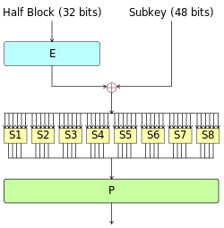

## **三、 实验要求**

1．编写一个 DES 算法，输出其每一轮的加密结果并显示在屏幕上；

2．编程实现对文件的加密，加密模式：电码本、分组链接模式。

## **四、 实验内容**

### 1． 编程实现 DES 算法；

### java实现

##### 先定义一个BOX类用于存放各种盒子

```java
package com.des.demo;

public class Box {


    // E 扩展置换
    public static int[] E = {
            32, 1, 2, 3, 4, 5,
            4, 5, 6, 7, 8, 9,
            8, 9, 10, 11, 12, 13,
            12, 13, 14, 15, 16, 17,
            16, 17, 18, 19, 20, 21,
            20, 21, 22, 23, 24, 25,
            24, 25, 26, 27, 28, 29,
            28, 29, 30, 31, 32, 1
    };
    //P置换表
    public static int[] P = {
            16, 7, 20, 21, 29, 12, 28, 17,
            1, 15, 23, 26, 5, 18, 31, 10,
            2, 8, 24, 14, 32, 27, 3, 9,
            19, 13, 30, 6, 22, 11, 4, 25
    };
    // 置换选择1，PC_1将64位密钥减至56位
    public static int[] PC_1 = {
            57, 49, 41, 33, 25, 17, 9,
            1, 58, 50, 42, 34, 26, 18,
            10, 2, 59, 51, 43, 35, 27,
            19, 11, 3, 60, 52, 44, 36,
            63, 55, 47, 39, 31, 23, 15,
            7, 62, 54, 46, 38, 30, 22,
            14, 6, 61, 53, 45, 37, 29,
            21, 13, 5, 28, 20, 12, 4
    };
    //置换选择2，PC_2 用于将循环左移和右移后的56bit密钥压缩为48bit
    public static int[] PC_2 = {
            14, 17, 11, 24, 1, 5,
            3, 28, 15, 6, 21, 10,
            23, 19, 12, 4, 26, 8,
            16, 7, 27, 20, 13, 2,
            41, 52, 31, 37, 47, 55,
            30, 40, 51, 45, 33, 48,
            44, 49, 39, 56, 34, 53,
            46, 42, 50, 36, 29, 32
    };
    // IP FP置换表
    public static int[] IP = {
            58, 50, 42, 34, 26, 18, 10, 2,
            60, 52, 44, 36, 28, 20, 12, 4,
            62, 54, 46, 38, 30, 22, 14, 6,
            64, 56, 48, 40, 32, 24, 16, 8,
            57, 49, 41, 33, 25, 17, 9, 1,
            59, 51, 43, 35, 27, 19, 11, 3,
            61, 53, 45, 37, 29, 21, 13, 5,
            63, 55, 47, 39, 31, 23, 15, 7
    };
    public static int[] FP = {
            40, 8, 48, 16, 56, 24, 64, 32,
            39, 7, 47, 15, 55, 23, 63, 31,
            38, 6, 46, 14, 54, 22, 62, 30,
            37, 5, 45, 13, 53, 21, 61, 29,
            36, 4, 44, 12, 52, 20, 60, 28,
            35, 3, 43, 11, 51, 19, 59, 27,
            34, 2, 42, 10, 50, 18, 58, 26,
            33, 1, 41, 9, 49, 17, 57, 25
    };


    // 8个S盒
    public static int[] S1 = {
            14, 4, 13, 1, 2, 15, 11, 8, 3, 10, 6, 12, 5, 9, 0, 7,
            0, 15, 7, 4, 14, 2, 13, 1, 10, 6, 12, 11, 9, 5, 3, 8,
            4, 1, 14, 8, 13, 6, 2, 11, 15, 12, 9, 7, 3, 10, 5, 0,
            15, 12, 8, 2, 4, 9, 1, 7, 5, 11, 3, 14, 10, 0, 6, 13
    };
    public static int[] S2 = {
            15, 1, 8, 14, 6, 11, 3, 4, 9, 7, 2, 13, 12, 0, 5, 10,
            3, 13, 4, 7, 15, 2, 8, 14, 12, 0, 1, 10, 6, 9, 11, 5,
            0, 14, 7, 11, 10, 4, 13, 1, 5, 8, 12, 6, 9, 3, 2, 15,
            13, 8, 10, 1, 3, 15, 4, 2, 11, 6, 7, 12, 0, 5, 14, 9
    };
    public static int[] S3 = {
            10, 0, 9, 14, 6, 3, 15, 5, 1, 13, 12, 7, 11, 4, 2, 8,
            13, 7, 0, 9, 3, 4, 6, 10, 2, 8, 5, 14, 12, 11, 15, 1,
            13, 6, 4, 9, 8, 15, 3, 0, 11, 1, 2, 12, 5, 10, 14, 7,
            1, 10, 13, 0, 6, 9, 8, 7, 4, 15, 14, 3, 11, 5, 2, 12};
    public static int[] S4 = {
            7, 13, 14, 3, 0, 6, 9, 10, 1, 2, 8, 5, 11, 12, 4, 15,
            13, 8, 11, 5, 6, 15, 0, 3, 4, 7, 2, 12, 1, 10, 14, 9,
            10, 6, 9, 0, 12, 11, 7, 13, 15, 1, 3, 14, 5, 2, 8, 4,
            3, 15, 0, 6, 10, 1, 13, 8, 9, 4, 5, 11, 12, 7, 2, 14
    };
    public static int[] S5 = {
            2, 12, 4, 1, 7, 10, 11, 6, 8, 5, 3, 15, 13, 0, 14, 9,
            14, 11, 2, 12, 4, 7, 13, 1, 5, 0, 15, 10, 3, 9, 8, 6,
            4, 2, 1, 11, 10, 13, 7, 8, 15, 9, 12, 5, 6, 3, 0, 14,
            11, 8, 12, 7, 1, 14, 2, 13, 6, 15, 0, 9, 10, 4, 5, 3
    };
    public static int[] S6 = {
            12, 1, 10, 15, 9, 2, 6, 8, 0, 13, 3, 4, 14, 7, 5, 11,
            10, 15, 4, 2, 7, 12, 9, 5, 6, 1, 13, 14, 0, 11, 3, 8,
            9, 14, 15, 5, 2, 8, 12, 3, 7, 0, 4, 10, 1, 13, 11, 6,
            4, 3, 2, 12, 9, 5, 15, 10, 11, 14, 1, 7, 6, 0, 8, 13
    };
    public static int[] S7 = {
            4, 11, 2, 14, 15, 0, 8, 13, 3, 12, 9, 7, 5, 10, 6, 1,
            13, 0, 11, 7, 4, 9, 1, 10, 14, 3, 5, 12, 2, 15, 8, 6,
            1, 4, 11, 13, 12, 3, 7, 14, 10, 15, 6, 8, 0, 5, 9, 2,
            6, 11, 13, 8, 1, 4, 10, 7, 9, 5, 0, 15, 14, 2, 3, 12
    };
    public static int[] S8 = {
            13, 2, 8, 4, 6, 15, 11, 1, 10, 9, 3, 14, 5, 0, 12, 7,
            1, 15, 13, 8, 10, 3, 7, 4, 12, 5, 6, 11, 0, 14, 9, 2,
            7, 11, 4, 1, 9, 12, 14, 2, 0, 6, 10, 13, 15, 3, 5, 8,
            2, 1, 14, 7, 4, 10, 8, 13, 15, 12, 9, 0, 3, 5, 6, 11
    };
    // 总S盒
    public static int[][] S = {S1, S2, S3, S4, S5, S6, S7, S8};

}

```

##### 再定义DES类继承BOX

```java
package com.des.demo;

public class DES extends Box {

    //DES密钥扩展算法
    public static String[] creatSubKeys(String key) {
        // 创建编码类对象 并将密钥转为64位长的二进制字符串
        Ecode k1 = new Ecode(key);
        k1.s2n();
        StringBuilder key64 = k1.getSb();
        StringBuilder key56 = new StringBuilder();

        // 64位变56位 使用PC_1表格进行操作
        for (int i = 0; i < 56; i++) {
            key56.append(key64.charAt(PC_1[i] - 1));
        }
        // 子密钥列表 16个子密钥
        String[] subKeys = new String[16];
        //初始化 C D
        String C = key56.substring(0, 28);
        String D = key56.substring(28, 56);

        // 移位次数 16个项中12个都是2，初始化为2

        for (int i = 0; i < 16; i++) {
            int shiftStep = 2;
            if (i == 0 || i == 1 || i == 8 || i == 15) {
                //1 2 9 16 轮仅位移1
                shiftStep = 1;
            }
            // C D 左移2或1位 调用自定义的位移方法
            C = leftMove(C, shiftStep);
            D = leftMove(D, shiftStep);
            // CD 字符串合并
            String CD;
            CD = C + D;
            // 通过PC_2置换，将56位变成48位
            StringBuilder key48 = new StringBuilder();
            for (int j = 0; j < 48; j++) {
                key48.append(CD.charAt(PC_2[j] - 1));
            }
            subKeys[i] = key48.toString();
        }
        return subKeys;
    }

    //自定义字符串左移n位方法
    private static String leftMove(String str, int position) {
        String str1 = str.substring(position);
        String str2 = str.substring(0, position);
        return str1 + str2;
    }

    // 初始 IP 置换
    public static String iPReplace(String binStr64) {
        StringBuilder ipStr = new StringBuilder();
        for (int i = 0; i < 64; i++) {
            ipStr.append(binStr64.charAt(IP[i] - 1));
        }
        return ipStr.toString();
    }

    // 逆初始 FP 置换
    public static String fPReplace(String binStr64) {
        StringBuilder fpStr = new StringBuilder();
        for (int i = 0; i < 64; i++) {
            fpStr.append(binStr64.charAt(FP[i] - 1));
        }
        return fpStr.toString();
    }

    // 拓展置换E 32 -> 48
    public static String replE(String binStr32) {
        StringBuilder eStr48 = new StringBuilder();
        for (int i = 0; i < 48; i++) {
            eStr48.append(binStr32.charAt(E[i] - 1));
        }
        return eStr48.toString();
    }

    // S盒代换 48 -> 32
    public static String replS(String binStr48) {
        int si = 0;
        StringBuilder binStr32 = new StringBuilder();
        // 48 个字符每组6个，共8组，
        for (int i = 0; i < 8; i++) {
            // 截取出6长度的一组 隔6个截取一次
            String binStr6 = binStr48.substring(i * 6, i * 6 + 6);
            // 总字符串中截取出 首尾作为行号 中间部分作为列号
            String row = String.valueOf(binStr6.charAt(0)) + binStr6.charAt(5);
            String col = binStr6.substring(1, 5);
            // 将字符作为二进制解析出数字
            int rown = Integer.parseInt(row, 2);
            int coln = Integer.parseInt(col, 2);
            // 根据S盒 4行16列的排布算出在一维状态下的索引
            int index = 16 * rown + coln;
            // 找到对应的S盒的对应位置进行代换 si++ 在执行一次后自动加一
            int bitn4 = S[i][index];
            //讲格式定为4个，不足补空位，后续替换为0
            String binStr4 = String.format("%4s", Integer.toBinaryString(bitn4)).replace(' ', '0');
            // binStr4逐个添加
            binStr32.append(binStr4);
        }
        return binStr32.toString();
    }

    // 取得S盒变换的结果后再进行一次P置换
    public static String replP(String binStr32) {
        StringBuilder sb32 = new StringBuilder();
        for (int i = 0; i < 32; i++) {
            sb32.append(binStr32.charAt(P[i] - 1));
        }
        return sb32.toString();
    }

    // 字符形式的二进制异或运算
    public static String xor(String s1, String s2) {
        // 二进制字符串转为数字 截取出钱30 后2或者18自行判断
        int len = s2.length();
        int sn1l = Integer.parseInt(s1.substring(0, 30), 2);
        int sn1r = Integer.parseInt(s1.substring(30), 2);
        int sn2l = Integer.parseInt(s2.substring(0, 30), 2);
        int sn2r = Integer.parseInt(s2.substring(30), 2);
        // 异或运算
        int snl = sn1l ^ sn2l;
        int snr = sn1r ^ sn2r;
        // 格式化字符串
        String left = String.format("%30s", Integer.toBinaryString(snl)).replace(' ', '0');
        String rlenfm = "%" + (len - 30) + "s";
        String right = String.format(rlenfm, Integer.toBinaryString(snr)).replace(' ', '0');

        // 生成format字符串格式参数
        return left + right;
    }

    public static String feistel(String binStr32, String subKey48) {
        // 扩展置换 E 32->48
        String binE48 = replE(binStr32);
        // 异或运算
        String binXor48 = xor(binE48, subKey48);
        // S盒代换 48->32
        String binS32 = replS(binXor48);
        // P 盒置换
        String binP32 = replP(binS32);
        return binP32;
    }

    // 加密过程
    public static String encryption(String binPlain64, String[] binKeys48) {
        // 初始IP置换
        String binIP = iPReplace(binPlain64);
        // 分割成左右两部分 Li Ri
        String left = binIP.substring(0, 32);
        String right = binIP.substring(32);
        // 定义 Li-1  Ri-1
        String beforeLeft;
        String beforeRight;
        // 16轮 Feistel 转换
        // Li=Ri-1    Ri=Li-1 ^ F(Ri-1, Ki)
        for (int i = 0; i < 16; i++) {
            beforeLeft = left;
            beforeRight = right;
            left = beforeRight;
            right = xor(beforeLeft, feistel(beforeRight, binKeys48[i]));
//            System.out.println("第" + (i + 1) + "轮的加密结果为" + left + right);
        }
        // 最后一轮交换后得到结果
        String encryptionText = right + left;
        return fPReplace(encryptionText);
    }

    public static String decryption(String binPlain64, String[] binKeys48) {
        // 初始IP置换
        String binIP = iPReplace(binPlain64);
        // 分割成左右两部分 Li Ri
        String left = binIP.substring(0, 32);
        String right = binIP.substring(32);
        // 定义 Li-1  Ri-1
        String beforeLeft;
        String beforeRight;
        // 16轮 Feistel 转换
        // Li=Ri-1    Ri=Li-1 ^ F(Ri-1, Ki)
        for (int i = 0; i < 16; i++) {
            beforeLeft = left;
            beforeRight = right;
            left = beforeRight;
            right = xor(beforeLeft, feistel(beforeRight, binKeys48[15 - i]));
//            System.out.println("第" + (i + 1) + "轮的解密结果为" + left + right);
        }
        // 最后一轮交换后得到结果
        String decryptionText = right + left;
        return fPReplace(decryptionText);
    }
}


```

##### Ecb电码本模式

```java
package com.des.demo;

public class Ecb extends DES {

    public static String encryption(String binPlain, String binKey) {
        // 生成子密钥串
        String[] binKeys48 = creatSubKeys(binKey);
        // 64个一组分组
        int group = binPlain.length() / 64;
        StringBuilder cipher = new StringBuilder();
        for (int i = 0; i < group; i++) {
//            System.out.println("开始第" + (i + 1) + "组加密");
            String binPlain64 = binPlain.substring(i * 64, (i + 1) * 64);
            cipher.append(encryption(binPlain64, binKeys48));
        }
        return cipher.toString();
    }

    public static String decryption(String binCipher, String binKey) {
        // 生成子密钥串
        String[] binKeys48 = creatSubKeys(binKey);
        // 64个一组分组
        int group = binCipher.length() / 64;
        StringBuilder plain = new StringBuilder();
        for (int i = 0; i < group; i++) {
            String binCipher64 = binCipher.substring(i * 64, (i + 1) * 64);
            plain.append(decryption(binCipher64, binKeys48));
        }
        return plain.toString();
    }
}

```

##### Cbc密码分组链接模式

```java
package com.des.demo;

public class Cbc extends DES {
    public static String encryption(String binStr, String binKey, String strIV) {
        // 生成子密钥串
        String[] binKeys48 = creatSubKeys(binKey);
        int group = binStr.length() / 64;
        // 将IV 编码成二进制
        Ecode si = new Ecode(strIV);
        si.s2n();
        String binIV = si.getBinString();
//        System.out.println("binIV" + binIV);

        StringBuilder cipher = new StringBuilder();
        // 进行第一轮的加密
        String binCbc1 = xor(binStr.substring(0, 64), binIV);
        String binCbcBefore = encryption(binCbc1, binKeys48);
        cipher.append(binCbcBefore);
        // 进行其余组的加密
        for (int i = 1; i < group; i++) {
            // 取余第i+1组
            String binCbcStri = binStr.substring(i * 64, i * 64 + 64);
            String binCbci = xor(binCbcStri, binCbcBefore);
            binCbcBefore = encryption(binCbci, binKeys48);
            cipher.append(binCbcBefore);
        }

        return cipher.toString();
    }

    public static String decryption(String binStr, String binKey, String strIV) {
        // 生成子密钥串
        String[] binKeys48 = creatSubKeys(binKey);
        int group = binStr.length() / 64;
        // 将IV 编码成二进制
        Ecode si = new Ecode(strIV);
        si.s2n();
        String binIV = si.getBinString();

        StringBuilder plaint = new StringBuilder();
        // 进行第一轮的加密
        String binCbcBefore = decryption(binStr.substring(0, 64), binKeys48);
        String binCbc1 = xor(binCbcBefore, binIV);
        plaint.append(binCbc1);
        // 进行其余组的加密
        for (int i = 1; i < group; i++) {
            // 取余第i+1组
            String binCbcStri = binStr.substring(i * 64, i * 64 + 64);

            binCbcBefore = decryption(binCbcStri, binKeys48);
            String binCbci = xor(binCbcBefore, binStr.substring(i * 64 - 64, i * 64));
            plaint.append(binCbci);
        }
        return plaint.toString();
    }

    // 字符形式的二进制异或运算 重写父类的方法 专为此处64位异或设计
    public static String xor(String s1, String s2) {
        // 二进制字符串转为数字 截取出钱30 后2或者18自行判断
        int len = s2.length();
        int sn1l = Integer.parseInt(s1.substring(0, 30), 2);
        int sn1c = Integer.parseInt(s1.substring(30, 60), 2);
        int sn1r = Integer.parseInt(s1.substring(60), 2);

        int sn2l = Integer.parseInt(s2.substring(0, 30), 2);
        int sn2c = Integer.parseInt(s2.substring(30, 60), 2);
        int sn2r = Integer.parseInt(s2.substring(60), 2);

        // 异或运算
        int snl = sn1l ^ sn2l;
        int snc = sn1c ^ sn2c;
        int snr = sn1r ^ sn2r;

        String left = String.format("%30s", Integer.toBinaryString(snl)).replace(' ', '0');
        String center = String.format("%30s", Integer.toBinaryString(snc)).replace(' ', '0');
        String rlenfm = "%" + (len - 60) + "s";
        String right = String.format(rlenfm, Integer.toBinaryString(snr)).replace(' ', '0');

        // 生成format字符串格式参数
        return left + center + right;
    }
}
```

##### Ecode二进制编码类

```java
package com.des.demo;

public class Ecode {
    public String str;
    public int len;
    private char[] array;
    private String[] binarray;
    private StringBuilder sb = new StringBuilder();
    private StringBuilder stringChar = new StringBuilder();

    // 规定所有组创建时必须有字符
    public Ecode(String str) {
        this.str = str;
    }

    // 编码时得到可变二进制字符串
    public StringBuilder getSb() {
        return sb;
    }

    // 编码时得到二进制字符串
    public String getBinString() {
        return sb.toString();
    }

    // 解码时得到字符串
    public String getStringChar() {
        return stringChar.toString();
    }

    // String to Number 编码
    public void s2n() {
        this.array = str.toCharArray();
        this.len = str.length();
        this.binarray = new String[len];
        for (int i = 0; i < len; i++) {
            // 逐个读取出字符
            char ch = array[i];
            // 转为二进制形式，以字符串存储
            // 如下是将字符定为8位，不足补零的两种方式，调用format或者做if els
            String binch = String.format("%8s", Integer.toBinaryString(ch)).replace(' ', '0');

/*            String binch = Integer.toBinaryString(ch);
            int binlen = binch.length();
            if (binlen == 6) {
                binch = "00" + binch;
            } else if (binlen == 7 || binlen == 15) {
                binch = "0" + binch;
            } else if (binlen != 8) {
                System.out.println("该字符符有问题");
            }*/

            binarray[i] = binch;
            sb.append(binch);
        }
    }

    // Number to String 解码 将二进制字符转为字符
    public void n2s() {
        // 获得字符长度 并分组
        this.len = str.length();
        for (int i = 0; i < len / 8; i++) {
            String item = str.substring(i * 8, i * 8 + 8);
            int ass = Integer.parseInt(item, 2);
            stringChar.append((char) ass);
        }
    }
}
```

##### 测试类

```java
package com.des.demo;

public class Test {
    public static void main(String[] args) {
        String str = "skpriminE1914168";
        String key="12345678";
        System.out.println("将要加密的内容为"+str);
        System.out.println("密钥为"+key);

        Ecode gin = new Ecode(str);
        gin.s2n();
        String plaint = gin.getBinString();


        System.out.println("\n欢迎来到ECB模式");
        String ciphere = Ecb.encryption(plaint, key);
        System.out.println("密文为"+ciphere);

        String plaintoute = Ecb.decryption(ciphere, key);
        System.out.println("明文为"+plaintoute);

        Ecode goute = new Ecode(plaintoute);
        goute.n2s();
        String plaintoutchare = goute.getStringChar();
        System.out.println("ECB解密"+plaintoutchare);


        System.out.println("\n欢迎来到CBC模式");
        String iV = "11112222";
        System.out.println("IV为"+iV);
        String cipherc = Cbc.encryption(plaint, key,iV);
        System.out.println("加密得到的密文为"+cipherc);

        String plaintoutc = Cbc.decryption(cipherc, key,iV);
        System.out.println("解密得到的明文为"+plaintoutc);

        Ecode goutc = new Ecode(plaintoutc);
        goutc.n2s();
        String plaintoutcharc = goutc.getStringChar();
        System.out.println("CBC解密"+plaintoutcharc);
    }
}
```

##### 文件输入输出类

```java
package com.des.demo;

import java.io.*;

public class FileRW {
    public static void main(String[] args) {
        //1.1有一个源文件
        File f1 = new File("Cryptology/src/com/des/demo/testin.txt");
        //1.2有一个目标文件：
        File f2 = new File("Cryptology/src/com/des/demo/output.txt");
        //2.1搞输入的管和输出的管，并分别接到源文件和目标文件上
        try (
                FileReader fr = new FileReader(f1);
                FileWriter fw = new FileWriter(f2);
        ) {
            //3利用缓冲字符数组，将数组转为String写出
            char[] ch = new char[8];
            int len = fr.read(ch);
            while (len != -1) {
                String str = new String(ch, 0, len);
                String key = "12345678";
                System.out.println("将要加密的内容为" + str);
                System.out.println("密钥为" + key);

                // 进行字符编码
                Ecode gin = new Ecode(str);
                gin.s2n();
                String plaint = gin.getBinString();

                // ECB  模式
                System.out.println("\n欢迎来到ECB模式");
                String ciphere = Ecb.encryption(plaint, key);
                System.out.println("密文为" + ciphere);

                String plaintoute = Ecb.decryption(ciphere, key);
                System.out.println("明文为" + plaintoute);

                Ecode goute = new Ecode(plaintoute);
                goute.n2s();
                String plaintoutchare = goute.getStringChar();
                System.out.println("ECB解密" + plaintoutchare);
                // 写入文件
                fw.write("ECB模式\n 密文：" + ciphere + "\n明文：" + plaintoute + "\n解码：" + plaintoutchare);

                // CBC  模式
                System.out.println("\n欢迎来到CBC模式");
                String iv = "11112222";
                System.out.println("iv为" + iv);

                String cipherc = Cbc.encryption(plaint, key, iv);
                System.out.println("加密得到的密文为" + cipherc);

                String plaintoutc = Cbc.decryption(cipherc, key, iv);
                System.out.println("解密得到的明文为" + plaintoutc);

                Ecode goutc = new Ecode(plaintoutc);
                goutc.n2s();
                String plaintoutcharc = goutc.getStringChar();
                System.out.println("CBC解密" + plaintoutcharc);
                // 写入文件
                fw.write("\nCBC模式\n 密文：" + cipherc + "\n明文：" + plaintoutc + "\n解码" + plaintoutcharc);
                len = fr.read(ch);
            }
        } catch (IOException e) {
            e.printStackTrace();
        }
    }
}
```

### Python实现

这里python由[对酒当歌](https://blog.csdn.net/youyouwoxi)实现 

```python
# IP置换表
import libnum

IP = [58, 50, 42, 34, 26, 18, 10, 2,
      60, 52, 44, 36, 28, 20, 12, 4,
      62, 54, 46, 38, 30, 22, 14, 6,
      64, 56, 48, 40, 32, 24, 16, 8,
      57, 49, 41, 33, 25, 17, 9, 1,
      59, 51, 43, 35, 27, 19, 11, 3,
      61, 53, 45, 37, 29, 21, 13, 5,
      63, 55, 47, 39, 31, 23, 15, 7
      ]
# 逆IP置换表
invIP = [40, 8, 48, 16, 56, 24, 64, 32,
         39, 7, 47, 15, 55, 23, 63, 31,
         38, 6, 46, 14, 54, 22, 62, 30,
         37, 5, 45, 13, 53, 21, 61, 29,
         36, 4, 44, 12, 52, 20, 60, 28,
         35, 3, 43, 11, 51, 19, 59, 27,
         34, 2, 42, 10, 50, 18, 58, 26,
         33, 1, 41, 9, 49, 17, 57, 25
         ]
# S盒中的S1盒
S1 = [14, 4, 13, 1, 2, 15, 11, 8, 3, 10, 6, 12, 5, 9, 0, 7,
      0, 15, 7, 4, 14, 2, 13, 1, 10, 6, 12, 11, 9, 5, 3, 8,
      4, 1, 14, 8, 13, 6, 2, 11, 15, 12, 9, 7, 3, 10, 5, 0,
      15, 12, 8, 2, 4, 9, 1, 7, 5, 11, 3, 14, 10, 0, 6, 13
      ]
# S盒中的S2盒
S2 = [15, 1, 8, 14, 6, 11, 3, 4, 9, 7, 2, 13, 12, 0, 5, 10,
      3, 13, 4, 7, 15, 2, 8, 14, 12, 0, 1, 10, 6, 9, 11, 5,
      0, 14, 7, 11, 10, 4, 13, 1, 5, 8, 12, 6, 9, 3, 2, 15,
      13, 8, 10, 1, 3, 15, 4, 2, 11, 6, 7, 12, 0, 5, 14, 9
      ]
# S盒中的S3盒
S3 = [10, 0, 9, 14, 6, 3, 15, 5, 1, 13, 12, 7, 11, 4, 2, 8,
      13, 7, 0, 9, 3, 4, 6, 10, 2, 8, 5, 14, 12, 11, 15, 1,
      13, 6, 4, 9, 8, 15, 3, 0, 11, 1, 2, 12, 5, 10, 14, 7,
      1, 10, 13, 0, 6, 9, 8, 7, 4, 15, 14, 3, 11, 5, 2, 12
      ]
# S盒中的S4盒
S4 = [7, 13, 14, 3, 0, 6, 9, 10, 1, 2, 8, 5, 11, 12, 4, 15,
      13, 8, 11, 5, 6, 15, 0, 3, 4, 7, 2, 12, 1, 10, 14, 9,
      10, 6, 9, 0, 12, 11, 7, 13, 15, 1, 3, 14, 5, 2, 8, 4,
      3, 15, 0, 6, 10, 1, 13, 8, 9, 4, 5, 11, 12, 7, 2, 14
      ]
# S盒中的S5盒
S5 = [2, 12, 4, 1, 7, 10, 11, 6, 8, 5, 3, 15, 13, 0, 14, 9,
      14, 11, 2, 12, 4, 7, 13, 1, 5, 0, 15, 10, 3, 9, 8, 6,
      4, 2, 1, 11, 10, 13, 7, 8, 15, 9, 12, 5, 6, 3, 0, 14,
      11, 8, 12, 7, 1, 14, 2, 13, 6, 15, 0, 9, 10, 4, 5, 3
      ]
# S盒中的S6盒
S6 = [12, 1, 10, 15, 9, 2, 6, 8, 0, 13, 3, 4, 14, 7, 5, 11,
      10, 15, 4, 2, 7, 12, 9, 5, 6, 1, 13, 14, 0, 11, 3, 8,
      9, 14, 15, 5, 2, 8, 12, 3, 7, 0, 4, 10, 1, 13, 11, 6,
      4, 3, 2, 12, 9, 5, 15, 10, 11, 14, 1, 7, 6, 0, 8, 13
      ]
# S盒中的S7盒
S7 = [4, 11, 2, 14, 15, 0, 8, 13, 3, 12, 9, 7, 5, 10, 6, 1,
      13, 0, 11, 7, 4, 9, 1, 10, 14, 3, 5, 12, 2, 15, 8, 6,
      1, 4, 11, 13, 12, 3, 7, 14, 10, 15, 6, 8, 0, 5, 9, 2,
      6, 11, 13, 8, 1, 4, 10, 7, 9, 5, 0, 15, 14, 2, 3, 12
      ]
# S盒中的S8盒
S8 = [13, 2, 8, 4, 6, 15, 11, 1, 10, 9, 3, 14, 5, 0, 12, 7,
      1, 15, 13, 8, 10, 3, 7, 4, 12, 5, 6, 11, 0, 14, 9, 2,
      7, 11, 4, 1, 9, 12, 14, 2, 0, 6, 10, 13, 15, 3, 5, 8,
      2, 1, 14, 7, 4, 10, 8, 13, 15, 12, 9, 0, 3, 5, 6, 11
      ]
# S盒
S = [S1, S2, S3, S4, S5, S6, S7, S8]
# P置换表
P_table = [16, 7, 20, 21, 29, 12, 28, 17,
           1, 15, 23, 26, 5, 18, 31, 10,
           2, 8, 24, 14, 32, 27, 3, 9,
           19, 13, 30, 6, 22, 11, 4, 25
           ]
# 置换选择1，将64位密钥减至56位
PC_1 = [57, 49, 41, 33, 25, 17, 9,
        1, 58, 50, 42, 34, 26, 18,
        10, 2, 59, 51, 43, 35, 27,
        19, 11, 3, 60, 52, 44, 36,
        63, 55, 47, 39, 31, 23, 15,
        7, 62, 54, 46, 38, 30, 22,
        14, 6, 61, 53, 45, 37, 29,
        21, 13, 5, 28, 20, 12, 4
        ]
# 置换选择2，用于将循环左移和右移后的56bit密钥压缩为48bit
PC_2 = [14, 17, 11, 24, 1, 5,
        3, 28, 15, 6, 21, 10,
        23, 19, 12, 4, 26, 8,
        16, 7, 27, 20, 13, 2,
        41, 52, 31, 37, 47, 55,
        30, 40, 51, 45, 33, 48,
        44, 49, 39, 56, 34, 53,
        46, 42, 50, 36, 29, 32
        ]
# 扩展置换E，将32bit数据扩展为48bit
E_table = [32, 1, 2, 3, 4, 5,
           4, 5, 6, 7, 8, 9,
           8, 9, 10, 11, 12, 13,
           12, 13, 14, 15, 16, 17,
           16, 17, 18, 19, 20, 21,
           20, 21, 22, 23, 24, 25,
           24, 25, 26, 27, 28, 29,
           28, 29, 30, 31, 32, 1
           ]


# DES密钥扩展算法
def CreateKeys(key64):
    # 通过置换选择1，将64位密钥变成56位密钥
    key56 = [key64[PC_1[i] - 1] for i in range(56)]
    c0 = key56[:28]
    d0 = key56[28:]  # 将密钥分成两部分
    resultKeys = []
    # 生成每一轮的密钥
    for i in range(16):
        if i in (0, 1, 8, 15):  # 确定移位次数
            sfttm = 1
        else:
            sfttm = 2
        c0 = c0[sfttm:] + c0[:sfttm]
        d0 = d0[sfttm:] + d0[:sfttm]  # 循环左移
        cd = c0 + d0
        # 通过置换选择2，将56位变成48位密钥
        key48 = [cd[PC_2[j] - 1] for j in range(48)]
        key48 = ''.join(key48)  # 列表转成字符串
        resultKeys.append(key48)
    return resultKeys


# 初始置换与逆初始置换
def ipChange(bits, mode):  # mode=1表示初始置换，mode=2表示逆初始置换
    if mode == 1:
        table = IP
    else:
        table = invIP
    resultbits = [bits[table[i] - 1] for i in range(64)]
    resultbits = ''.join(resultbits)  # 列表转成字符串
    return resultbits


# 通过扩展置换表E，将32bit扩展成48bit
def Eextend(rbits32):
    rbits48 = [rbits32[E_table[i] - 1] for i in range(48)]
    rbits48 = ''.join(rbits48)  # 列表转成字符串
    return rbits48


# S盒代换,将48bit变成32bit
def Schange(rbits48):
    k = 0
    rbits32 = ''
    for i in range(0, 48, 6):
        bits6 = rbits48[i:i + 6]
        row = bits6[0] + bits6[5]  # 首位两位作为行
        row = int(row, 2)
        col = bits6[1:5]  # 中间四位作为列
        col = int(col, 2)
        ind = row * 16 + col
        bits4 = bin(S[k][ind])[2:]
        if len(bits4) < 4:
            bits4 = '0' * (4 - len(bits4)) + bits4  # 不足四位则补0
        k += 1
        rbits32 += bits4
    return rbits32


# P置换
def Pchange(rbits32):
    rbits32 = [rbits32[P_table[i] - 1] for i in range(32)]
    rbits32 = ''.join(rbits32)  # 列表转成字符串
    return rbits32


# 01比特字符串的异或
def xor(bit1, bit2):
    bitlen = len(bit1)
    xorres = int(bit1, 2) ^ int(bit2, 2)
    xorbits = bin(xorres)[2:]  # 去掉'0b'
    if len(xorbits) < bitlen:
        xorbits = '0' * (bitlen - len(xorbits)) + xorbits  # 长度不够则在前面补0
    return xorbits


# DES的F函数
def F_func(bits32, key48):
    Ebits = Eextend(bits32)  # 扩展置换
    xorbits = xor(Ebits, key48)  # 异或操作
    Sbits = Schange(str(xorbits))  # S盒代换
    Pbits = Pchange(Sbits)  # P盒置换
    return Pbits


# DES加密与解密
def DES(origbits, keys, mode):  # mode=True表示加密，mode=False表示解密
    if mode == True:
        # print('DES字符明文为：', origtxt)

        print('64bit明文：\t   ', origbits)
        origbits = ipChange(origbits, 1)  # 初始置换
        lbits = origbits[:32]
        rbits = origbits[32:]
        # 16轮Feistel
        for i in range(16):
            prelbits = lbits  # 上一轮的L0
            prerbits = rbits  # 上一轮的R0
            lbits = prerbits
            rbits = xor(prelbits, F_func(prerbits, keys[i]))
            print('第{}轮的加密结果为{}'.format(i + 1, lbits + rbits))
        # 32bit互换
        newbits = rbits + lbits
        newbits = ipChange(newbits, 2)  # 逆初始变换
        print('64bit密文：\t   ', newbits)
        newtxt = bin2str(newbits)
        # print('字符串密文为：',newtxt)
    else:
        # print('字符密文为：', origtxt)
        # origbits = str2bin(origbits)  # 字符串转成二进制
        print('64bit密文：\t   ', origbits)
        origbits = ipChange(origbits, 1)  # 初始置换
        lbits = origbits[:32]
        rbits = origbits[32:]
        # 16轮Feistel
        for i in range(16):
            prelbits = lbits  # 上一轮的L0
            prerbits = rbits  # 上一轮的R0
            lbits = prerbits
            rbits = xor(prelbits, F_func(prerbits, keys[15 - i]))
            print('第{}轮的解密结果为{}'.format(i + 1, lbits + rbits))
        # 32bit互换
        newbits = rbits + lbits
        newbits = ipChange(newbits, 2)  # 逆初始变换
        print('64bit明文：\t   ', newbits)
        newtxt = bin2str(newbits)
        # print('字符串明文为：', newtxt)
    return newbits


# 当一个bit出错时观察DES的加密结果
def observeDES(origbit, keys, mode):  # mode=True表示加密，mode=False表示解密
    resultbits = []
    if mode == True:
        # print('字符明文为：', origbit)
        origbits = str2bin(origbit)  # 字符串转成二进制
        print('64bit明文：\t\t   ', origbits)
        origbits = ipChange(origbits, 1)  # 初始置换
        lbits = origbits[:32]
        rbits = origbits[32:]
        # 16轮Feistel
        for i in range(16):
            prelbits = lbits  # 上一轮的L0
            prerbits = rbits  # 上一轮的R0
            lbits = prerbits
            rbits = xor(prelbits, F_func(prerbits, keys[i]))
            print('第{}轮的加密结果为{}'.format(i + 1, lbits + rbits))
            resultbits.append(lbits + rbits)
        # 32bit互换
        newbits = rbits + lbits
        newbits = ipChange(newbits, 2)  # 逆初始变换
        # print('64bit密文：\t   ',newbits)
        newbit = bin2str(newbits)
    else:
        # print('密文为：', origbit)
        origbits = str2bin(origbit)  # 字符串转成二进制
        print('64bit密文：\t\t   ', origbits)
        origbits = ipChange(origbits, 1)  # 初始置换
        lbits = origbits[:32]
        rbits = origbits[32:]
        # 16轮Feistel
        for i in range(16):
            prelbits = lbits  # 上一轮的L0
            prerbits = rbits  # 上一轮的R0
            lbits = prerbits
            rbits = xor(prelbits, F_func(prerbits, keys[15 - i]))
            print('第{}轮的解密结果为{}'.format(i + 1, lbits + rbits))
            resultbits.append(lbits + rbits)
        # 32bit互换
        newbits = rbits + lbits
        newbits = ipChange(newbits, 2)  # 逆初始变换
        print('64bit明文：\t', newbits)
        newbit = bin2str(newbits)
        print('字符串明文为：', newbit)
    return newbit, resultbits


# 电码本（ECB）模式
def ECB(origbin, keys, mode):  # mode=True表示加密，mode=False表示解密
    r = len(origbin) % 64
    if r != 0:
        origbin = origbin + '0' * (64 - r)  # 字符长度不是4的倍数则在后面补上空格
    newtxt = ''
    for i in range(0, len(origbin), 64):
        intxt = origbin[i:i + 64]
        outtxt = DES(intxt, keys, mode)
        newtxt = newtxt + outtxt
    return newtxt


# 密码分组链接模式（CBC）
def CBC(origbit, keys, iv, mode):  # mode=True表示加密，mode=False表示解密
    if mode == True:
        # 首先得到c1
        p1 = origbit[:64]
        intbit = xor(p1, iv)  # 第一轮与IV异或
        c1 = DES(intbit, keys, mode)  # c1是字符密文
        newbit = c1
        # 得到c2到cn
        for i in range(64, len(origbit), 64):
            p = origbit[i:i + 64]
            c1bits = c1
            intbit = xor(p, c1bits)
            c1 = DES(intbit, keys, mode)
            newbit += c1
        return newbit
    else:
        # 首先得到p1
        c1 = origbit[:64]
        outbit = DES(c1, keys, mode)
        p1bits = outbit
        p1 = xor(p1bits, iv)  # p1是字符明文
        newbit = p1
        # 得到p2到pn
        for i in range(64, len(origbit), 64):
            ci = origbit[i:i + 64]
            outbit = DES(ci, keys, mode)
            pibits = outbit
            c1bits = origbit[i - 64:i]
            pi = xor(pibits, c1bits)
            newbit += pi
        return newbit


# 观察当密文分组出错时，还原的明文有几个分组错误
def ObserveGroupError(origtxt, keys):
    pass


def str2bin(message):
    """将字符串转换为二进制"""
    # # 自定义编码方式
    # result = ''
    # for i in message:
    #     t = bin(ord(i))[2:]  # 字符转成ASCII，再转成二进制，并去掉前面的0b
    #     if len(t) % 16 != 0:  # 使用16位二进制表示一个字符
    #         comp = 16 - len(t) % 16
    #         t = '0' * comp + t  # 不够16位则补0
    #     result += t
    # return result

    # 调用libnum库的方式
    lnbits = libnum.s2b(message)
    surpluszero = len(lnbits) % 64
    return lnbits if surpluszero == 0 else lnbits + '0' * (64 - surpluszero)


#
def bin2str(bits):
    """二进制转回字符串"""
    # # 自定义方法
    # result = []
    # for i in range(0, len(bits), 16):
    #     tbit = bits[i:i + 16]  # 使用16位二进制表示一个字符
    #     c = chr(int(tbit, 2))
    #     result.append(c)
    # result = ''.join(result)
    # return result
    # 调用libnum.b2s转回字符串
    lnstr = str(libnum.b2s(bits))
    # 删去\x00,输出正确的格式
    lnstr = lnstr[2:-1].replace('\\x00','')
    return lnstr

if __name__=='__main__':
    file_path=input('请输入文件路径：')#text.txt
    print(file_path)
    with open(file_path, 'r',encoding='utf-8') as fp:
        origtxt = fp.read()
        key = input('请输入密钥')
        key64 = str2bin(key)
        keys = CreateKeys(key64)
        mode = int(input('你需要加密还是解密？（1加密，0解密）'))
        mode = bool(mode)
        mthd=int(input('你要使用ECB模式还是CBC模式？（1表示ECB，2表示CBC）'))
        if mthd==1:
            # 三元运算符 mode不为0时即加密时进行编码
            origbin = origtxt if  mode ==0 else str2bin(origtxt)
            newbinECB = ECB(origbin, keys, mode)
            # 三元运算符 mode为0时即解密时进行解码=
            newbinECB = bin2str(newbinECB) if mode == 0 else newbinECB
            with open('newECB.txt', 'w', encoding='utf-8') as outfile:
                outfile.write(newbinECB)
        else:
            # ivstr = '87654321'
            ivstr = input("请输入IV")
            # iv转二进制，并在长度过长时自动截取
            iv = str2bin(ivstr)[:64]
            # 三元运算符 mode不为0时即加密时进行编码
            origbin = origtxt if mode == 0 else str2bin(origtxt)
            newbinCBC = CBC(origbin, keys, iv, mode)
            # 三元运算符 mode为0时即解密时进行解码=
            newbinCBC = bin2str(newbinCBC) if mode == 0 else newbinCBC
            with open('newCBC.txt', 'w', encoding='utf-8') as outfile:
                outfile.write(newbinCBC)
```

### 输出效果

#### ECB模式

##### 加密


##### 解密

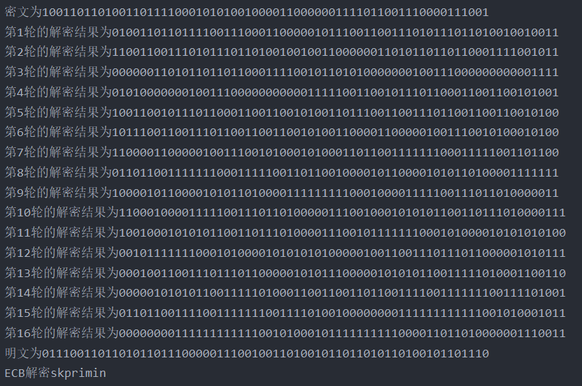

#### CBC模式

##### 加密

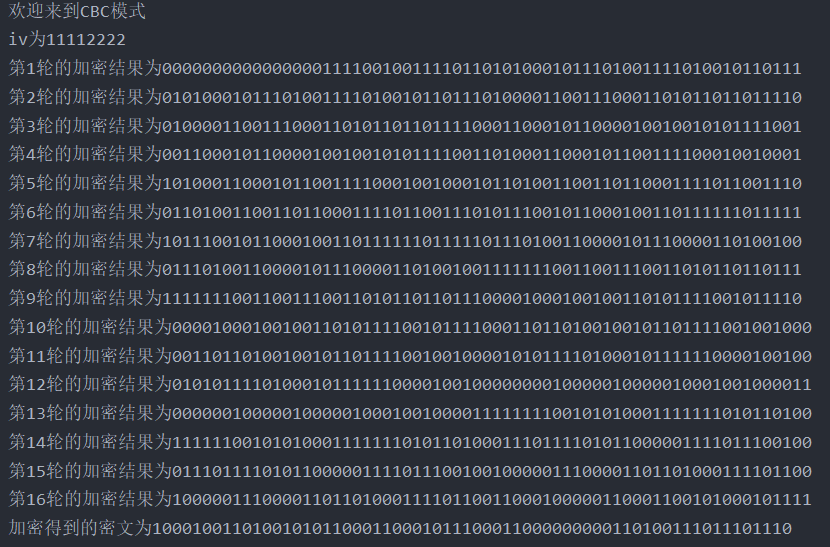

##### 解密

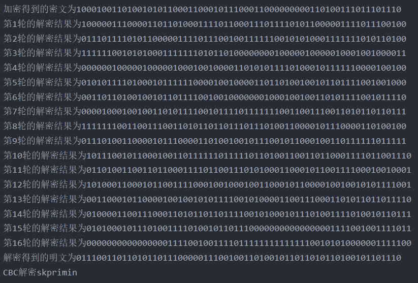

#### 控制台自行输入内容


#### 文件输入输出

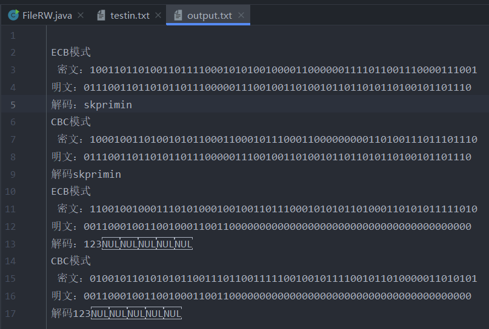

### 2． 改变 1 位明文观察输出 DES 算法的 16 轮输出，几轮后密文变化达到 32位以上；

想要通过肉眼比较出不同的位数是困难的，可以使用python写一写这种简单的工具

- 

即使是给字符串格式化也可以使用技巧，通过替换换行符实现

- 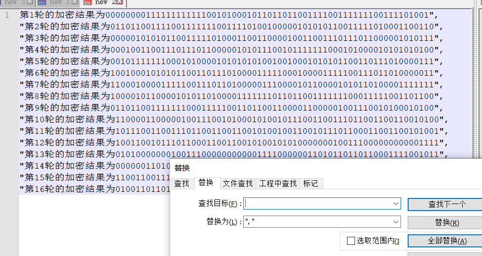

随后编写脚本运行，发现在第五轮时变化就达到32位以上，由于一轮加密的结果是01组成的64位字符，想保持32位以上的差异概率较低，其后一直反复，但大体在32左右。

```python
skprimin = [
    "第1轮的加密结果为0000000011111111111100101000101101101100111100111111100111101001", "第2轮的加密结果为0110110011110011111110011110100100000101010110011111010001100110", ...
    ]

skprimio = [
    "第1轮的加密结果为0000000011111111011100101000101111101101011100110110100111101001", "第2轮的加密结果为1110110101110011011010011110100110000001111101011010111001001110", ...
    ]

for i in range(16):
    s1 = skprimin[i][-64:]
    s2 = skprimio[i][-64:]
    change = 0
    for index,j in enumerate(s1):
        if j != s2[index]:
            change += 1
    print(f"第{i+1}轮有{change}位不同")
```

- 

### 3． 改变 1 位密钥观察输出 DES 算法的 16 轮输出，几轮后密文变化达到 32位以上；

依靠人眼依然不现实

- 

  通过脚本比较，发现在第5轮差异就达到了32以上

- 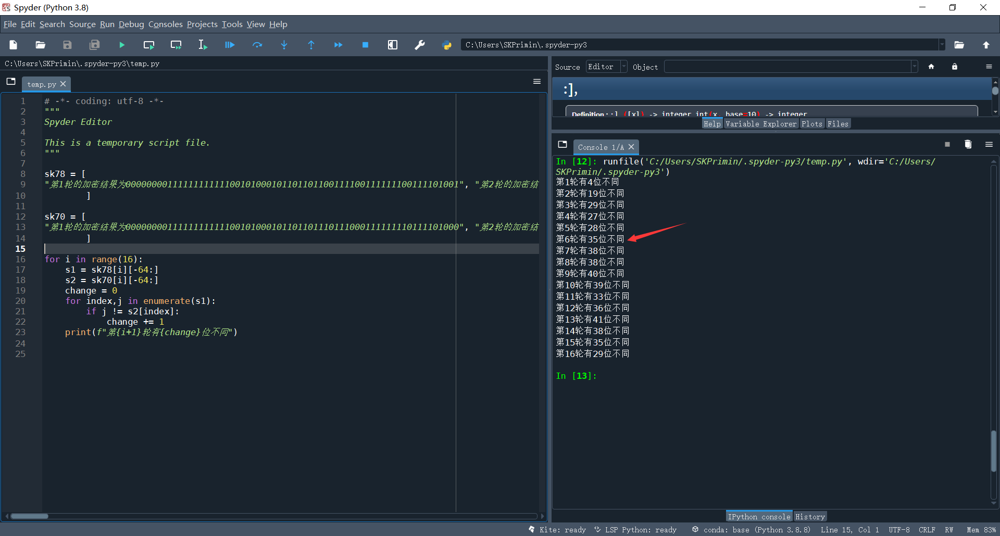

### 4． 在电码本模式和分组链接模式中，在最少 64 个分组的明文中，观察当一个密文分组错误时，还原的明文有几个分组错误。

首先生成了一段长达8*64=512长度的字符串，可分为64组。ECb,CBC模式下均得到了4096个字符的密文，这里我们在解密是替换掉一部分密文，替换第二组的密文。


```java
package com.des.demo;

public class Test {
    public static void main(String[] args) {

        // 直接定义明文密钥
        String str = "11112222111122221111222211112222111122221111222211112222111122221111222211112222111122221111222211112222111122221111222211112222111122221111222211112222111122221111222211112222111122221111222211112222111122221111222211112222111122221111222211112222111122221111222211112222111122221111222211112222111122221111222211112222111122221111222211112222111122221111222211112222111122221111222211112222111122221111222211112222111122221111222211112222111122221111222211112222111122221111222211112222111122221111222211112222";
        String key = "12345678";
        System.out.println("将要加密的内容为" + str);
        System.out.println("密钥为" + key);

        // 进行字符编码
        Ecode gin = new Ecode(str);
        gin.s2n();
        String plaint = gin.getBinString();


        // ECB  模式
        System.out.println("\n欢迎来到ECB模式");
        String ciphere = Ecb.encryption(plaint, key);
        System.out.println("密文为" + ciphere);
		
        // 截取替换
        String replace = String.format("%64s", "0").replace(' ', '0');
        ciphere = ciphere.substring(0, 64) + replace + ciphere.substring(128);
        System.out.println("修改后的密文为" + ciphere);

        String plaintoute = Ecb.decryption(ciphere, key);
        System.out.println("明文为" + plaintoute);

        Ecode goute = new Ecode(plaintoute);
        goute.n2s();
        String plaintoutchare = goute.getStringChar();
        System.out.println("ECB解密" + plaintoutchare);

        // CBC  模式
        System.out.println("\n欢迎来到CBC模式");
        String iv = "11112222";
        System.out.println("iv为" + iv);

        String cipherc = Cbc.encryption(plaint, key, iv);
        System.out.println("加密得到的密文为" + cipherc);
		// 截取替换
        cipherc = cipherc.substring(0, 64) + replace + cipherc.substring(128);
        System.out.println("修改后的密文为" + cipherc);

        String plaintoutc = Cbc.decryption(cipherc, key, iv);
        System.out.println("解密得到的明文为" + plaintoutc);

        Ecode goutc = new Ecode(plaintoutc);
        goutc.n2s();
        String plaintoutcharc = goutc.getStringChar();
        System.out.println("CBC解密" + plaintoutcharc);
    }
}

```


由图可以轻而易举的看出 ECB一组出错只会影响本组，而CBC模式出错会影响本组以及下一组。

