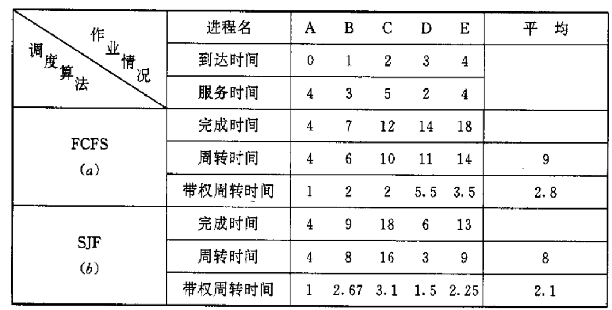

# 作业调度  FCFS SJF java

### 实验内容

- 设计调度算法，模拟实现作业调度。

### 实验目的

- 巩固和加深作业调度的概念。

### 实验题目

- 设计先来先服务调度算法

> **先来先服务(FCFS)调度算法**：FCFS是最简单的调度算法，该算法既可用于作业调度，也可用于进程调度。当在作业调度中采用该算法时，系统将按照作业到达的先后次序来进行调度，或者说它是优先考虑在系统中等待时间最长的作业，而不管该作业所需执行时间的长短，从后备作业队列中选择几个最先进入该队列的作业，将它们调入内存，为它们分配资源和创建进程，然后把它放入就绪队列。
- 设计按短作业优先调度算法

> **短作业优先的调度算法**：SJF算法是以作业的长短来计算优先级，作业越短，其优先级越高。作业的长短是以作业所要求的运行时间来衡量的。SJF算法可以分别用于作业调度和进程调度。在把短作业优先调度算法用于作业调度时，它将从外存的作业后备队列中选择若干个估计运行时间最短的作业，优先将它们调入内存运行。

## 实验内容

### 数据结构和符号说明

本次作业调度，首先我们需要设计作业块PCB。定义一个`PCB类`，在其中须有`作业名、到达时间、服务时间`三个输入量和`开始执行时间、完成时间、周转时间、带权周转时间`四个调度时计算得出的量。有关变量及符号定义如下：

```java
/**
 * 三个公共变量:作业名、到达时间、服务时间
 */
String threadName;
int timeArrival;
int timeSever;
/**
 * 四个私有变量：开始执行时间、完成时间、周转时间、带权周转时间
 */
private int timeStart;
private int timeComplete;
private int timeTurnaround;
private double timeWeightedTurnaround;
```

随后定义一个FCFS类和一个SJF类，主要内容都是一个`dispatch(PCB[] starr)`方法表示调度，和一个`sort(PCB[] starr, int num)`方法对作业进行排序，SJF由于需要在上一个作业完成后对已到达的作业重新排序，因此多了一个`sortSevertime(PCB[] starr, int left, int right)`对作业中截取出来的部分进行排序。

`FcomeFsever`类中需要依照`starr[i].timeArrival`即每一个作业的到达时间进行排序，排序号后直接按照顺序进行调度。

`ShortestJobFirst`类中先对按照到达时间进行排序，调度第一个，随后每次完成都对已到达的作业重新排序。如果发现已经对所有作业重排，就不再重排，节约资源。

### 流程图

```mermaid
graph TD
    A(开始) -->|输入作业基本数据| B{选择算法}
    B --> |FCFS| C(先来先服务)
    B -->|SJF| D(短作业优先)
    C -->|dispatch| E(作业调度)
    E -->|sort| F(到达时间排序)
   F -->|run|Z(作业运行)

    D--> |dispatch| G(作业调度)
    G--> |sort| H(到达时间排序)
    H-->|run|Y(作业运行)
    Y--> |sortSevertime| I(数组重排)
    I-->|run|Y
```

### 源程序

##### PCB类

- 一个作业就是一个PCB类实例

```java
import java.text.DecimalFormat;

/**
 * @author: SKPrimin 
 * @date: 2021/10/28  19:18
 * @ClassName: SeverThread
 * @Description: TODO 定义一个作业类，模拟PCB
 */
public class PCB {
    /**
     * 三个公共变量:作业名、到达时间、服务时间
     */
    String threadName;
    int timeArrival;
    int timeSever;
    /**
     * 四个私有变量：开始执行时间、完成时间、周转时间、带权周转时间
     */
    private int timeStart;
    private int timeComplete;
    private int timeTurnaround;
    private double timeWeightedTurnaround;

    public PCB() {//允许空参构造器存在
    }

    public PCB(String threadName, int timeArrival, int timeSever) { //正规的有参构造器
        this.threadName = threadName;
        this.timeArrival = timeArrival;
        this.timeSever = timeSever;
    }

    public void setTimeStart(int timeStart) {//将由算法调度程序分配开始时间
        this.timeStart = timeStart;
    }

    public int getTimeComplete() {
        return timeComplete;
    }

    public int getTimeTurnaround() {
        return timeTurnaround;
    }

    public double getTimeWeightedTurnaround() {
        return timeWeightedTurnaround;
    }

    public void run() { //开始调度后的运行内容
        /* 计算出完成时间、周转时间、带权周转时间 */
        timeComplete = timeStart + timeSever;
        timeTurnaround = timeComplete - timeArrival;
        DecimalFormat dF = new DecimalFormat("0.00");
        timeWeightedTurnaround = Double.parseDouble(dF.format((double) timeTurnaround / timeSever));
        //调用toString()将内容输出
        System.out.println(this);

    }

    @Override
    public String toString() {
        return "'" + threadName + '\'' +
                "\t\t" + timeArrival +
                "\t\t" + timeSever +
                "\t\t\t" + timeStart +
                "\t\t" + timeComplete +
                "\t\t" + timeTurnaround +
                "\t\t" + timeWeightedTurnaround;
    }
}
```

##### FCFS类

```java
/**
 * @author: SKPrimin 
 * @date: 2021/10/28  19:10
 * @ClassName: FCFS
 * @Description: TODO 先来先服务算法
 */
public class FcomeFsever {
    public void dispatch(PCB[] starr) {
        System.out.println("先来先服务算法");
        System.out.println("作业名\t到达时间\t服务时间\t开始执行时间\t完成时间\t周转时间\t带权周转时间");
        int num = starr.length;
        //周转时间之和与带权周转时间之和
        int timeTurnaroundSum = 0;
        double timeWeightedTurnaroundSum = 0;
        sort(starr, num);
        //此后的SeverThread数组都是排序完成的
        int timeStart = starr[0].timeArrival;
        for (PCB i : starr) {
            // 三元运算符，确保系统调度作业时作业已经到达
            timeStart = timeStart > i.timeArrival ? timeStart : i.timeArrival;
            i.setTimeStart(timeStart);
            i.run();
            // 将此次完成时间作为下一个已到达作业的开始时间
            timeStart = i.getTimeComplete();
            timeTurnaroundSum += i.getTimeTurnaround();
            timeWeightedTurnaroundSum += i.getTimeWeightedTurnaround();
        }
        System.out.println("平均周转时间："+(double)timeTurnaroundSum/num+
                "，平均带权周转时间："+ timeWeightedTurnaroundSum /num);
    }

    public void sort(PCB[] starr, int num) { //根据到达时间对作业进行升序排序，排序方式：选择排序
        for (int i = 0; i < num - 1; i++) {
            int index = i;
            for (int j = i + 1; j < num; j++) {
                if (starr[j].timeArrival < starr[index].timeArrival) {
                    index = j;
                }
            }
            //将找到的最小值放到第一的位置，进行下一遍循环
            PCB temp = starr[index];
            starr[index] = starr[i];
            starr[i] = temp;
        }
    }
}
```

##### SJF类

```java
package com.process.fcfs;

/**
 * @author: SKPrimin 
 * @date: 2021/10/28  19:50
 * @ClassName: ShortestJobFirst
 * @Description: TODO 短作业优先算法
 */
public class ShortestJobFirst {
    public void dispatch(PCB[] starr) {
        System.out.println("短作业优先算法算法");
        System.out.println("作业名\t到达时间\t服务时间\t开始执行时间\t完成时间\t周转时间\t带权周转时间");
        int num = starr.length;
        //周转时间之和与带权周转时间之和
        int timeTurnaroundSum = 0;
        double timeWeightedTurnaroundSum = 0;
        sort(starr, num);
        //此后的SeverThread数组都是依照服务时间排序完成的
        /* 当前执行进程、系统调度此次作业的时间、调度完成的作业数目*/
        PCB item = starr[0];
        int timeStart = starr[0].timeArrival;
        int count = 0;
        boolean lastsortflag = true;
        for (int i = 0; i < num; i++) {

            // 三元运算符，确保系统调度作业时作业已经到达
            timeStart = timeStart > item.timeArrival ? timeStart : item.timeArrival;
            item.setTimeStart(timeStart);
            item.run();
            //完成作业+1,并在将此次完成时间作为下一个已到达作业的开始时间
            count++;
            timeStart = item.getTimeComplete();
            timeTurnaroundSum += item.getTimeTurnaround();
            timeWeightedTurnaroundSum += item.getTimeWeightedTurnaround();
            //已到达的作业再依照服务时间重排，先确立左右边界
            int rightcount = count;
            for (int j = 0; j < num - count; j++) {
                if (starr[j + count].timeArrival <= timeStart) {
                    rightcount++;
                }
            }
            // 需要重排的数组切片，当所有作业都重排后停止
            if (rightcount <= num && lastsortflag){
                sortSevertime(starr, count, rightcount);
            }
            if (rightcount  == num){ // 代表已经将所有作业重排，此后无需重排
                lastsortflag = false;
            }
            item = starr[(i + 1) % num];
        }
        System.out.println("平均周转时间：" + (double) timeTurnaroundSum / num +
                "，平均带权周转时间：" + timeWeightedTurnaroundSum / num);
    }

    public void sort(PCB[] starr, int num) {
        //根据到达时间对作业进行升序排序，排序方式：选择排序
        for (int i = 0; i < num - 1; i++) {
            int index = i;
            for (int j = i + 1; j < num; j++) {
                if (starr[j].timeArrival < starr[index].timeArrival) {
                    index = j;
                }
            }
            //将找到的最小值放到第一的位置，进行下一遍循环
            PCB temp = starr[index];
            starr[index] = starr[i];
            starr[i] = temp;
        }
    }

    public void sortSevertime(PCB[] starr, int left, int right) {
        //第一轮，根据到达时间对作业进行升序排序，排序方式：选择排序
        int num = right - left;
        for (int i = 0; i < num - 1; i++) {
            int index = i;
            for (int j = i + 1; j < num; j++) {
                if (starr[left + j].timeSever < starr[left + index].timeSever) {
                    index = j;
                }
            }
            //将找到的最小值放到第一的位置，进行下一遍循环
            PCB temp = starr[left + index];
            starr[left + index] = starr[left + i];
            starr[left + i] = temp;
        }
    }

}
```

##### 测试类

```java
import java.util.Scanner;

/**
 * @author: SKPrimin 
 * @date: 2021/10/28  21:13
 * @ClassName: Test
 * @Description: TODO 测试类 用于读取输入并调用两大算法
 */
public class Test {
    public static void main(String[] args) {
        // 读取输入的数组并浅拷贝
        PCB[] arr1 = dataReadIn();
        PCB[] arr2 = new PCB[arr1.length];
        System.arraycopy(arr1, 0, arr2, 0, arr1.length);

        //调用两大算法
        FcomeFsever fcfs = new FcomeFsever();
        fcfs.dispatch(arr1);
        ShortestJobFirst sjf = new ShortestJobFirst();
        sjf.dispatch(arr2);
    }

    public static PCB[] dataReadIn() { //数据读入函数,直接设为静态函数，强制要求写入数据
        System.out.print("请输入本次需要调度的作业数目：");
        Scanner sc = new Scanner(System.in);
        int n = sc.nextInt();
        PCB[] starr = new PCB[n];
        System.out.println("请输入每一个作业的作业名、到达时间、服务时间（一行一个,中间用空格区分）");
        for (int i = 0; i < n; i++) {
            starr[i] = new PCB(sc.next(), sc.nextInt(), sc.nextInt());
        }
        return starr;
    }
}
```

### 运行时的初值和结果



依照给出的作业实例，我们将数据输入程序后执行

```java
请输入本次需要调度的作业数目：5
请输入每一个作业的作业名、到达时间、服务时间（一行一个,中间用空格区分）
A 0 4
B 1 3
C 2 5
D 3 2
E 4 4
先来先服务算法
作业名	到达时间	服务时间	开始执行时间	完成时间	周转时间	带权周转时间
'A'		0		4			0		4		4		1.0
'B'		1		3			4		7		6		2.0
'C'		2		5			7		12		10		2.0
'D'		3		2			12		14		11		5.5
'E'		4		4			14		18		14		3.5
平均周转时间：9.0，平均带权周转时间：2.8
短作业优先算法算法
作业名	到达时间	服务时间	开始执行时间	完成时间	周转时间	带权周转时间
'A'		0		4			0		4		4		1.0
'D'		3		2			4		6		3		1.5
'B'		1		3			6		9		8		2.67
'E'		4		4			9		13		9		2.25
'C'		2		5			13		18		16		3.2
平均周转时间：8.0，平均带权周转时间：2.124
```
