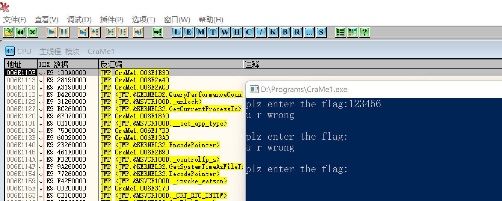
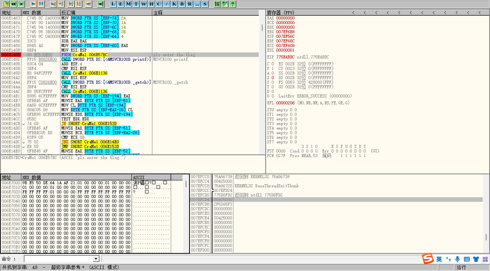
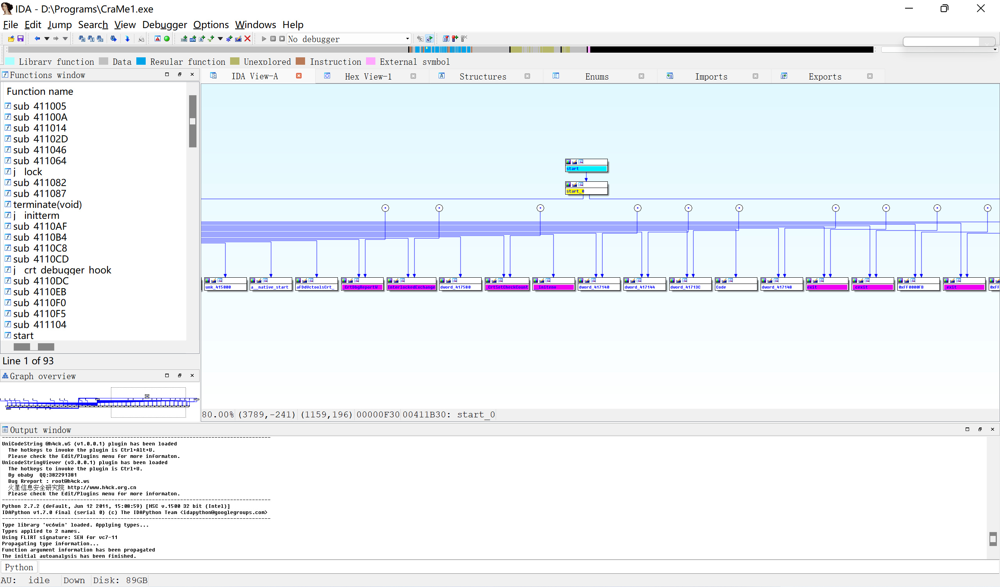
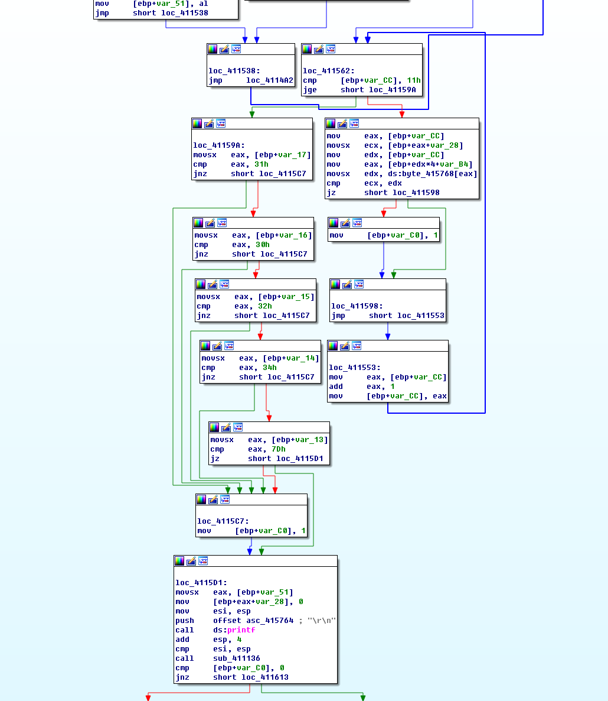
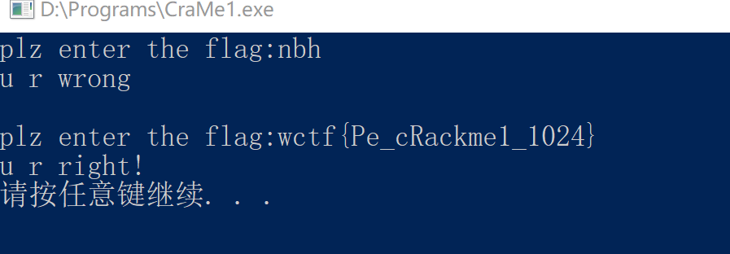
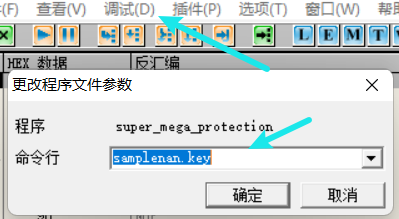
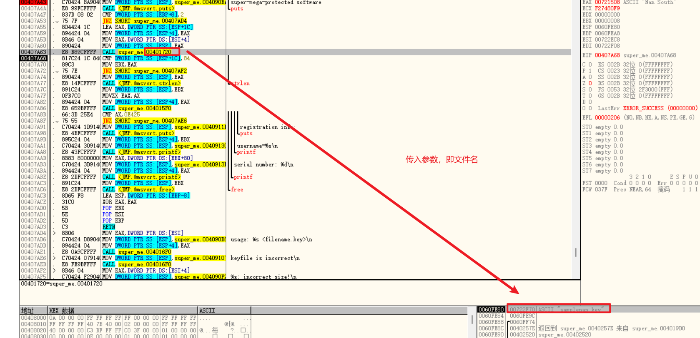
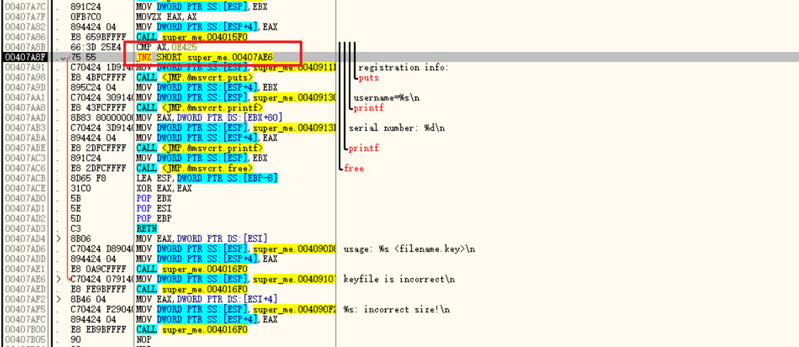
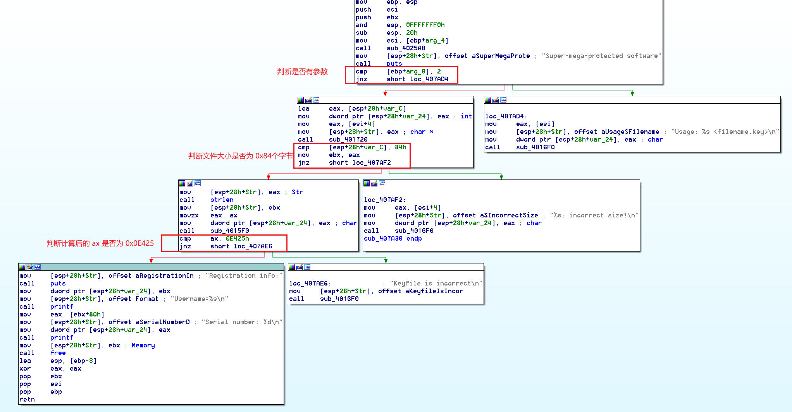

# 逆向工程 PE 逆向

## CraMe1.exe

https://github.com/SKPrimin/HomeWork/tree/main/ReverseEngineering/lab5_pe

1. 运行CraMe1.exe，提示 "u r right!" 代表成功。首先修改exe使得出现成功提示，其次不修改exe输入正确的密码达到成功的目的。

### 修改exe

既然是修改exe，那么我们首先想到的就是动态调试，也就是使用OD

##### 查找关键点

我们F9运行程序，随机输入一些东西，进而查看程序交互，显然我们可以从`plz enter the flag`和`u r wrong`两个地方作为突破口



在琳琅满目的汇编块中肉眼找出显然是大海捞针，我们可以借助插件`超级字串参考`辅助查找


显然接触自出我们找到了位置，双击进入第一个关键点`plz enter the flag`

##### 动态调试

再次我们<kbd>F2</kbd>设下断点，



随后<kbd>F8</kbd>开始逐步运行查看状态，其中我们发现下图的指令会循环几次执行，同时也会显示此前输入的内容，即这部分是接收函数，随后我们直接<kbd>Ctrl + F8</kbd>自动步过加速。


而在这里又是多次循环，我们猜测这里可能就是字符串比较，但这个次数实在太多了，根据密码加密的原则，再次猜测可能是现场计算出密码


###### 判断

而接下来便是本部分最为重要的判断部分了，可见，问题的关键就是这一条指令

```
006E15F8   /75 19           JNZ SHORT CraMe1.006E1613
```


那么我们自然可以通过修改这条指令来改变代码逻辑，

> JNE: Jump short if not equal (ZF=0)
>
> JNZ: Jump near if not zero (ZF=0)
>
> JZ:  Jump near if 0 (ZF=1)
>
> JE: Jump near if equal (ZF=1)

##### 修改程序


双击修改指令后，复制到可执行文件->保存文件


### 输入密码

显然想直接输入密码我们就要通过静态分析源代码的方式逆向分析

##### 定位字符

由于打开时映入眼帘的逻辑图过于百花齐放



我们先使用字符串定位，随后倒推流程，搜索`u r right`，找到了数据段


同时还发现了一段看似毫无规律的字符，根据程序规则，其逻辑位置在结果判断语句之前，那么密码很有可能与此相关

```
wfxc{gdv}fwfctslydRddoepsckaNDMSRITPNsmr1_=2cdsef66246087138,0
```

##### 定位代码区

根据字符串提示的地址，我们找到了代码的判断区域


在此处我们，我们再查看逻辑图，其逻辑结构清晰可见


如下是部分比较部分



通过对左半边流程的分析，我们关注 `[ebp+var_c0]`的值，就可以推测出，这是再对比几个位置的值与预留的`0x31 0x30 0x32 0x34 0x7D` 是否一致，如果有一个不一致就会直接wrong。计算得到，`var_17 16 15 14 13`依次对应`1024}`

右侧`loc_411562 `函数处，`jge:Jump short if greater or equal (SF=OF)`即，当`var_CC`大于等于`0x11 = 17`时才会跳转到后续的纯字符比较部分，即密码的长度大于17，不出以为是17+5 = 23位

##### 逆向破解

接下来我们<kbd>F4</kbd>/<kbd>F5</kbd>一键反汇编，得到了两种结果，我们选出其中最关键的前17位密码部分进行分析

```c++
int sub_4113A0()
{
  memset(&v1, 0xCCu, 0x194u);
  v33 = (unsigned int)&savedregs ^ dword_417000;
  v26 = 0;
  v4 = 1;
  v5 = 4;
  v6 = 14;
  v7 = 10;
  v8 = 5;
  v9 = 36;
  v10 = 23;
  v11 = 42;
  v12 = 13;
  v13 = 19;
  v14 = 28;
  v15 = 13;
  v16 = 27;
  v17 = 39;
  v18 = 48;
  v19 = 41;
  v20 = 42;
  v21 = 26;
  v22 = 20;
  v23 = 59;
  v24 = 4;
  v25 = 0;
  printf("plz enter the flag:");
……

  v3 = 0;
  for ( i = 0; i < 17; ++i )
  {
    if ( v27[i] != byte_415768[*(&v4 + i)] ) //byte_415768 : swfxc{gdv}fwfctslydRddoepsckaNDMSRITPNsmr1_=2cdsef66246087138  *(&v4 + i) : v4 v5 ……
      v3 = 1;
  }
  if ( v28 != 49 || v29 != 48 || v30 != 50 || v31 != 52 || v32 != 125 )
    v3 = 1;
……
  if ( v3 )
  {
    printf("u r wrong\r\n\r\n");
……
  }
  else
  {
    printf("u r right!\r\n");
……
```

##### 映射

可知，前17位的比较是先映射处vi的值，然后根据`vi`的值再次映射到byte_415768中得到字符，即这是一个双层函数，
$$
s = f(g(x))
\\
g(x) = numcode(x)
\\
f(y) = msg(y)
$$

```python
>>> msg = 'swfxc{gdv}fwfctslydRddoepsckaNDMSRITPNsmr1_=2cdsef66246087138'
numcode = [0x01, 0x04, 0x0E, 0x0A, 0x05, 0x24, 0x17, 0x2A, 0x0D, 0x13, 0x1C, 0x0D, 0x1B, 0x27, 0x30, 0x29, 0x2A, 0x1A, 0x14, 0x3B, 0x04, 0x00]
>>> ''.join([msg[numcode[i]] for i in range(17)])
'wctf{Pe_cRackme1_'
```

得到前17位 `wctf{Pe_cRackme1_`，再与此前的合并可得`wctf{Pe_cRackme1_1024}`

随即输入测试，错误；输入密码，正确！



## super_mega_protection

> Exe: super_mega_protection.exe
> Key file: sample.key
> This is a software copy protection imitation, which uses a key file. The key file contain a user (or customer) name and a serial number.
>
> 这是使用密钥文件的软件复制保护模仿。 密钥文件包含用户（或客户）名称和序列号。
>
> There are two tasks:
>
> (Easy) with the help of any debugger, force the program to accept a changed key file.
>
> 在任何调试器的帮助下，迫使程序接受更改的密钥文件。
>
> (Medium) your goal is to modify the user name to another, without patching the program.
>
> 您的目标是在不修补程序的情况下将用户名修改为另一个。

#### 测试

尝试运行程序，通过报错信息提示得知需要有`<filename.key>`文件才能正常运行，通过一番查看找到了原有的

```
./super_mega_protection.exe sample.key
```


我们打开这个神秘的`<filename.key>`，发现开始部分是用户名称`Username`，末尾有三个或是四个未知字节，可能是加密后的序列号，其余均为填充

```c
44 65 6e 6e 69 73 20 59 75 72 69 63 68 65 76 
4e 61 bc 00
```

按照小端存储原则，我们算出`0x00bc614e =  12,345,678` 正是int类型的序列号


我们先尝试做一下修改用户名，修改时保持末尾序列号的地址不变，保存为新文件`samplenan.key`


尝试运行修改后的文件，发现报错，报错信息`Keyfile is incorrect`

```bash
./super_mega_protection.exe samplenan.key
```


接着我们尝试修改序列号`1,914,007 = 0x 1D 34 97 `，修改为小端存储下的`97 34 1d 00`，此时发现能够正常打开。那么这个文件的的SN序列事实上号只是个幌子，真正的核心在用户名上


### Easy有调试修改

以上修改末尾的SN序列号时，已经实现了让程序接收修改后的文件了，接下来我们让程序接收修改用户名的情况

使用OD动态调试，设置调试时的命令行参数，使用`Username`被修改的文件`samplenan.key`



#### 定位

根据`Super-mega-protected software`的提示语，快速定位到关键点，这里我们发现可以一网打尽，所有的关键指令均在此处

在此处<kbd>f2</kbd>打下断点，随后开始逐步执行


#### 动态分析

根据这一步的调用指令可知，参数`samplenan.key`已经被传入，读取的正是用户名被修改的文件



继续运行，发现我们修改后的用户名也进入寄存器，目前暂存在BX寄存器中


继续前进，我们发现了这两条关键指令，也就是关键的跳走到提示错误的指令。其含义是将`AX`和`0E425`进行对比，`JNZ: Jump near if not zero (ZF=0)`。如果不相同便跳转。

```assembly
CMP AX,0E425
JNZ SHORT super_me.00407AE6 
```



#### 修改

这里我们又见到了老朋友 `JNZ`，最简单的方式当然是直接换成他的补集`JE`。

```assembly
CMP AX,0E425
JE SHORT super_me.00407AE6 
```

在运行前修改指令即可直接在调试中运行。


### Medium 解密

使用IDA打开进行静态反汇编，打开后依然难有头绪，我们以`Registration info:`为切入点开始按图索骥，果然将主要输出语句一网打尽


此处的逻辑也清晰可见，需要有参数，参数指出的文件大小 0x84 个字节，运算后的得到的某个数值需为 `0x0E425  = 58,405 `



#### AX与0x0E425

那么现在最关键的一步就是知晓 AX是怎么得到的，可见AX的处理就在`sub_4015F0`函数处，再附带上主函数中与调用`sub_4015F0`的部分

将读取缓冲区和由`strlen`计算的长度传递给函数`sub_407A30`。`strlen`确实只计算字符串的长度直到 0，这意味着读取缓冲区的其余部分被完全忽略。再一次，我们很容易想到不检查*SN*，只对用户名进行控制。

```c
int __cdecl sub_407A30(int a1, int a2) // 主函数
{

  puts("Super-mega-protected software");
……
  v2 = (const char *)sub_401720(*(char **)(a2 + 4), (int)&v7); // 读文件部分
  v3 = (int)v2;
……
  v4 = strlen(v2);
  if ( (unsigned __int16)sub_4015F0(v3, v4) != -7131 ) //  v3为读取到的字节流整形化的数据，v4为字节流的长度
      /* 在十六位无符号情况下 -7131 与 0x0E425  = 58,405是一致的  
      58,405 =  1110 0100 0010 0101 
       -7131 =  1110 0100 0010 0101 */
    sub_4016F0("Keyfile is incorrect\n", v6);
    
  puts("Registration info:");
  printf("Username=%s\n", v3);
  printf("Serial number: %d\n", *(_DWORD *)(v3 + 128));
……
}


int __cdecl sub_4015F0(int a1, __int16 a2)
{
  result = 0;
  v3 = a1;
  if ( a2 )
  {
    v4 = 0xFFFF;
    do
    {
      v5 = *(_BYTE *)(++v3 - 1);
      v6 = v4;
      v7 = v4 >> 1;
      v8 = v7 ^ 0x8408;
      if ( !(((unsigned __int8)v5 ^ v6) & 1) )
        v8 = v7;
        
      v9 = v8 ^ (*(_BYTE *)(v3 - 1) >> 1);
      v10 = v8 >> 1;
      v11 = v10 ^ 0x8408;
      if ( !(v9 & 1) )
        v11 = v10;
      v12 = v11 >> 1;
        
      v13 = v11 ^ (*(_BYTE *)(v3 - 1) >> 2);
      v14 = (v11 >> 1) ^ 0x8408;
      if ( !(v13 & 1) )
        v14 = v12;
      v15 = v14 >> 1;
        
      v16 = v14 ^ (*(_BYTE *)(v3 - 1) >> 3);
      v17 = (v14 >> 1) ^ 0x8408;
      if ( !(v16 & 1) )
        v17 = v15;
      v18 = v17 >> 1;
        
      v19 = v17 ^ (*(_BYTE *)(v3 - 1) >> 4);
      v20 = (v17 >> 1) ^ 0x8408;
      if ( !(v19 & 1) )
        v20 = v18;
      v21 = v20 >> 1;
        
      v22 = v20 ^ (*(_BYTE *)(v3 - 1) >> 5);
      v23 = (v20 >> 1) ^ 0x8408;
      if ( !(v22 & 1) )
        v23 = v21;
      v24 = v23 >> 1;
        
      v25 = v23 ^ (*(_BYTE *)(v3 - 1) >> 6);
      v26 = (v23 >> 1) ^ 0x8408;
      if ( !(v25 & 1) )
        v26 = v24;
      v27 = v26 >> 1;
        
      v28 = v26 ^ (v5 >> 7);
      v4 = (v26 >> 1) ^ 0x8408;
      if ( !(v28 & 1) )
        v4 = v27;
    }
    while ( v3 != a1 + (unsigned __int16)(a2 - 1) + 1 );
    v29 = ~v4;
    result = (v29 << 8) | BYTE1(v29);
  }
  return result;
}
```

计算函数看似很复杂，实际上核心步骤如下

#### 算法重现

由于python无法指定数据类型，故需要通过`& 0xFFFFFFFF`的方式实现32位

编写脚本

```python
import random
import string

NameBefore = "Nan South_"


def GetNextName():
    """生成随机字符串"""
    nums = random.randint(3, 5)
    ranStr = ''.join([random.choice(
        string.ascii_letters + string.digits + string.punctuation) for n in range(nums)])

    return NameBefore + ranStr


def HashIt(Name):
    """运算"""
    edx = 0x0000ffff

    for ch in Name:
        ch = ord(ch) & 0xFFFFFFFF
        eax = ch
        edi = edx
        edx = edx >> 1
        esi = edx
        esi = (esi ^ 0x8408) & 0xFFFFFFFF

        if ((edi ^ ch) & 1) == 0:
            esi = edx

        edi = ch
        edi = edi >> 1
        edi = (edi ^ esi) & 0xFFFFFFFF
        esi = esi >> 1

        edx = esi

        edx = (edx ^ 0x8408) & 0xFFFFFFFF
        if (edi & 1) == 0:
            edx = esi

        edi & 1

        for x in range(2, 7):
            esi = ch
            edi = edx
            edi = edi >> 1
            esi = esi >> x

            esi = (esi ^ edx) & 0xFFFFFFFF
            edx = edi
            edx = (edx ^ 0x8408) & 0xFFFFFFFF

            if (esi & 1) == 0:
                edx = edi
            esi & 1

        esi = edx
        esi = esi >> 1
        eax = eax >> 7
        eax = (eax ^ edx) & 0xFFFFFFFF
        edx = esi
        edx = (edx ^ 0x8408) & 0xFFFFFFFF

        al = eax & 0xFF
        if ((al & 1) == 0):
            edx = esi

    edx = (~edx) & 0xFFFFFFFF

    code = (edx >> 8) & 0x000000FF
    code = code << 8
    code = code | edx

    code = code & 0x0000FFFF

    return ((code << 8) | (code >> 8)) & 0x0000FFFF


findNum = 10
while (True):
    Namex = GetNextName()
    if (HashIt(Namex) == 0xe425):
        print("Found a name: ")
        print(Namex)
        print("\n")
        findNum -= 1
        if (findNum == 0):
            break

```


#### 运行

修改文件内容


运行成功，在不修补程序的情况下将用户名修改为另一个。


此时，一位经验丰富有的逆向er可能已经意识到这个算法实际上是`CRC16/X-25`模型。

验证`CRC16-X-25("Dennis Yurichev") = 0x25E4`（小端存储，因此`0xe425`）。


## LEC

### 汇编分析


1. 阅读
   https://en.wikipedia.org/wiki/X86_calling_conventions
   然后回答2个问题：
   What does this code do?

The function has 4 arguments and it is compiled by GCC for Linux x64 ABI (i.e., arguments are passed in registers).

```assembly
<f>:
   0:                   mov    r8,rdi
   3:                   push   rbx
   4:                   mov    rdi,rsi
   7:                   mov    rbx,rdx
   a:                   mov    rsi,r8 ;一翻乾坤大挪移
   d:                   xor    rdx,rdx  ;rdx清0

begin:
  10:                   lods   rax,QWORD PTR ds:[rsi] ;从串取指令,从ds:si取出一个字 寄给ax
  12:                   div    rbx ;除法 被除数 bx
  15:                   stos   QWORD PTR es:[rdi],rax ; 商寄存在ax,保存在es:[rdi]中
  17:                   loop   begin ;cx--  cx不为零时循环 控制循环次数
  19:                   pop    rbx ; bx值出栈
  1a:                   mov    rax,rdx
  1d:                   ret
```

通过分析，既然这有四个参数，可对应，必然有两个是数组指针，分别用于取数存结果。这是一个除法功能，bx为被除数，cx为循环次数哦即数组的执行长度。

What does this code do? 

Non-optimizing GCC 4.8.2:

```assembly
<f>:
   0:             push   rbp
   1:             mov    rbp,rsp
   4:             mov    QWORD PTR [rbp-0x8],rdi
   8:             mov    QWORD PTR [rbp-0x10],rsi
   c:             mov    rax,QWORD PTR [rbp-0x8]
  10:             movzx  eax,BYTE PTR [rax]  ; 地址ds[ax]上的一个字节无符号扩展送到eax
  13:             movsx  dx,al				 ; al有符号扩展到dx
  17:             mov    rax,QWORD PTR [rbp-0x10]
  1b:             mov    WORD PTR [rax],dx
  1e:             mov    rax,QWORD PTR [rbp-0x10] ;ds[bp-0x10]的数据送到ax
  22:             movzx  eax,WORD PTR [rax]       ;ds[ax]的字无符号扩展送到eax
  25:             test   ax,ax    ;ax与ax进行与操作，不改变ax
  28:             jne    2c       ;ax不为0就跳到2c,即下列两处无需再加1
  2a:             jmp    38 
  2c:             add    QWORD PTR [rbp-0x8],0x1
  31:             add    QWORD PTR [rbp-0x10],0x2
  36:             jmp    c 
  38:             pop    rbp
  39:             ret
```

将一个无符号数数组按有符号数扩展后存入另一个数组。

### LINUX的crackme


2. 阅读 LINUX的crackme的逆向小记
   https://bbs.pediy.com/thread-11315.htm

这是一个简易的Linux逆向，这是一个简易的Linux逆向作者，在2005年便完成仅用Linux上的gdb等基础的反汇编工具，便完成了一个注册机的破解，作者并没有当今高效的Ida及反汇编插件，仅通过查看汇编指令便抽丝剥茧，找到了关键的函数，用近乎手工的方式修改了程序执行逻辑


### IOS & Android

3. 阅读
   https://blog.csdn.net/ir0nf1st/article/details/67799899
   https://www.cnblogs.com/LittleHann/p/3374206.html

这是一个iOS逆向，作者几乎从零开始教我们认识iOS文件的结构，逐步查看iOS文件的各种头部信息，进而开始反汇编并阅读代码，更是解析了动态链接地址等复杂的过程，作者最终分析出了函数的原型在一步步的分析出了函数的内容。
本篇文章作者创作了一个安卓上的注册机，由于是安卓代码做着很轻松的获得到了其中的JAVA源代码，开始逐步进行分析，对每一个关键的类进行分析，随后找到了破解的关键所在，作者甚至写出了一个注册机，够成功帮助我们获得签名注册码，从而破解软件。


## RSA-Attack


1. (2选1，原理一样的)MTC3 Broadcasting and low exponent — RSA-Attack
   https://www.mysterytwisterc3.org/en/challenges/level-2/broadcasting-and-low-exponent--rsa-attack
2. Alice's Birthday Party (Part 2)
   https://www.mysterytwisterc3.org/en/challenges/level-2/alices-birthday-party-part-2

hint：
中国剩余定理 
https://www.di-mgt.com.au/bigdigits.html


果断选择第二个

> 
>
> - Alice从去年的错误中吸取了教训，不再向使用相同RSA模数N的收件人发送加密电子邮件。
> - 今年，她邀请她的朋友鲍勃、伯莎和伯蒂参加她的生日聚会。
> - 因此，Alice将相同的消息发送给她的三个朋友，并使用他们各自的公共RSA密钥进行加密。
> - 伊芙能否再次解密密文，从而确定聚会的时间和地点？
>
> 
>
> 加密方法
> •Bob、Bertha和Birte的公钥为（N1，e1）、（N2，e2）和（N3，e3），可在Mystery Twister网站上下载。
> •明文的编码方法与前一年相同，即应用base64编码，然后使用字符的ASCII码作为整数的十六进制表示。
>
> ```python
> N1=
> 514745167025222387434132377137056715954750729807151447929894289695587285793889099978536904494455862473045694392353612260528582074521711735864082380505874261026769465596315849668245703081452047808798727647904141791488099702631575692170683102622471798376397440600292225038412176681344166204027842724877162681931
> N2=
> 332459552799915544356022641605448137617079921391832222557892949808060953028449422328281413629912335051440744955455010851012308918294549765005480121061697711447087615327860789708246235156912421474047484838827777697938563515420810650393553528058831317409340577149233554235346445890238642955390137465511286414033
> N3=
> 665701912162243069059653781669230805473457427767514323262762891771122352328706695409103713864384833437438648120217615990765220365745013739246022203593234785338178963805463643869398986119431772931646042972240277833431035018628949924813463553419243108837309078316455504749755062865258063926243606206806549969161
> 
> e=3
> 
> c1=
> 159610386572167689266326385036487109027500941380400104125191262882664358398577536610497671009102596940624920315091422093100238619835848693651492344785000232303139338861093680138737091249739575100655219967271819921458016154329847843423233652818852580016834561970850695063090000199448970052668647861992230109134
> c2=
> 80704323590708576386562863656130406931573788060159775931074197125212042930440694778363300836637666152530601069635539711403775897104413839059003511049631024172974390473641408894970527777947213128650545118958630567223577806350516381008539951304600069024003674444114727988917350720932569342357635015732615468372
> c3=
> 290728542387622789691059470283422806073663108257730190721270583629901119139049111765276898786687400514004023098315787810926656039376046957101984075353288285867739293190825676944209163087896697394093577432590616749562076462942759742984949258019827469729922204479107792698042941392668070743176808454529741938138
> ```

根据RSA运算规则
$$
ed=1\modϕ(n)
\\
M=C_1^{d_1}\mod N_1
\\
M=C_2^{d_2}\mod N_2
\\
M=C_3^{d_3}\mod N_3
$$
根据中国剩余定理得知
$$
N = \prod^n_{i=1} N_i
\\
M \equiv \sum^n_{i=1} C^{d_i}_i \times \frac{N}{n_i} \times 	\left( {\frac{N}{n_i}} \right)^{-1}
$$

```python
import gmpy2
from functools import reduce
import base64

N1 = ……
N2 = ……
N3 = ……

e = 3

c1 = ……
c2 = ……
c3 = ……

def CRT(items):
    N = reduce(lambda x, y: x * y, (i[1] for i in items))
    result = 0
    for a, n in items:
        m = N // n
        d, r, s = gmpy2.gcdext(n, m)
        result += a * s * m
    return result % N, N


# n, c
n = [N1, N2, N3]
c = [c1, c2, c3]
data = list(zip(c, n))
x, n = CRT(data)
m = gmpy2.iroot(gmpy2.mpz(x), e)[0].digits()
mh = str(hex(int(m)))
print('M is: ' + mh)
ms = ''.join([chr(int(mh[2 * i:2 * i + 2], 16)) for i in range(1, len(mh) >> 1)])
print(ms)
print(base64.b64decode(ms))
```

解密得到


解密得到明文：

Einladung zu meiner Geburtstagsparty. Die Party findet am 20.12.2012 in Bletchley statt.

这个网站时德国人做的，明文也是德语，翻译为：邀请我的生日聚会。 该聚会将于2012年12月20日在Bletchley举行。