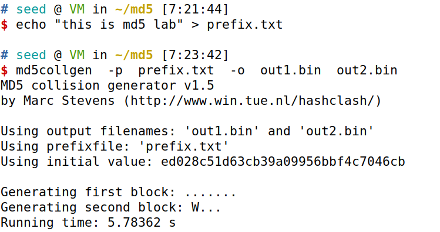
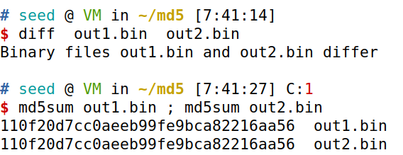
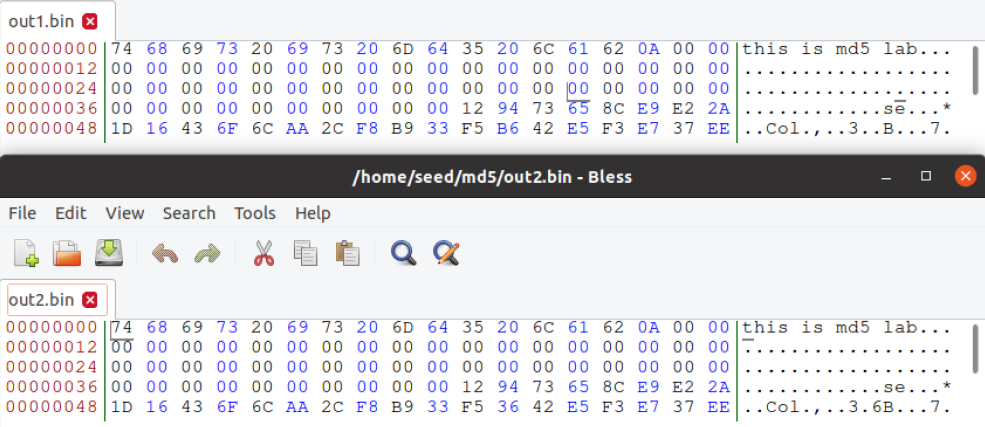
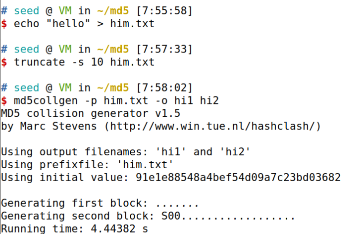
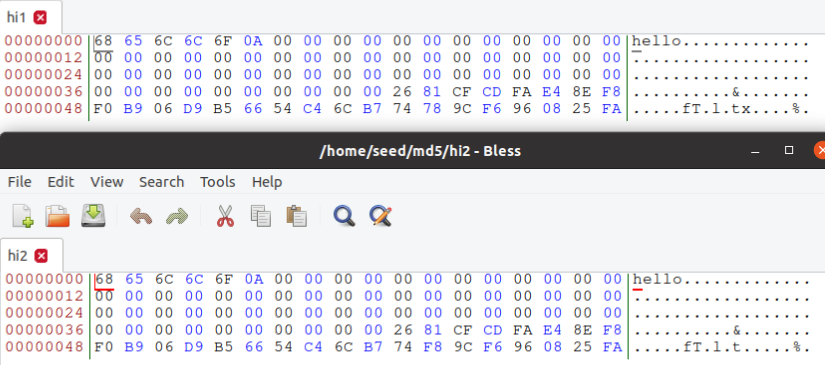
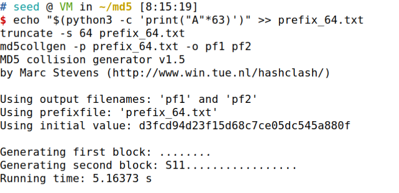
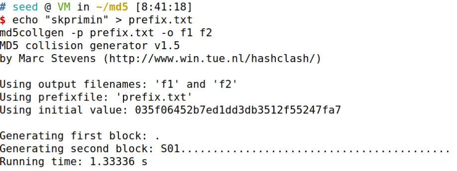
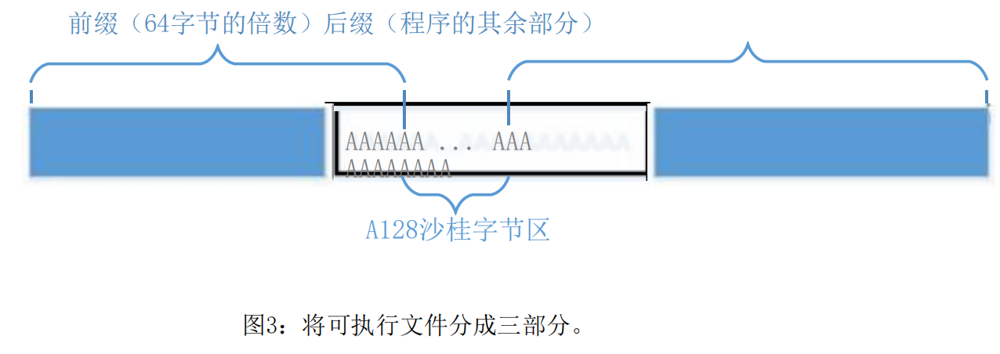

# MD5 Collision Attack

## 简介

一个安全的单向哈希函数需要满足两个特性：单向特性和抗碰撞特性。单向属性确保给定一个哈希值h，找到一个输入M在计算上是不可行的，这样的哈希(M)=h。抗碰撞特性保证了找到两个不同的输入在计算上是不可行的M1和M2，从而生成hash(M1) = hash(M2)。 

一些广泛使用的单向哈希函数很难保持抗碰撞性能。在2004年的加密货币的会议上，王晓云和合著者展示了对MD5的碰撞攻击。2017年2月，CWI阿姆斯特丹和谷歌研究公司宣布了冲击攻击， 打破了SHA1的抗碰撞特性。虽然许多学生在理解单向属性的重要性方面没有什么困难，但他们不容易理解为什么抗碰撞特性是必要的，以及这些攻击会造成什么影响。 

本实验室的学习目标是让学生真正了解碰撞攻击的影响，并亲眼所见，如果一个广泛使用的单向哈希函数的抗碰撞特性被破坏，会造成什么损害。为了实现这个目标，学生需要对MD5哈希函数发起实际的碰撞攻击。使用这些攻击，学生应该能够创建两个不同的程序，共享相同的MD5散列，但有完全不同的行为。本实验室涵盖了以下所描述的一些主题： 

- 单向哈希函数，MD5
- 抗碰撞性能
- 沙痂碰撞袭击 

**环境**：实验室使用了一个名为“Fast MD5 Collision Generation”的工具，这是由马克·史蒂文斯编写的。二进制文件的名称在虚拟机中称为md5colgen，它安装在/usr/bin文件夹中。如果它不在那里，你可以从实验室的网站 

上下载它(在Labsetup.zip)。如果您有兴趣将该工具安装到您自己的机器上，您可以直接从https://www.win.tue.nl/hashclash/下载。

### 任务1:使用相同的MD5散列生成两个不同的文件

> 在此任务中，我们将生成具有相同MD5哈希值的两个不同文件。这两个文件的开头部分需要是相同的， 即，它们共享相同的prefix。我们可以使用md5colgen程序来实现这一点，它允许我们提供任何任意内容的prefix文件。该程序的工作方式如图1所示。下面的命令对于一个给定的文件prefix.txt生成两个输出文件 out1.bin 和 out2.bin，先创建文件：
>
> ```bash
> md5collgen  -p  prefix.txt  -o  out1.bin  out2.bin
> ```
>
> 

```bash
echo "this is md5 lab" > prefix.txt

md5collgen  -p  prefix.txt  -o  out1.bin  out2.bin
```



> 我们可以使用diff命令来检查输出文件是否不同。我们还可以使用md5sum命令来检查每个输出文件的MD5哈希，请参阅以下命令。
>
> ```bash
> diff  out1.bin  out2.bin
> md5sum  out1.bin
> md5sum  out2.bin
> ```



可见两个输出文件相同

> 自1。箱和出2。bin是二进制的，我们不能使用cat之类的文本查看器程序来查看它们；我们需要使用二进制编辑器来查看（和编辑）它们。我们已经在虚拟机中安装了一个名为bless 的十六进制编辑器软件。请使用这样的编辑器来查看这两个输出文件，并描述您的观察结果。



这两个bin文件

> 此外， 您还应回答以下问题：
>
> 1. Q1:如果prefix文件的长度不是64的倍数，那么会发生什么呢？ 

它将用零填充。

先创建了一个文件`him.txt`

```bash
echo "hello" > him.txt
```

并使用

```bash
truncate -s 10 him.txt
```

截断它，取前十个字符，不足的填充0。 运行

```bash
md5collgen -p him.txt -o hi1 hi2
```



查看结果使用

```bash
bless hi1
```

我们可以看到前64个（十六进制的40）已填充零。 这是因为MD5处理大小64字节的块。



> 2. 创建一个恰好为64字节的文件，然后再次运行碰撞工具，看看会发生什么。 

前64个没有观察到零填充，但会填充接下来的 64 字节，即从字节偏移 40 到 7F。

向文件中输入63个字符，带上本来的结束符刚好64个，为了确保万无一失，可以使用truncate截取，前提是你的字符数超过64个，否则truncate也会自动填充0，造成干扰。生成文件

```bash
echo "$(python3 -c 'print("A"*63)')" >> prefix_64.txt
truncate -s 64 prefix_64.txt
md5collgen -p prefix_64.txt -o pf1 pf2
```



命令，查看输出信息bless pf1 pf2


> 3. md5colgen为这两个输出文件生成的数据（128字节）是否完全不同？请识别所有不同的字 
>
> 节。

不，不是所有字节都不同。 在上一次情况下，字节仅在个别位置处不同。在多次试验之后，发现这些差异的地方不是固定的。


### 任务2:了解MD5的属性

> 在这个任务中，我们将尝试理解MD5算法的一些特性。这些特性对我们在这个实验室进行进一步的任务很重要。
>
> MD5是一个相当复杂的算法，但从非常高的层面，它不是那么复杂。如图2所示，MD5将输入数据划分为64个字节的块，然后在这些块上迭代计算散列。MD5算法的核心是一个压缩函数，它接受两个输入，一个64字节的数据块和前一次迭代的结果。压缩函数产生一个128位的IHV，它代表“中级哈希值”(Intermediate Hash Value)；然后将此输出输入到下一个迭代中。如果当前的迭代是最后一个迭代，则IHV将是最终的哈希值。第一次迭代的IHV输入(IHV0)是一个固定的值。 


> 基于 MD5 算法的工作原理，我们可以推导出一个属性： - 给定两个输入`M`，`N`如果`MD5(M) = MD5(N)`，那么对于任何输入`T`，`MD5(M || T) = MD5(N || T)`。因此，将特定的suffix添加到具有相同 MD5 散列的任何两个不同消息中，通过连接原始消息和suffix消息，得到两个新的更长消息，这两个消息也具有相同的 MD5 散列。
>
> 也就是说，如果输入m和n具有相同的哈希，则将相同的suffix添加到它们将导致两个具有相同哈希值的输出。 此属性不仅适用于MD5哈希算法，还适用于许多其他哈希算法。 您在此任务中的工作是设计实验，以证明这一属性持有MD5。
>
> 您可以使用cat命令将两个文件（二进制文件或文本文件）连接为一个文件
>
> ```bash
> cat  file1  file2  >  file3
> ```

向文件写入信息，并生成两份文件

```bash
echo "skprimin" > prefix.txt
md5collgen -p prefix.txt -o f1 f2
```



创建suffix，并添加

```bash
echo "btfjade" > suffix

cat f1 suffix > fs1
cat f2 suffix > fs2
```


比较

```bash
md5sum f1 ; md5sum f2 ; md5sum fs1 ; md5sum fs2;
```


我们可以看到MD5哈希值保持相同。

### 任务3:生成使用相同的MD5散列生成两个可执行文件

> 在此任务中，您将得到以下C程序。您的工作是创建这个程序的两个不同版本，这样它们的xyz数组的内容就不同了，但可执行文件的哈希值是相同的。

数组我们只用a填充数组内容。这使得在编译后很容易在可执行文件中发现数组的位置。要打印 200 `A`，我们可以使用 python 

```python
python3 -c "print('\'A\', '*200)"


或

python3 -c "print('\''+'\',\''.join(x for x in ['A']*200)+'\'')"
```

```c
#include <stdio.h>
unsigned char xyz[200] = {
    /*此数组的实际内容取决于您 */
    'A', 'A', 'A', 'A', 'A', 'A', 'A', 'A', 'A', 'A', 'A', 'A', 'A', 'A', 'A', 'A', 'A', 'A', 'A', 'A', 'A', 'A', 'A', 'A', 'A', 'A', 'A', 'A', 'A', 'A', 'A', 'A', 'A', 'A', 'A', 'A', 'A', 'A', 'A', 'A', 'A', 'A', 'A', 'A', 'A', 'A', 'A', 'A', 'A', 'A', 'A', 'A', 'A', 'A', 'A', 'A', 'A', 'A', 'A', 'A', 'A', 'A', 'A', 'A', 'A', 'A', 'A', 'A', 'A', 'A', 'A', 'A', 'A', 'A', 'A', 'A', 'A', 'A', 'A', 'A', 'A', 'A', 'A', 'A', 'A', 'A', 'A', 'A', 'A', 'A', 'A', 'A', 'A', 'A', 'A', 'A', 'A', 'A', 'A', 'A', 'A', 'A', 'A', 'A', 'A', 'A', 'A', 'A', 'A', 'A', 'A', 'A', 'A', 'A', 'A', 'A', 'A', 'A', 'A', 'A', 'A', 'A', 'A', 'A', 'A', 'A', 'A', 'A', 'A', 'A', 'A', 'A', 'A', 'A', 'A', 'A', 'A', 'A', 'A', 'A', 'A', 'A', 'A', 'A', 'A', 'A', 'A', 'A', 'A', 'A', 'A', 'A', 'A', 'A', 'A', 'A', 'A', 'A', 'A', 'A', 'A', 'A', 'A', 'A', 'A', 'A', 'A', 'A', 'A', 'A', 'A', 'A', 'A', 'A', 'A', 'A', 'A', 'A', 'A', 'A', 'A', 'A', 'A', 'A', 'A', 'A', 'A', 'A', 'A', 'A', 'A', 'A', 'A', 'A', 'A', 'A', 'A', 'A', 'A', 'A'};
int main()
{
    int i;
    for (i = 0; i < 200; i++)
    {
        printf("%x", xyz[i]);
    }
    printf("\n");
}
```

> 您可以选择在源代码级别工作，即生成上述C程序的两个版本，这样在编译后，它们对应的可执行文件具有相同的MD5哈希值。然而，直接在二进制级别上工作可能更容易。您可以在xyz数组中放一些 
>
> 任意的值，将上面的代码编译为二进制代码。然后，您可以使用十六进制编辑器工具直接在二进制文件中修改xyz数组的内容。
>
> 查找数组的内容存储在二进制文件中的位置并不容易。但是，如果我们用一些固定的值来填充数组，我们可以很容易地在二进制文件中找到它们。例如，下面的代码用0x41填充数组，这是字母A的ASCII值。在二进制文件中找到200个a并不难。
>
> **指南**：在数组内部，我们可以找到两个位置，在那里我们可以将可执行文件分为三个部分：一个prefix、一个128字节的区域和一个suffix。该prefix的长度需要是64个字节的倍数。有关该文件的分割方式的说明，请参见图3。



> 我们可以在prefix上运行md5colgen来生成两个具有相同MD5哈希值的输出。让我们使用P和Q来表示这些输出的第二部分（每个部分有128个字节）（即，prefix后面的部分）。因此，我们有以下内容：
>
> ```bash
> MD5 (prefix k P) = MD5 (prefix k Q)
> ```
>
> 基于MD5的属性，我们知道，如果我们在上面的两个输出中附加相同的suffix，所得到的数据也将具有相同的哈希值。基本上，以下内容对任何suffix都适用：
>
> ```bash
> MD5 (prefix k P k suffix) = MD5 (prefix k Q k suffix)
> ```
>
> 因此，我们只需要使用P和Q来替换数组的128个字节（在两个分法点之间），并且我们将能够创建两个具有相同哈希值的二进制程序。它们的结果是不同的，因为它们每个人都打印出自己的数组，其中有不同的内容。
>
> **工具**：您可以使用bless来查看二进制可执行文件，并找到数组的位置。对于分割一个二进制文件，我们可以使用一些工具来从一个特定的位置分割一个文件。头部和尾部的命令就是如此有用的工具。你可以看看他们的手册来学习如何使用它们。我们给出以下三个例子：
>
> ```bash
> head -c 3200 a.out > prefix
> tail -c 100 a.out > suffix
> tail -c +3300 a.out > suffix
> ```
>
> 上面的第一个命令保存了a.out的第3200字节到prefix。 第二个命令将最后100个字节保存到suffix。 第三个命令将3300个字节的数据保存a.out 的结尾到suffix。 通过这两个命令，我们可以将二进制文件划分为从任何位置的碎片。 如果我们需要一起粘合某些作品，我们可以使用CAT命令。
>
> 如果您使用Wells将数据块从一个二进制文件复制到另一个二进制文件到另一个文件中，请菜单项“编辑 - >选择范围”非常方便，因为您可以使用起始点和a选择一块数据块 范围，而不是手动计算选择了多少字节。

编译

```bash
gcc t3.c -o a.out
```

4224是64的倍数

```bash
head -c 4224 a.out > prefix
md5collgen -p prefix -o a b
```


保留原始二进制文件中 10FF 之后的字节作为suffix 

```bash
tail -c +4353 a.out > suffix
```

再创建两个二进制文件，将suffix写进到两个单独的文件

```bash
cat a suffix > m
cat b suffix > n
```


赋权执行

```bash
chmod 4755 m
chmod 4755 n

echo $(./m) | md5sum
echo $(./n) | md5sum
```


### 任务4：使两个程序表现不同

> 在以前的任务中，我们已成功创建了两个具有相同MD5哈希的程序，但其行为是不同的。但是，它们的差异仅在他们打印出的数据中;它们仍然执行相同的指令序列。在这项任务中，我们希望实现更具意义和更有意义的东西。
>
> 假设您已创建一个软件，这些软件是好事。您将软件发送到可信任的权限以获得认证。该权限对您的软件进行了全面的测试，并得出结论，您的软件确实做得很好。权威将向您展示您的证明，指出您的计划是好的。为了防止您在获得证书后更改程序，您的程序的MD5哈希值也包含在证书中;证书由权限签署，因此您无法在证书或您的程序上更改任何内容，而不会呈现签名无效。
>
> 您想通过管理权限获得您的恶意软件，但如果您只需将恶意软件发送到权限，因此您有零机会实现这一目标。但是，您注意到该权限使用MD5来生成散列值。你有一个想法。您计划准备两个不同的程序。一个程序将始终执行良好的指令并做好事，而其他程序将执行恶意指令并导致损坏。您可以获得这两个程序以共享相同的MD5哈希值。
> 然后，您将良性版本发送给证书的权限。由于此版本做得好，它将通过证书，并且您将获得包含良性计划的哈希值的证书。由于您的恶意程序具有相同的哈希值，因此该证书对您的恶意计划也有效。因此，您已成功获得了对恶意计划的有效证明。如果其他人相信当局发出的证书，他们将下载您的恶意计划。
>
> 此任务的目的是启动上述攻击。即，您需要创建两个共享相同MD5哈希的程序。但是，一个程序将始终执行良性说明，而其他程序将执行恶意指令。在您的工作中，执行良性/恶意指示并不重要;它表明这两个程序执行的指令是不同的。
>
> **指导方针**。创建两个完全不同的程序，产生相同的MD5哈希值非常硬。 MD5CollGen产生的两个哈希碰撞程序需要共享相同的预先预定X;此外，正如我们从上一个任务中看到的那样，如果我们需要将一些有意义的SUF X添加到MD5CollGen产生的输出，则添加到两个程序的SUF X也需要相同。这些是我们使用的MD5碰撞生成程序的局限性。虽然还有其他更复杂和更高级的工具，可以提升一些限制，例如接受两个不同的预先xes ，它们需要更多的计算能力，因此它们超出了此实验室的范围。我们需要在限制内生成两个不同的程序。
>
> 有很多方法可以实现上述目标。我们提供一种方法作为参考，但鼓励学生提出自己的想法。教师可以考虑获得自己的想法的奖励学生。在我们的方法中，我们创建了两个阵列X和Y.我们比较这两个阵列的内容;如果他们是相同的，良性代码被执行;否则，执行恶意代码。请参阅以下伪代码：

```c
Array  X;
Array  Y;
main()
{
    if(X’s  contents  and  Y’s  contents  are  the  same)
    	run  benign  code;
    else
    	run  malicious  code;
    return;
}
```

> 我们可以使用一些值初始化阵列x和y，这些值可以帮助我们在exe可变的二进制文件中找到他们的位置。 我们的工作是更改这两个阵列的内容，因此我们可以生成具有相同MD5哈希的两个不同的版本。 在一个版本中，x和y的内容相同，因此执行良性代码; 在其他版本中，x和y的内容是不同的，因此执行恶意代码。 我们可以使用类似于任务3中使用的技术来实现这一目标。图4illustLate程序的两个版本看起来像什么。


<center>图4一种具有不同行为的两个哈希碰撞程序的方法</center>

> 从图4中，我们知道这两个二进制文件具有相同的MD5哈希值，只要P和Q被相应地生成。在第一个版本中，我们使数组X和Y的内容相同，而在第二个版本中，我们使它们的内容不同。因此，我们唯一需要改变的是这两个数组的内容，并且不需要改变程序的逻辑。

