# Heartbleed

<p style="color:r">小组成员：蓝晓航，张丞，张婷，韦萌</p>

Heartbleed Bug（CVE-2014-0160）是OpenSSL库中的一个严重实现的缺陷，它可以从受害者服务器的内存中窃取数据。 被盗数据的内容取决于服务器内存中的内容。 它可能包含私钥，TLS会话键，用户名，密码，信用卡等。该漏洞是在心跳协议的实现中，由SSL/TLS使用以保持连接。

- TLS / SSL协议在两个通信应用程序之间提供安全通道，TLS / SSL广泛使用
- 心跳扩展：实施TLS的保存功能
- Heartbleed Bug是TLS / SSL心跳扩展中的实施缺陷

OpenSSL是TLS / SSL协议的商业级工具包


这个实验室的目标是让学生了解这种漏洞的严重程度，攻击如何运作，以及如何解决问题。 受影响的OpenSSL版本范围为`1.0.1`至`1.0.1f`。 这我们Ubuntu VM中的版本为1.0.1。

- 了解对openssl脆弱性的智慧攻击
- 启动Heartbleed攻击并研究其对HTTPS服务器的潜在影响。

### 环境配置

在此实验室中，我们需要设置两个VM：一个名为攻击者机器和另一个名为受害者服务器的VM。我们使用预先构建的Seedubuntu12.04 VM。 VM需要使用NAT网络适配器进行网络设置。这可以通过进入VM设置，拣选网络，然后单击适配器标记来完成，以将适配器切换到NAT网络。确保两个VM都位于同一NAT网络上。

此次攻击中使用的网站可以是使用SSL/TLS的任何HTTPS网站。但是，由于攻击真实网站是违法的，我们已经在VM中设置了一个网站，并对我们自己的VM进行攻击。我们使用名为elgg的开源社交网络应用程序，并在以下URL中托管它：https://www.heartbleedlabelgg.com。
我们需要修改攻击机上的/etc/hosts 文件，以将服务器名称映射到服务器VM的IPad-ad。在/etc/hosts中搜索以下行，并使用托管elgg应用程序的服务器VM的实际IP地址替换IP地址127.0.0.1。
127.0.0.1 www.heartbleedlabelg.com 

在这里我们为了方便，使用同一个VM，既是受害机又是攻击机

查看VM的ip地址


在攻击机上配置hosts文件

```bash
sudo vim /etc/hosts
```


修改内容

```bash
192.168.136.130 www.heartbleedlabelg.com 
```


随后访问网址www.heartbleedlabelg.com 

需要将连接设置为可信任

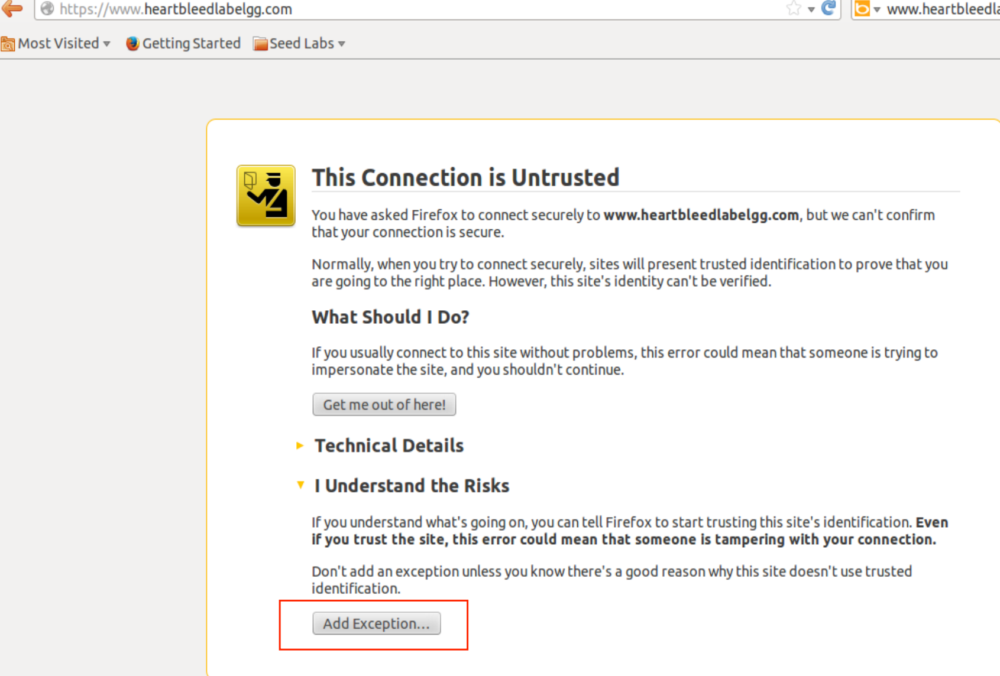

随后访问成功

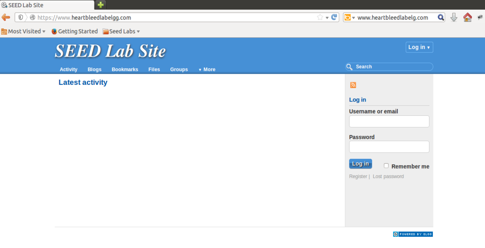

#  Lab Tasks

在处理实验室任务之前，您需要了解心跳协议的工作原理。 心跳协议由两种消息类型组成：HeartBeaTrequest数据包和HeartBreadonse数据包。 客户端向服务器发送HeartBeaTrequest数据包。 当服务器收到它时，它会在HeartBeaTresponse数据包中发送回副本。 目标是保持联系。 该协议在图1中示出。

> 许多安全的Web服务器建立在OpenSSL之上。
> 当客户端和服务器未在一段时间内彼此发送数据时，两者或防火墙之间可以打破信道。
>
> - 协议：
>
>   - 发件人向接收器发送心跳数据包。
>
>   - 在数据包内部有有效负载，有效载荷长度字段。 （有效载荷的实际内容并不重要）
>
>   - 接收器构造响应分组，并应根据请求携带相同的有效载荷数据。
>
> - 当接收器获取心跳请求时，它从报文中检索有效载荷长度值（n），从请求包中的有效载荷字段的开头开始将n个字节的数据复制到响应数据包。


## 任务1：启动心脏出血攻击

> 在这项任务中，学生将在我们的社交网站上推出智慧攻击，看看可以实现什么样的损害。 智慧攻击的实际损坏取决于服务器内存中存储的信息。 如果服务器上没有太多活动，则无法窃取有用的数据。  因此，我们需要与Web服务器互动为合法用户。在管理员模式这样做，并执行以下操作：
>
> - 从浏览器访问https://www.heartbleedlabelgg.com
> - 以站点管理员身份登录。 （用户名：admin;密码：seedelgg）
>

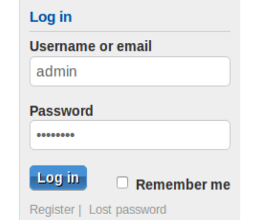

> - 将Boby添加为朋友。 （转到`More -> Members`，然后单击`Boby -> Add Friend`）

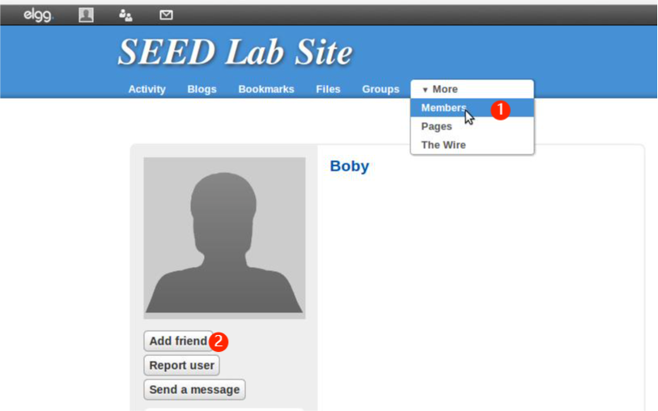

> - 发送Boby私信。

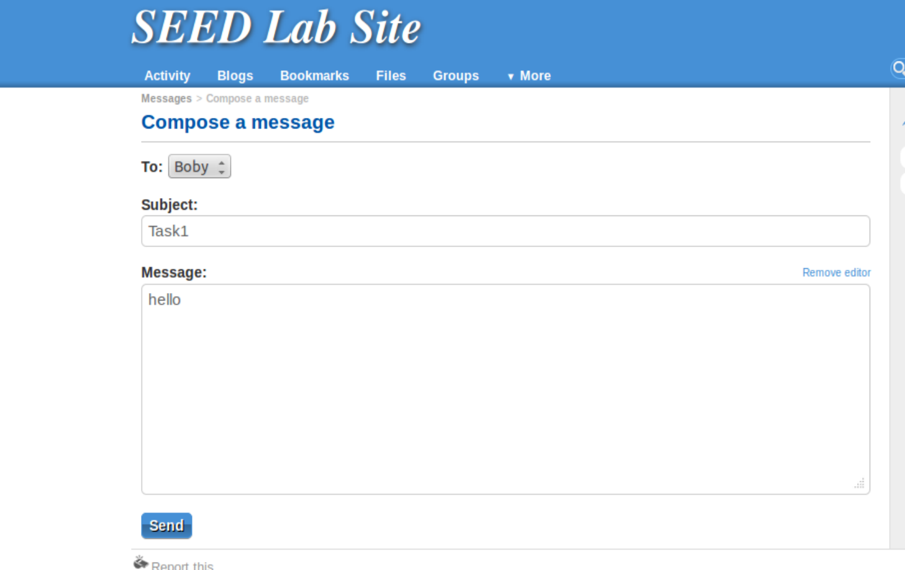

在消息页面发现确有一条消息


> 完成了足够的互动作为合法用户之后，您可以启动攻击并查看您可以退出受害者服务器的信息。 编写程序从头开始启动智慧攻击并不容易，因为它需要心跳协议的低级了解。 幸好，其他人已经写了攻击代码。 因此，我们将使用现有代码在智慧攻击中获得第一手经验。 我们使用的代码被称为攻击。最初由Jared Stafford写的。 我们对教育目的的代码进行了一些较小的变化。 
>
> 您可以从Lab的网站下载代码，更改其权限，以便文件可执行。 

```bash
chmod +x attack.py
```

> 然后，您可以按如下方式运行攻击代码：
>
> ```bash
> $./attack.py  www.heartbleedlabelgg.com
> ```
>


> 您可能需要多次运行攻击代码以获取有用的数据。 尝试并查看您是否可以从目标服务器获取以下信息。
>
> - 用户名和密码。
> - 用户的活动（用户完成了什么）。
> - 私信的确切内容。
>
> 对于从心脏出血攻击中窃取的每条秘密，您需要截图，并解释您如何进行攻击，以及您的观察结果。

多次攻击，发现其中一次得到了私信的确切内容


甚至又一次直接得到了用户名和密码


## 任务2：找到Heartbleed漏洞的原因

> 在这项任务中，学生将比较攻击者代码发送的良性数据包和恶意数据包的结果，以确定Heartbleed漏洞的根本原因。
>
> Heartbleed攻击是基于心跳要求。此请求仅向服务器发送一些数据，服务器将数据复制到其响应数据包，因此所有数据都会回来。在正常情况下，假设请求包括3个字节的数据“abc”，因此长度为值3.服务器将在存储器中放置数据，并将3个字节从数据的开头复制到其响应。包。在攻击场景中，请求可能包含3个字节的数据，但长度可以说1003。当服务器构造其响应数据包时，它从数据的开始（即“abc”）副本，但它拷贝1003字节，而不是3个字节。这些额外的1000种显然不会来自请求包；它们来自服务器的私人内存，它们可能包含其他用户的信息，密钥，密码等。
>
> 在这个任务中，我们将处理请求的长度字段。 首先，让我们了解心跳响应数据包是如何从图2构建的。当心跳请求数据包来临时，服务器将解析数据包以获得有效载荷和有效载荷长度值（图2中突出显示）。 这里，有效载荷仅是3字节字符串“ABC”，并且有效载荷长度值是3。服务器程序将盲目地从请求包中取出此长度值。 然后，它通过指向存储“ABC”的内存并将有效载荷长度字节复制到响应有效载荷来构建响应数据包。 以这种方式，响应分组将包含3字节字符串“abc”。

 <center>
    
    <br>
    <div style="color:orange; border-bottom: 1px solid #d9d9d9;
    display: inline-block;
    color: #999;
    padding: 2px;">
      图2：良性心跳通讯
  	</div>
</center>

> 我们可以推出像图3所示的Heartbleed攻击一样。我们保持相同的有效载荷（3个字节），但将有效载荷长度设置为1003。在构建响应数据包时，服务器将再次盲目地取消此有效载荷长度值。 这一次，服务器程序将指向字符串 “ABC” 并将1003个字节从内存复制到响应数据包作为有效载荷。 除了字符串“ABC”之外，额外的1000个字节被复制到响应数据包中，这可能是来自内存的任何东西，例如秘密活动，记录信息，密码等。

 <center>
    
    <br>
    <div style="color:orange; border-bottom: 1px solid #d9d9d9;
    display: inline-block;
    color: #999;
    padding: 2px;">
      图3：Heartbleed攻击通讯
  	</div>
</center>

复制多少取决于有效载荷长度字段中包含的值。

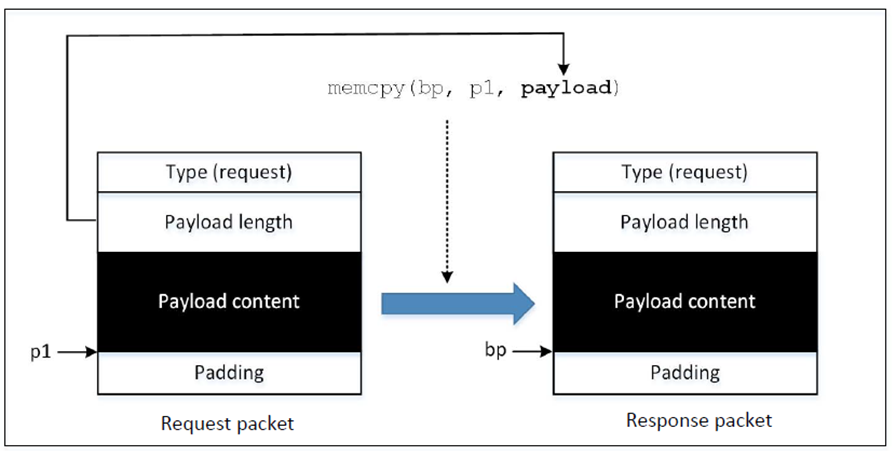

攻击结果：来自服务器内存的一些数据也被复制到响应数据包中，这将被发送出去


> 我们的攻击代码允许您使用不同的有效载荷长度值。 默认情况下，该值设置为相当大的（0x4000），但可以使用以下示例中所示的命令选项“-l”（字母ell）或“--length”来减少大小
>
> ```bash
> $./attack.py  www.heartbleedlabelgg.com  -l  0x015B
> $./attack.py  www.heartbleedlabelgg.com  --length  83
> ```

```
./attack.py  www.heartbleedlabelgg.com  -l  100
```

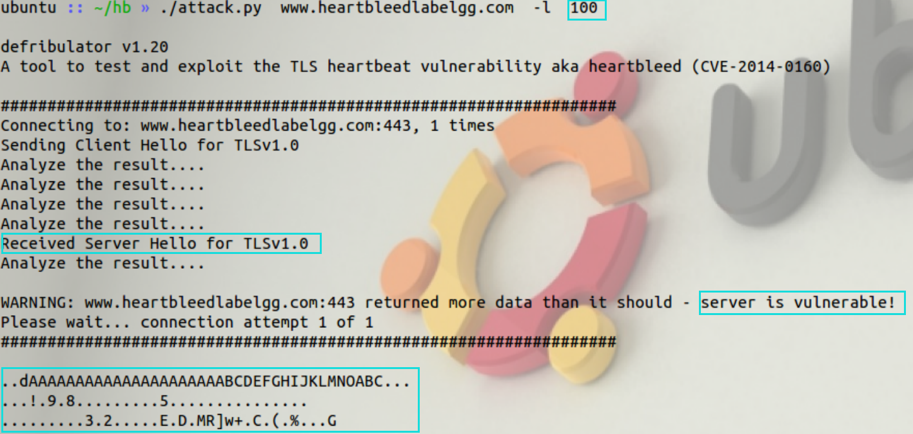

减小长度

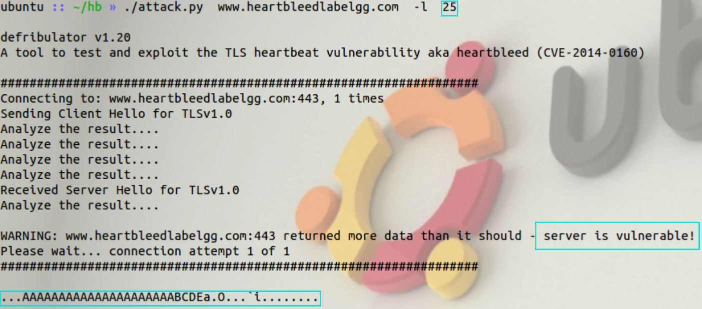

再次减小

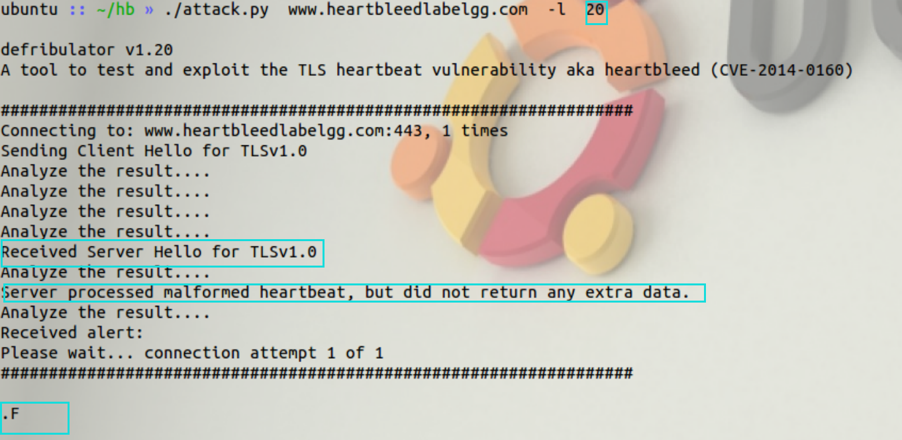

发现已经接收不到额外的数据了

> 您的任务是使用具有不同有效载荷长度值的攻击程序，并回答以下问题：
>
> - 问题2.1：随着长度变量减少，您可以观察到什么样的差异？

随着负载长度的减少，获取到的信息也会减少

> - 问题2.2：随着长度变量减小，输入长度变化有边界值。 在该边界或下方，心跳查询将接收响应数据包，而不附加任何额外数据（这意味着请求是良性的）。 请达到那个边界长度。 您可能需要尝试多个不同的长度值，直到Web服务器在没有额外数据的情况下发送回复。 为帮助您解决此问题，当返回的字节数小于预期长度时，程序将打印"Server processed malformed Heartbeat, but did not return any extra data.”

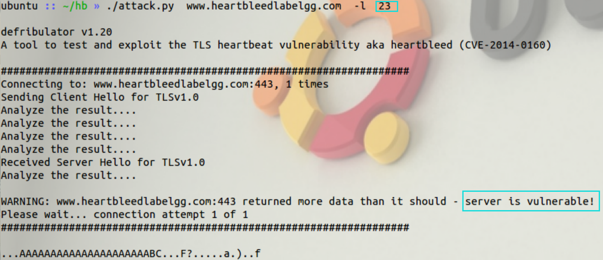

逐个减小

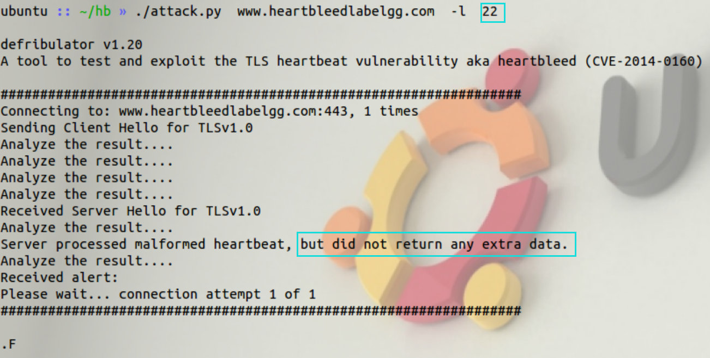

发现到22时便不再能成功，即边界长度为22

## 任务3：对策和错误修复

> 逐步漏洞漏洞，最好的方法是将OpenSSL库更新为最新版本。 这可以使用以下命令来实现。 应该指出的是，一旦更新，很难返回易受攻击的版本。 因此，请确保在进行更新之前已完成以前的任务。 您还可以在更新之前拍摄VM的快照。
>
> ```
> #sudo  apt-get  update
> #sudo  apt-get  upgrade
> ```

#### 任务3.1更新OpenSSL库后再次尝试攻击。

 请描述您的观察。

据我所知，你在seed12中是不可能更新成功的。

#### 任务3.2源代码中的Heartbleed错误。 

>  以下C样式结构（与源代码完全相同）是心跳请求/响应数据包的格式。
>
> ```c
> struct  {
> 	HeartbeatMessageType  type;  //  1  byte:  request  or  the  response    uint16 
>     payload_length;           //  2  byte:  the  length  of  the  payload opaque 
>     payload[HeartbeatMessage.payload_length];
> 	opaque padding[padding_length];
> }  HeartbeatMessage;
> ```
>
> 数据包的第一个字段（1字节）是类型信息，第二个字段（2字节）是有效载荷长度，然后是实际的有效载荷和填充物。有效载荷的大小应与有效载荷长度字段中的值相同，但在攻击情况下，有效载荷长度可以设置为不同的值。 下面的代码片段显示了服务器如何将数据从请求包复制到响应包中。

<center>清单1：处理心跳请求数据包并生成响应数据包</center>

```c
/* 为响应分配内存，大小为1字节的消息类型，
加上2字节的有效载荷长度，
加上有效载荷，加上填充物*/
unsigned int payload;
unsigned int padding = 16; /*使用最小的填充物 */

//  先从类型字段读取
hbtype = *p++; /*这条指令之后，指针p将指向payload_length字段*/

//  从请求包的payload_length字段中读取
n2s(p, payload); /* 函数n2s(p, payload)从指针p中读出16位，
                * 并将该值存储在INT变量 "payload "中。*/

pl = p; // pl 指向有效载荷内容的开头
if (hbtype == TLS1_HB_REQUEST)
{
    unsigned char *buffer, *bp;
    int r;
    /* 为响应分配内存，大小为1字节的消息类型，
    加上2字节的有效载荷长度，加上有效载荷，加上填充物 */

    buffer = OPENSSL_malloc(1 + 2 + payload + padding);
    bp = buffer;

    // 输入响应类型、长度和复制有效载荷
    *bp++ = TLS1_HB_RESPONSE;
    s2n(payload, bp);
    // 复制有效载荷
    memcpy(bp, pl, payload);
    /*pl是指向有效载荷内容开头的指针*/
    bp += payload;
    // 随机填充
    RAND_pseudo_bytes(bp, padding);
    //这个函数将从缓冲区复制3+payload+padding的字节，并将它们放入心跳响应包，以发回给请求客户端。
    OPENSSL_free(buffer);
    r = ssl3_write_bytes(s, TLS1_RT_HEARTBEAT, buffer, 3 + payload + padding);
}
```

> 请指出清单1中代码的问题，并提供解决该问题的方法（即需要进行哪些修改来解决该问题）。你不需要重新编译代码，只要在实验报告中描述如何解决这个问题即可。

上面的代码将指针p移动到发件方的负载长度字段，然后由响应分组缓冲区payload确定，缓冲器的大小由有效载荷和填充确定。 然后使用“memcpy（）”函数将程序复制到将加载内容复制到新创建的缓冲区的缓冲区。 `Memcpy（BP，P1，Poyload）`此语句开始将有效载荷数据复制到从P1到有效载荷字节的每个缓冲区的有效载荷字节缓冲区。

漏洞在于，回复包的内容是请求包中的载荷复制而来的，但是具体复制多少数据不是由载荷的实际大小决定，而是发送方声称的大小决定的。

防范措施：

在18行`pl = p;`之前加入如下代码：

```c
if( 1 + 2 + payload + 16 > s->s3->rrec.length)
 return 0;
```

rrec.length能够得到数据包真实长度，1 + 2 + payload + 16是请求数据包的声称长度，如果声称长度大于真实长度，就丢弃数据包。

> 此外，请对Alice、Bob和Eva关于Heartbleed漏洞的根本原因的以下讨论进行评价。
>
> Alice认为根本原因是在缓冲区复制过程中缺少边界检查；
>
> Bob认为原因是缺少用户输入验证；
>
> Eva认为我们只要删除数据包中的长度值就可以解决一切问题。

三人说的都很有理，根本原因正是忽略掉了对长度变量的验证

