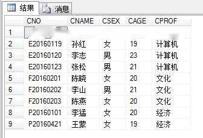
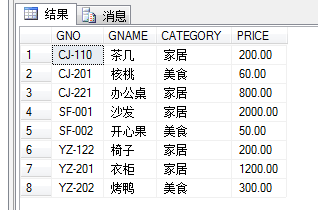
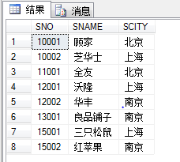
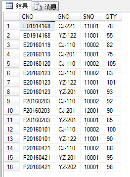
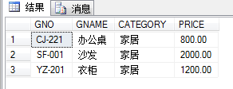
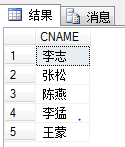
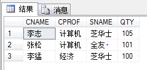
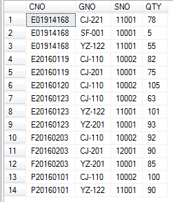
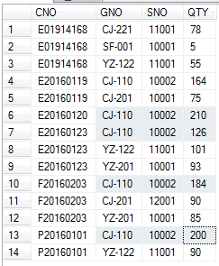
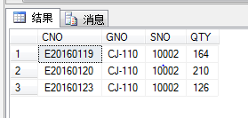

# **《数据库原理实验》测试题**

请认真阅读要求，完成以下任务。

在SQL SERVER 中建立该教学数据库，命名为"CGS\_"+**自己的学号**，并按照表1-表4模式说明的属性**用SQL语句**建立四个基本表（表名加学号），**设置主码和外部码**，然后从给定的EXCEL 表（CGS.Xls）中**导入实例数据(建议分批导入，避免外键冲突)**。

1.  **给出建立基本表的SQL语句和执行结果截图。**

```sql
CREATE TABLE C168
(
CNO CHAR(9),
CNAME CHAR(8),
CSEX CHAR(2),
CAGE TINYINT,
CPROF CHAR(10),
PRIMARY KEY(CNO),
);


CREATE TABLE G168
(
 GNO CHAR(6),
GNAME CHAR(12),
CATEGORY CHAR(10),
PRICE MONEY	,
PRIMARY KEY(GNO),
);

CREATE TABLE S168
(
 SNO CHAR(5),
SNAME CHAR(12),
SCITY CHAR(10),
PRIMARY KEY(SNO),
);

CREATE TABLE CGS168
(
CNO	CHAR(9),
GNO	CHAR(6),
SNO	CHAR(5),
QTY TINYINT	,
PRIMARY KEY(CNO,GNO,SNO),
FOREIGN KEY(CNO) REFERENCES C168(CNO),
FOREIGN KEY(GNO) REFERENCES G168(GNO),
FOREIGN KEY(SNO) REFERENCES S168(SNO),
);

```

{width="2.1041666666666665in" height="1.7708333333333333in"}

1.  **导入数据，插入自己的数据**

数据库中实例数据见表5-表8，在EXCEL文档 "CGS.Xls" 中用四个同名的SHEET给出，请用"导入数据"功能将数据导入到相应基本表中。

表5 客户表C数据

-------------- --------------- ------------- ------------- -------------

  **CNO**        CNAME           CSEX          CAGE          CPROF

  P20160101      李猛            女            20            经济

  P20160421      王蒙            女            19            经济

  E20160123      张松            男            21            计算机

  E20160120      李志            男            23            计算机

  E20160119      孙红            女            19            计算机

  F20160201      陈晓            女            20            文化

  F20160202      李山            男            21            文化

  F20160203      陈燕            女            20            文化

-------------- --------------- ------------- ------------- -------------

表6 商品表G数据

-------------- ------------------ --------------------- ----------------

  **GNO**        GNAME              CATEGORY              PRICE

  SF-001         沙发               家居                  2000

  SF-002         开心果             美食                  50

  CJ-110         茶几               家居                  200

  CJ-201         核桃               美食                  60

  CJ-221         办公桌             家居                  800

  YZ-122         椅子               家居                  200

  YZ-201         衣柜               家居                  1200

  YZ-202         烤鸭               美食                  300

-------------- ------------------ --------------------- ----------------

表7 商家表S数据

----------------------- ------------------------- ----------------------

  **SNO**                 SNAME                     SCITY

  10001                   顾家                      北京

  11001                   全友                      北京

  10002                   芝华士                    上海

  12001                   沃隆                      上海

  15001                   三只松鼠                  上海

  13001                   良品铺子                  南京

  12002                   华丰                      南京

  15002                   红苹果                    南京

----------------------- ------------------------- ----------------------

表8 销售记录表CGS数据

------------------- ----------------- -------------- -------------------

  **CNO**             **GNO**           **SNO**        QTY

  P20160101           CJ-110            10002          100

  P20160101           YZ-122            11001          90

  P20160421           CJ-110            10002          86

  P20160421           YZ-201            10001          95

  P20160421           YZ-202            10001          98

  E20160123           YZ-122            11001          101

  E20160123           YZ-201            10001          93

  E20160123           CJ-110            10002          63

  E20160120           CJ-110            10002          105

  E20160119           CJ-110            10002          82

  E20160119           CJ-201            10001          75

  F20160203           CJ-110            10002          92

  F20160203           CJ-201            12001          90

  F20160203           YZ-201            10001          85

------------------- ----------------- -------------- -------------------

请每位同学导入数据后，在C(客户表)表中插入一条自己的个人信息，另外在CGS（销售记录）表中插入2条自己的购物记录（注意商品代码一定不要用'SF-001'，商家代码自己选择，数量自己决定，但必须在50-150之间）。分别截图展示此时四个基本表中的数据（可以交互式打开表，也可以用SQL语句查询表）。

**C168表**

**已插入一条自己的个人信息**



**G168表**



**S168表**



**CGS168**

已插入2条自己的购物记录



3.  **用SQL语言完成下列任务，每一小题完成之后立即截图，截图中必须包含数据库名、SQL语句以及执行结果。（50分）**

&nbsp;

1)  查询"家居"类价格介于500至2000之间（包括500和2000）的商品信息

```sql
--1)	查询“家居”类价格介于至之间（包括和）的商品信息
SELECT * FROM G168
WHERE CATEGORY = '家居' AND PRICE BETWEEN 500 AND 2000;
```



2)  查询从事行业以"计算"开头且与本人同性别（本人男性则查询男性，本人女性则查询女性）的客户信息

```sql
--2)	查询从事行业以“计算”开头且与本人同性别
--（本人男性则查询男性，本人女性则查询女性）的客户信息
SELECT * FROM C168
WHERE CPROF LIKE '计算%' AND CSEX = '男';
```


3)  查询自己的购物记录（以客户代号为查询条件，显示结果表头为：姓名，商品名称，商家名称，单价，数量，总价）

```sql
--3)	查询自己的购物记录（以客户代号为查询条件，显示结果表头为：姓名，商品名称，商家名称，单价，数量，总价）
SELECT CNAME,GNAME,SNAME,PRICE,QTY,PRICE*QTY AS SUMPRICE
FROM C168,G168,S168,CGS168
WHERE CGS168.CNO = '192168' AND CGS168.CNO=C168.CNO AND CGS168.GNO=G168.GNO AND CGS168.SNO=S168.SNO
```


4)  查询单次交易数量大于所有交易平均数量的客户姓名

```sql
--4)	查询单次交易数量大于所有交易平均数量的客户姓名
SELECT CNAME FROM C168
WHERE CNO IN(

    SELECT CNO FROM CGS168
    WHERE QTY >= (
        SELECT AVG(QTY)
        FROM CGS168
    )
)
```



5)  查询商品"茶几"销量前3的销售记录对应的客户姓名、从事行业、商家名称和销售数量，按销量从高到低显示

```sql
--5)	查询商品“茶几”销量前的销售记录对应的
--客户姓名、从事行业、商家名称和销售数量，按销量从高到低显示
SELECT CNAME,CPROF,SNAME,QTY
FROM C168,S168,CGS168
WHERE CGS168.CNO=C168.CNO AND CGS168.SNO=S168.SNO AND 
QTY IN(
    SELECT TOP 3 QTY
    FROM CGS168
    ORDER BY QTY DESC
)
```



6)  查询用户王蒙没有购买的商品信息

```sql
--6)	查询用户王蒙没有购买的商品信息
SELECT * FROM G168
WHERE GNO !=ALL
(
    SELECT GNO FROM CGS168
    WHERE CNO IN(
        SELECT CNO FROM C168
        WHERE CNAME = '王蒙'
    )
)
```


7)  将自己购买商家"10001"的"沙发"的购物记录插入销售记录表中，购买数量为5(应该在插入语句中利用查询给出"沙发"的商品代号)；

```sql
--7)	将自己购买商家“”的“沙发”的购物记录插入销售记录表中，
---购买数量为(应该在插入语句中利用查询给出“沙发”的商品代号)；
INSERT 
INTO CGS168(CNO,GNO,SNO,QTY)
SELECT '192168',GNO,'10001',5 FROM G168
WHERE GNAME='沙发'
```


8)  删除客户"王蒙"的购物信息

```sql
--8)	删除客户“王蒙”的购物信息
DELETE 
FROM CGS168
WHERE CNO IN (
    SELECT CNO 
    FROM C168
    WHERE CNAME='王蒙'
)
```



9)  将所有用户购买的"茶几"的数量调整为原先的2倍；

```sql
--9)	将所有用户购买的“茶几”的数量调整为原先的倍；
UPDATE CGS168
SET QTY = QTY*2
WHERE GNO IN(
    SELECT GNO FROM G168
    WHERE GNAME='茶几'
)
```

可以看到"茶几"的数量调整为原先的2倍



10) 建立一个从事计算机行业的客户购买\"茶几\"的视图CGS_CSCJ，通过视图查询显示结果。

```sql
--10)	建立一个从事计算机行业的客户购买"茶几"的视图CGS_CSCJ，通过视图查询显示结果。
CREATE VIEW CGS_CSCJ AS SELECT *
FROM CGS168
WHERE 
GNO IN(
	SELECT GNO FROM G168
	WHERE GNAME='茶几')
AND CNO IN (SELECT CNO FROM C168
	WHERE CPROF='计算机')

```



