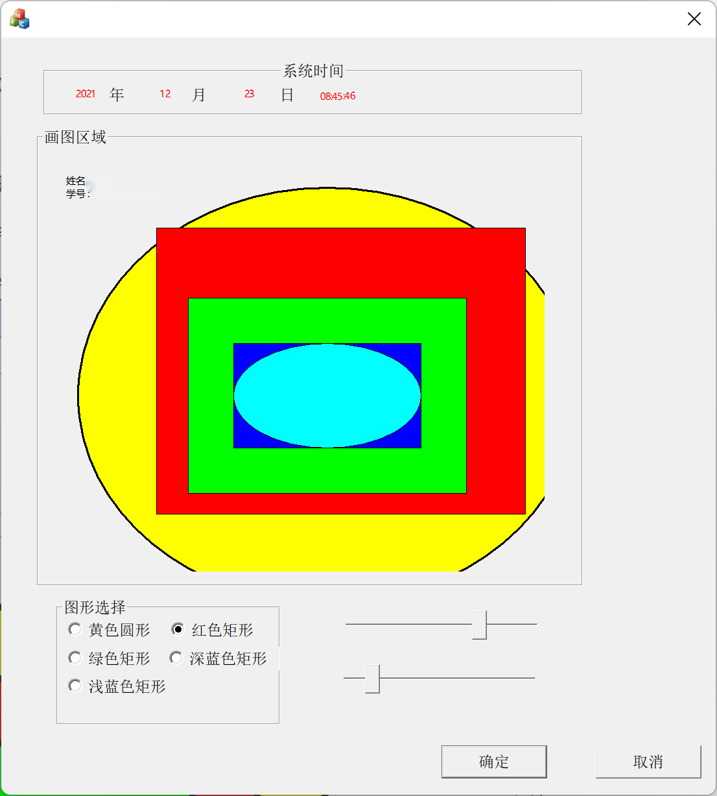
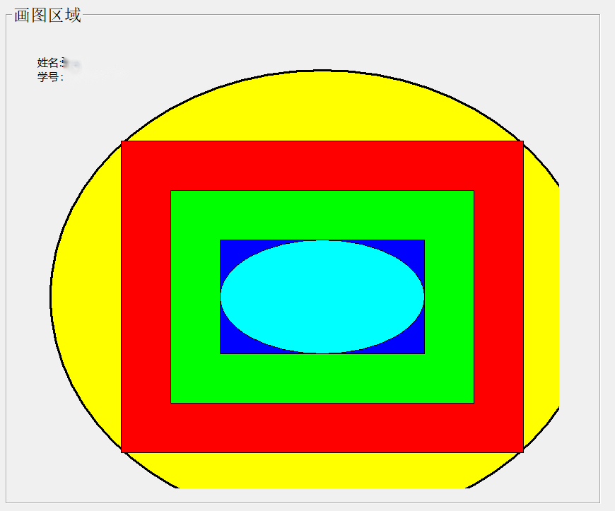
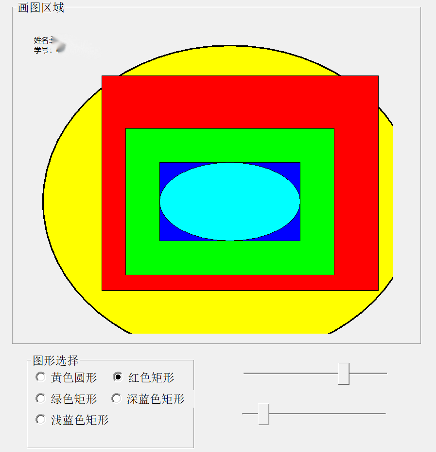
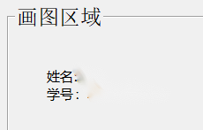

# 实验三Socket通信中的前端UI开发 Windows界面图形绘制

实验目的：

1. 了解设备描述表和 GDI 对象的特性；

2. 掌握 MFC 常用 GDI 对象的使用方法；

3. 基于 MFC 编写绘制个性化图形图像的应用程序。

实验任务：

1. 进一步理解设备描述表的概念；

2. 了解掌握设备描述表的获取和使用方法；

3. 使用 MFC 设备描述表和 GDI 对象进行界面图形绘制。

实验设备：

个人 PC，WindowsXP 操作系统，Visual C++ 6.0 开发环境。

实验内容：

1.使用设备描述表和 GDI 对象开发具有个性化图形显示的 MFC 应用程序，实现

多个不同颜色的矩形和圆形的叠加显示和动态控制，界面设计如图 。



###  功能要求

1.  重叠显示 5 个图形，按从大到小、从底部到顶部的顺序分别为：
   - 一个<font color=#FFFF00>黄色圆形(255,255,0)</font>
    - 一个<font color=#FF0000>红色矩形(255,0,0)</font>
    - 一个<font color=#00FF00>绿色矩形(0,255,0)</font>
    - 一个<font color=#0000FF>深蓝色矩形(0,0,255)</font>
    - 一个<font color=#00FFFF>蓝色圆形(0,255,255)</font>
   - 各个图形大小面积不一，重叠显示；
2.  以上图形绘制在界面上的一个静态文本控件确定的区域内，图像超出该区域不显示；
3.  通过一组单选按钮可以选定某一个图形作为控制的对象，通过两个滑动条可以控制选定的图形进行两个方向上的动态移动；
4.  在主界面上方，设置一个区域用于动态显示时间。时间使用新创建的特定字体显示，并用该字体在界面上显示自己的姓名和学号。

###  参考步骤

#### 绘制图形

- 在对话框上绘制图形

在你主对话框的 OnPaint()函数中，有 CPaintDC dc(this);即获得设备描述表，可以照此方法，使

用 dc 绘制图形。如采用堆上和栈上分配的方法画直线：

\----------------------------------------------------------------------------------------

```cpp
CPaintDC dc(this);
//----栈上分配----//
CPen pNewPen(你的线型, 你的线宽, 你的颜色);
pOldPen=dc.SelectObject(&pNewPen); //选择新笔，并保存旧笔
dc.MoveTo(起点); //画直线
dc.LineTo(终点);
dc.SelectObject(pOldPen);//恢复原有的笔
//------堆上分配-----//
pNewPen=new CPen;
pNewPen->CreatePen(你的线型, 你的线宽, 你的颜色)；
pOldPen=dc.SelectObject(pNewPen); //选择新笔，并保存旧笔
dc.MoveTo(起点); //画直线
dc.LineTo(终点);
dc.SelectObject(pOldPen); //恢复原有的笔
delete pNewPen;//删除新笔
```

\------------------------------------------------------------------------------------

你是不是已经在对话框上画出直线了？

2. 在对话框上画矩形和圆形

用你的设备描述表调用以下函数：

```cpp
Rectangle(矩形左上角横坐标, 矩形左上角纵坐标, 矩形右下角横坐标, 矩形右下角纵坐标)
Ellipse (左上角横坐标,左上角纵坐标,右下角横坐标, 右下角纵坐标)
//相对于最小外接矩形
```

通过调整坐标，观察你画出的图形的位置的变化，体会横坐标和纵坐标的位置关系。

3. 自定义线条的图形

特定的线条通过选用特定的画笔来绘制

```cpp
CPen pNewPen(你需要的线型, 你需要的宽度, 你需要的颜色);
pOldPen=你的设备描述表.SelectObject(&pNewPen); //选入你定义的新 GDI 画笔
```

再使用你的设备描述表调用不同的图形绘制函数

4. 使用画刷，绘制自定义填充颜色的图形

通过选入特定颜色的画刷来设置

```cpp
CBrush Brush (你需要的颜色);
pOldBrush=你的设备描述表.SelectObject(&Brush);//选入画刷
```

再使用你的设备描述表调用不同的图形绘制函

5. 自定义线条和填充颜色的图形
   - 分别设置画笔和画刷
   - 分别选入画笔和画刷
   - 使用你的设备描述表绘制你的图形
   - 分别恢复画笔和画刷

6. 多个图形的绘制

从最底层到最上层逐一绘制你的图形，注意，绘制每层图像时如果线型和填充颜色不同要设置新的画笔和画刷。

以上你就可以在对话框界面上重叠得绘制五个图形了。

```cpp
//-----布置界面，使用一个静态文本控件，调整其大小后作为你的绘图区域。------
		CWnd* pWnd = GetDlgItem(IDC_STATIC_DRAW);
		CDC* dc = pWnd->GetDC();
		pWnd->Invalidate();
		pWnd->UpdateWindow();

		CRect rectView;
		CRgn rgn;
		GetDlgItem(IDC_STATIC_DRAW)->GetWindowRect(&rectView);
		ScreenToClient(&rectView);
		rgn.CreateRectRgn(rectView.left, rectView.top, rectView.right, rectView.bottom);
		dc->SelectClipRgn(&rgn);

		CPaintDC newdc(this);
		newdc.SelectClipRgn(&rgn);

		CPen pNewPen(PS_SOLID, 3, RGB(0, 0, 0));
		CBrush yellowBrush(RGB(255, 255, 0));//选中新笔
		CPen* pOldPen = newdc.SelectObject(&pNewPen);//选中新画刷

		//画黄色圆形
		CBrush* pOldBrush = newdc.SelectObject(&yellowBrush);
		CRect yellowEclipse(rectView);
		yellowEclipse.left += x1;
		yellowEclipse.top += y1;
		yellowEclipse.right += x1;
		yellowEclipse.bottom += y1;
		newdc.Ellipse(yellowEclipse);
		newdc.SelectObject(pOldPen);
		newdc.SelectObject(pOldBrush);

		//画红色矩形
		CBrush redBrush(RGB(255, 0, 0));
		pOldBrush = newdc.SelectObject(&redBrush);
		CRect redRect(rectView);
		redRect.left += x2 + 100 ;
		redRect.top += y2 + 100;
		redRect.right += x2 - 100;
		redRect.bottom += y2 - 100;
		newdc.Rectangle(redRect);
		newdc.SelectObject(pOldBrush);

		//画绿色矩形
		CBrush greeBrush(RGB(0, 255, 0));
		pOldBrush = newdc.SelectObject(&greeBrush);
		CRect greeRect(rectView);
		greeRect.left += x3 + 170;
		greeRect.top += y3 + 170;
		greeRect.right += x3 - 170;
		greeRect.bottom += y3 - 170;
		newdc.Rectangle(greeRect);
		newdc.SelectObject(pOldBrush);

		//画深蓝色矩形
		CBrush navyblueBrush(RGB(0, 0, 255));
		pOldBrush = newdc.SelectObject(&navyblueBrush);
		CRect navyblueRect(rectView);
		navyblueRect.left += x4 + 240;
		navyblueRect.top += y4 + 240;
		navyblueRect.right += x4 - 240;
		navyblueRect.bottom += y4 - 240;
		newdc.Rectangle(navyblueRect);
		newdc.SelectObject(pOldBrush);

		//画浅蓝色圆形
		CBrush lightbrueBrush(RGB(0, 255, 255));
		pOldBrush = newdc.SelectObject(&lightbrueBrush);
		rectView.left += x5 + 240;
		rectView.top += y5 + 240;
		rectView.right += x5 - 240;
		rectView.bottom += y5 - 240;
		newdc.Ellipse(rectView);
		newdc.SelectObject(pOldBrush);
```



#### 移动控制功能

加入图形移动控制功能，并将所绘图形限定在对话框的特定区域内。使用一组 Radio 按钮，分别对应于你的每个图形。在界面上再加入两个滑动条，分别对应水平移动和垂直移动，通过Radio 选定特定的图形后，拖动滑动条，则对应的图形会在界面上整体移动。

Step1. 布置界面，使用一个静态文本控件，调整其大小后作为你的绘图区域。

获取该静态文本区域的窗口句柄和设备描述表，并将该区域设置为裁剪区域(该区域之外的绘图不可见)。

```cpp
CWnd  pWnd = GetDlgItem(你的静态文本 ID); 
CDC  dc = pWnd->GetDC();//注意这里获取了新的 dc
pWnd->Invalidate();
pWnd->UpdateWindow();
CRect rectView; 
CRgn rgn;
GetDlgItem(你的静态文本 ID)->GetClientRect(&rectView);
rgn.CreateRectRgn(rectView.left, rectView.top, rectView.right, rectView.bottom); 
dc->SelectClipRgn(&rgn);
```

注意以上代码和下面的部分代码写在`OnPaint()`函数的什么位置？else语句之中

这样，你已经获得了在该静态控件范围内绘图的设备描述表，并将该控件范围设定为裁剪区域。随后使用新获取的设备描述表进行绘图即可，过程和前述完全类似。

Step2.使用滑动条控制图像的移动
由以上可知，当你使用设备描述表在 OnPaint 函数中绘制矩形或圆形时，图形的位置由以下形参决定：
(矩形左上角横坐标，矩形左上角纵坐标，矩形右下角横坐标，矩形右下角纵坐标)
将两个滑动条控件动态得到的值分别作为对应图像横坐标和纵坐标的整体偏移量，即可实
现图像的动态移动。即采用如下形参模式：` (左上角横坐标+横坐标动态偏移量，左上角纵坐标+纵坐标动态偏移量，右下角横坐标+横坐标动态偏移量，右下角纵坐标+纵坐标动态偏移量)`其中的两个动态偏移量根据滑动条的位置得到。此外仍需响应 `OnHScroll(UINT nSBCode, UINT nPos, CScrollBar pScrollBar)`函数，在其中实现动态获取滑动条位置作为图形整体偏移量的功能，
如：

```cpp
void CMFCDRAWDlg::OnHScroll(UINT nSBCode, UINT nPos, CScrollBar* pScrollBar)
{
	// TODO: 在此添加消息处理程序代码和或调用默认值
	UpdateData(TRUE);
	pointx = Sliderx.GetPos();
	pointy = Slidery.GetPos();
	switch (m_radio)
	{
	case 0:
		x1 = pointx;
		y1 = pointy;
		break;
	case 1:
		x2 = pointx;
		y2 = pointy;
		break;
	case 2:
		x3 = pointx;
		y3 = pointy;
		break;
	case 3:
		x4 = pointx;
		y5 = pointy;
		break;
	case 4:
		x5 = pointx;
		y5 = pointy;
		break;
	default:
		break;

	}
	Invalidate(TRUE);
	CMFCDRAWDlg::OnPaint();
	CDialogEx::OnHScroll(nSBCode, nPos, pScrollBar);
```

```cpp

void CMFCDRAWDlg::OnBnClickedRadio1()
{
	// TODO: 在此添加控件通知处理程序代码
	UpdateData(TRUE);
	Sliderx.SetPos(x1);
	Slidery.SetPos(y1);

	x1 = Sliderx.GetPos();
	y1 = Slidery.GetPos();
	CMFCDRAWDlg::OnPaint();
}


void CMFCDRAWDlg::OnBnClickedRadio2()
{
	// TODO: 在此添加控件通知处理程序代码
	UpdateData(TRUE);
	Sliderx.SetPos(x2);
	Slidery.SetPos(y2);

	x2 = Sliderx.GetPos();
	y2 = Slidery.GetPos();
	CMFCDRAWDlg::OnPaint();
}


void CMFCDRAWDlg::OnBnClickedRadio3()
{
	// TODO: 在此添加控件通知处理程序代码
	UpdateData(TRUE);
	Sliderx.SetPos(x3);
	Slidery.SetPos(y3);

	x3 = Sliderx.GetPos();
	y3 = Slidery.GetPos();
	CMFCDRAWDlg::OnPaint();
}


void CMFCDRAWDlg::OnBnClickedRadio4()
{
	// TODO: 在此添加控件通知处理程序代码
	UpdateData(TRUE);
	Sliderx.SetPos(x4);
	Slidery.SetPos(y4);

	x4 = Sliderx.GetPos();
	y4 = Slidery.GetPos();
	CMFCDRAWDlg::OnPaint();
}


void CMFCDRAWDlg::OnBnClickedRadio5()
{
	// TODO: 在此添加控件通知处理程序代码
	UpdateData(TRUE);
	Sliderx.SetPos(x5);
	Slidery.SetPos(y5);

	x5 = Sliderx.GetPos();
	y5 = Slidery.GetPos();
	CMFCDRAWDlg::OnPaint();
}
```


效果展示



#### 添加文本

Step3.在对话框上部增加区域动态显示时间

设置显示时间所需要的字体

可在头文件中增加 CFont 类成员变量

在对话框初始化中加入创建字体代码：

```cpp
你的字体成员变量.CreateFont(你的字体大小,0,0,0, FW_BOLD, FALSE, FALSE, 0, ANSI_CHARSET, OUT_DEFAULT_PRECIS, CLIP_DEFAULT_PRECIS, DEFAULT_QUALITY, DEFAULT_PITCH|FF_SWISS, _T("隶书"))
cfont.CreateFont(20, 0, 10, 0, FW_NORMAL, FALSE, FALSE, 0, ANSI_CHARSET, OUT_DEFAULT_PRECIS, CLIP_DEFAULT_PRECIS, DEFAULT_QUALITY, DEFAULT_PITCH | FF_SWISS, _T("微软雅黑"));
```

将所有需要设置为该字体的静态文本控件，如年月日，使用该字体显示：

```cpp
GetDlgItem(你的静态控件 ID)->SetFont(&你的字体)
GetDlgItem(IDC_STATIC_YEAR)->SetFont(&cfont);
GetDlgItem(IDC_STATIC_MONTH)->SetFont(&cfont);
GetDlgItem(IDC_STATIC_DAY)->SetFont(&cfont);
GetDlgItem(IDC_STATIC_TIME)->SetFont(&cfont);
```

```c++
HBRUSH CMFCDRAWDlg::OnCtlColor(CDC* pDC, CWnd* pWnd, UINT nCtlColor)
{
	HBRUSH hbr = CDialogEx::OnCtlColor(pDC, pWnd, nCtlColor);

	// TODO:  在此更改 DC 的任何特性
	if (pWnd->GetDlgCtrlID() == IDC_STATIC_YEAR)
	{
		pDC->SetTextColor(RGB(255, 0, 0));
	}
	if (pWnd->GetDlgCtrlID() == IDC_STATIC_MONTH)
	{
		pDC->SetTextColor(RGB(255, 0, 0));
	}
	if (pWnd->GetDlgCtrlID() == IDC_STATIC_DAY)
	{
		pDC->SetTextColor(RGB(255, 0, 0));
	}
	if (pWnd->GetDlgCtrlID() == IDC_STATIC_TIME)
	{
		pDC->SetTextColor(RGB(255, 0, 0));
	}

	// TODO:  如果默认的不是所需画笔，则返回另一个画笔
	return hbr;
}
```

最后，在定时器中，每隔一秒，更新时间：

例子：

```cpp
m_GlobalTime = CTime::GetCurrentTime(); //使用 CTime 对象得到当前时间
str = m_GlobalTime.Format("%Y%m%d %H%M%S ");
 //年月日时分秒的对应 
str = m_GlobalTime.Format("%Y"); GetDlgItem(IDC_NIAN)->SetWindowText(str);  
//或向静态文本控件关联的变量赋值。
```

```cpp
void CMFCDRAWDlg::OnTimer(UINT_PTR nIDEvent)
{
	// TODO: 在此添加消息处理程序代码和/或调用默认值
	CTime m_GlobalTime;
	m_GlobalTime = CTime::GetCurrentTime(); //使用 CTime 对象得到当前时间
	CString str1, str2, str3, str4;
	str1 = m_GlobalTime.Format("%Y");
	GetDlgItem(IDC_STATIC_YEAR)->SetWindowText(str1);
	str2 = m_GlobalTime.Format("%m");
	GetDlgItem(IDC_STATIC_MONTH)->SetWindowText(str2);
	str3 = m_GlobalTime.Format("%d");
	GetDlgItem(IDC_STATIC_DAY)->SetWindowText(str3);
	str4 = m_GlobalTime.Format("%H:%M:%S");
	GetDlgItem(IDC_STATIC_TIME)->SetWindowText(str4);
	CDialogEx::OnTimer(nIDEvent);
}
```


Step4. 使用你已经创建的字体，在绘图区显示自己的名字和学号。

```cpp
选入你新建的字体；
你的设备描述表.TextOut(左上角横坐标,左上角纵坐标,"姓名：张三");
… …
```

```c++
		//显示学号姓名
		newdc.SelectObject(&cfont);
		newdc.SetBkMode(TRANSPARENT);//设置背景透明
		newdc.TextOut(100, 210, "姓名:张三");
		newdc.TextOut(100, 230, "学号：192168001");

```



关于进一步完善你的系统的思考：

在 Radio 按钮再次选定之前移动过的图形时，滑动条每次应该回到上次该图形对应的位置

